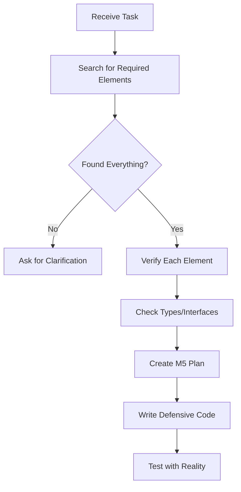

# 🧠 ANTI-HALLUCINATION CHECKLIST

## 🚨 STOP BEFORE YOU CODE!

### 1. **File/Path Verification**
```bash
# BEFORE: "I'll update the component"
# AFTER: Verify it exists first!

# Check file exists
ls -la path/to/Component.tsx || echo "❌ FILE NOT FOUND!"

# Check directory structure
find . -name "Component.tsx" -type f

# Verify import paths
grep -r "from.*Component" --include="*.ts*"
```

### 2. **Function/Method Verification**
```bash
# BEFORE: "I'll call the updateUser function"
# AFTER: Prove it exists!

# Search for function definition
grep -n "function updateUser\|const updateUser\|updateUser.*=" file.ts

# Check if it's exported
grep "export.*updateUser" file.ts

# Verify function signature
ast-grep --pattern 'function updateUser($$$)' 
```

### 3. **Property/Type Verification**
```typescript
// BEFORE: Assuming properties exist
const name = user.profile.displayName; // DANGEROUS!

// AFTER: Defensive coding
// @AI-FIX-XXX [timestamp] Add: Safe property access
const name = user?.profile?.displayName ?? 'Unknown';

// Or better - check the type definition first:
// grep "interface.*User\|type.*User" -A 20
```

### 4. **Library Usage Verification**
```bash
# BEFORE: "I'll use this library feature"
# AFTER: Verify it's installed and imported

# Check if installed
grep "library-name" package.json || echo "❌ NOT INSTALLED!"

# Check version
npm list library-name

# Check if already imported
grep "from 'library-name'" file.ts

# ALWAYS check Context7 for correct usage!
```

### 5. **State/Store Verification**
```bash
# BEFORE: "I'll update the store"
# AFTER: Verify store structure

# Find store definition
grep -r "createStore\|configureStore\|create(" --include="*.ts*"

# Check current state shape
grep -r "interface.*State\|type.*State" --include="*.ts*"

# Verify action exists
grep "action.*name" store/file.ts
```

## 🔍 HALLUCINATION PATTERNS TO AVOID

### 1. **The Phantom Import**
```typescript
// HALLUCINATION: Importing non-existent utils
import { formatDate } from '@/utils/date'; // DOES THIS EXIST?

// REALITY CHECK:
// ls utils/date.ts || echo "No such file!"
```

### 2. **The Ghost Function**
```typescript
// HALLUCINATION: Calling non-existent methods
await user.refreshToken(); // DOES USER HAVE THIS METHOD?

// REALITY CHECK:
// grep -n "refreshToken" $(find . -name "*.ts" | grep -i user)
```

### 3. **The Imaginary Prop**
```tsx
// HALLUCINATION: Using props that don't exist
<Component onSuccess={handleSuccess} /> // IS onSuccess A REAL PROP?

// REALITY CHECK:
// grep "onSuccess" Component.tsx
// grep "interface.*Props" Component.tsx -A 10
```

### 4. **The Fictional Configuration**
```typescript
// HALLUCINATION: Accessing config that doesn't exist
const apiKey = process.env.STRIPE_API_KEY; // IS THIS IN .env?

// REALITY CHECK:
// grep "STRIPE_API_KEY" .env .env.* || echo "NOT CONFIGURED!"
```

### 5. **The Assumed API**
```typescript
// HALLUCINATION: Calling API endpoints that don't exist
const data = await fetch('/api/users/analytics'); // DOES THIS ENDPOINT EXIST?

// REALITY CHECK:
// find . -path "*/api/users/analytics*" -o -name "*analytics*.ts"
// grep -r "analytics" app/api/
```

## 📋 MANDATORY VERIFICATION CHECKLIST

Before writing ANY code, verify:

- [ ] **File exists**: `test -f "path/to/file"`
- [ ] **Function exists**: `grep "functionName" file`
- [ ] **Import exists**: `grep "from.*module" file`
- [ ] **Type/Interface defined**: `grep "interface Name" -r .`
- [ ] **Property exists**: Check type definition
- [ ] **API endpoint exists**: Check api/ directory
- [ ] **ENV var exists**: `grep "VAR_NAME" .env*`
- [ ] **Database table exists**: Check schema/migrations
- [ ] **Component prop exists**: Check component interface
- [ ] **Store action exists**: Check store files

## 🛑 RED FLAGS - STOP IMMEDIATELY

If you catch yourself:
1. **Writing code without verification** → STOP
2. **Assuming something exists** → STOP  
3. **Remembering from "before"** → STOP
4. **Guessing file paths** → STOP
5. **Inventing function names** → STOP

## 💊 THE CURE

### Instead of Hallucinating:
```bash
# 1. Search for what you need
find . -name "*keyword*" -type f
grep -r "keyword" --include="*.ts*"

# 2. Read existing code
cat file.ts | grep -A 5 -B 5 "pattern"

# 3. Check examples
grep -r "similar_usage" --include="*.ts*" -B 2 -A 2

# 4. Ask for clarification
echo "I need to find X. Can you point me to the right file?"
```

### The Golden Rule:
**If you can't grep it, it doesn't exist. If it doesn't exist, don't use it.**

## 🎯 SUCCESS PATTERN



**Remember**: Every hallucination costs hours of debugging. Every verification saves days of work. 