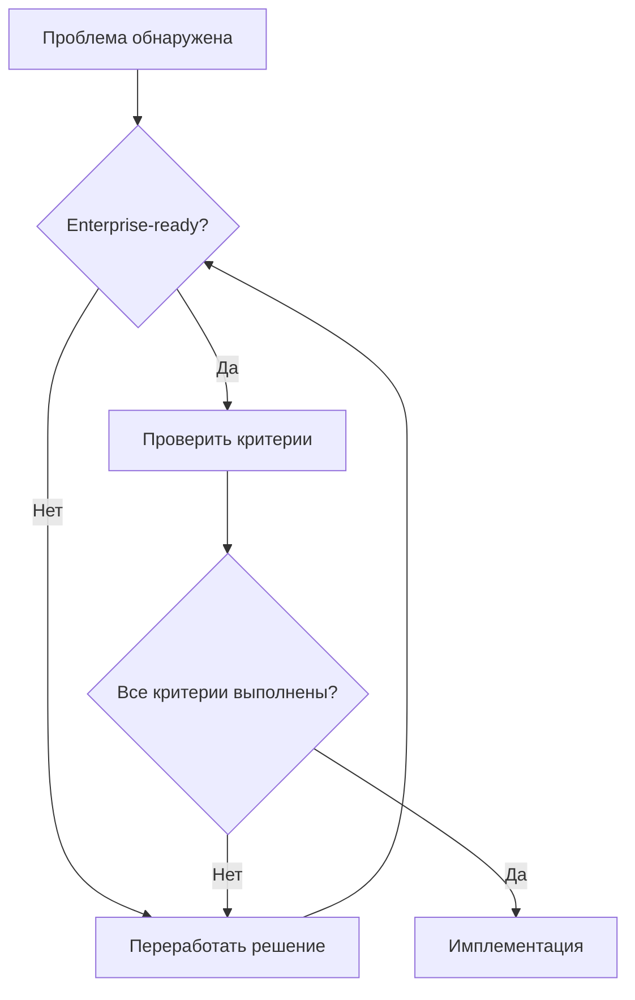

# 🐛 МЕТОДОЛОГИЯ СИСТЕМНОГО ДЕБАГГИНГА

## 📋 НАЗНАЧЕНИЕ
Этот документ описывает ОБЯЗАТЕЛЬНЫЙ системный подход к дебаггингу в проекте. Используется для автоматического следования процессу БЕЗ создания костылей, временных решений и обходных путей.

---

## 📁 ОБЯЗАТЕЛЬНАЯ СИСТЕМА 4 ФАЙЛОВ

**См. [Систему 4 файлов в индексе методологий](./METHODOLOGY_INDEX.md#-система-4-файлов---обязательна-для-каждой-задачи)**

Для ЛЮБОЙ задачи дебаггинга создаются:
1. **ARCHITECTURE_CONTEXT.md** - где возникла проблема
2. **SOLUTION_PLAN.md** - план исправления
3. **IMPACT_ANALYSIS.md** - анализ влияния fix'а
4. **IMPLEMENTATION_REPORT.md** - отчет (после)

📚 **[Полный пример системы 4 файлов](./FOUR_FILES_EXAMPLE.md)**

---

## 🚨 КРИТИЧЕСКИЕ ПРИНЦИПЫ

### **ЗОЛОТЫЕ ПРАВИЛА ДЕБАГГИНГА:**
1. **ДАННЫЕ > КОД** - Сначала проверяй данные, потом код
2. **ДИАГНОСТИКА > ИСПРАВЛЕНИЕ** - Понимай причину, не лечи симптомы
3. **СИСТЕМАТИЧНОСТЬ > СКОРОСТЬ** - Медленно, но правильно
4. **КОРЕНЬ > ПОВЕРХНОСТЬ** - Исправляй причину, не следствие
5. **ПРОСТОТА > СЛОЖНОСТЬ** - Самое простое решение обычно правильное

---

## 🎯 ОБЯЗАТЕЛЬНЫЙ ПРОЦЕСС ДЕБАГГИНГА

### 0️⃣ **СТОП! ПРОВЕРКА ДАННЫХ (5 минут)**
**ПЕРЕД любым анализом кода:**

```javascript
// 1. Открыть DevTools
console.log('=== DATA CHECK START ===')

// 2. Проверить localStorage
console.table(Object.entries(localStorage))

// 3. Проверить sessionStorage
console.table(Object.entries(sessionStorage))

// 4. Проверить cookies
console.log(document.cookie)

// 5. Проверить текущее состояние
console.log('Current state:', {
  url: window.location.href,
  localStorage: {...localStorage},
  user: window.__USER_STATE__ // или где хранится
})
```

**Если данные не соответствуют ожиданиям - СТОП! Проблема найдена.**

### 1️⃣ **СБОР СИМПТОМОВ**
**Что фиксировать:**
- Точное описание проблемы
- Шаги воспроизведения
- Ожидаемое поведение
- Фактическое поведение
- Скриншоты консоли
- Network запросы
- Версии браузера/ОС

**Инструменты:**
```bash
# Сохранить состояние консоли
copy(console.logs) # В DevTools

# Экспорт HAR файла
Network tab → Export HAR

# Сохранить состояние React
React DevTools → Components → Export
```

### 2️⃣ **ИЗОЛЯЦИЯ ПРОБЛЕМЫ**
**Систематическое сужение области:**

```javascript
// А. Проверка на уровне API
const testAPI = async () => {
  const response = await fetch('/api/endpoint')
  const data = await response.json()
  console.log('API Test:', { response, data })
  return data
}

// Б. Проверка на уровне компонента
const TestComponent = () => {
  console.log('Component render')
  return <div>Test</div>
}

// В. Проверка на уровне хука
const testHook = () => {
  console.log('Hook called')
  const result = useCustomHook()
  console.log('Hook result:', result)
  return result
}
```

### 3️⃣ **АНАЛИЗ ДАННЫХ**
**Обязательные проверки:**

```bash
# 1. Формат данных API
curl -s "http://localhost:3000/api/endpoint" | jq '.'

# 2. Типы полей
curl -s "http://localhost:3000/api/endpoint" | jq '.[0] | to_entries | map({key, type: .value | type})'

# 3. Null/undefined значения
curl -s "http://localhost:3000/api/endpoint" | jq '.[0] | to_entries | map(select(.value == null))'

# 4. Структура вложенных объектов
curl -s "http://localhost:3000/api/endpoint" | jq '.[0] | paths(scalars) as $p | {path: $p, value: getpath($p)}'
```

### 🔌 **CONTEXT7 CHECK - ОБЯЗАТЕЛЬНО ПРИ ПРОБЛЕМАХ С БИБЛИОТЕКАМИ**
**Если проблема связана со сторонней библиотекой:**

#### ⚠️ **СТОП! Проверь актуальность документации:**
```bash
# 1. Найти библиотеку в Context7
mcp_context7_resolve-library-id "проблемная-библиотека"

# 2. Получить актуальную документацию
mcp_context7_get-library-docs "/org/project/version"

# 3. Проверить версию в package.json
grep "library-name" package.json

# 4. Сравнить с актуальной версией и API
```

#### 🚨 **Частые причины проблем с библиотеками:**
1. **Устаревшее API** - метод переименован/удален
2. **Breaking changes** - изменилась сигнатура
3. **Deprecated функционал** - используем старый подход
4. **Неправильные типы** - изменились интерфейсы
5. **Конфликт версий** - несовместимые зависимости

#### ✅ **Правильная диагностика:**
```typescript
// 1. Проверить через Context7 актуальное API
const actualAPI = await checkContext7Documentation()

// 2. Сравнить с используемым кодом
const currentUsage = analyzeCurrentCode()

// 3. Найти расхождения
const differences = compareAPIUsage(actualAPI, currentUsage)

// 4. Исправить согласно актуальной документации
```

### 4️⃣ **ПОИСК КОРНЕВОЙ ПРИЧИНЫ**
**Систематический анализ:**

```typescript
// 1. Трассировка данных
const traceData = (data: any, label: string) => {
  console.group(`TRACE: ${label}`)
  console.log('Input:', data)
  console.log('Type:', typeof data)
  console.log('Keys:', Object.keys(data || {}))
  console.log('Values:', Object.values(data || {}))
  console.trace('Stack trace')
  console.groupEnd()
  return data
}

// 2. Точки отладки
const debugPoint = (checkpoint: string, data: any) => {
  console.log(`🔍 ${checkpoint}:`, {
    timestamp: new Date().toISOString(),
    data,
    stack: new Error().stack
  })
}

// 3. Проверка потока
const flowCheck = {
  start: (id: string) => console.time(id),
  checkpoint: (id: string, data: any) => console.log(`⏱️ ${id}:`, data),
  end: (id: string) => console.timeEnd(id)
}
```

### 5️⃣ **ВАЛИДАЦИЯ ГИПОТЕЗ**
**НЕ предполагать - проверять:**

```javascript
// Гипотеза: Проблема в типе данных
console.assert(typeof data.price === 'number', 'Price should be number', data.price)

// Гипотеза: Проблема в timing
performance.mark('start-operation')
await operation()
performance.mark('end-operation')
performance.measure('operation', 'start-operation', 'end-operation')
console.log(performance.getEntriesByType('measure'))

// Гипотеза: Проблема в состоянии
const stateSnapshot = JSON.stringify(currentState)
// ... операция ...
const newStateSnapshot = JSON.stringify(currentState)
console.log('State changed:', stateSnapshot !== newStateSnapshot)
```

### 6️⃣ **ПРАВИЛЬНОЕ ИСПРАВЛЕНИЕ**
**Принципы качественного решения:**

#### ⚠️ **СТОП! ПЕРЕД НАПИСАНИЕМ КОДА - СОЗДАНИЕ ФАЙЛОВ ПЛАНИРОВАНИЯ**

**ОБЯЗАТЕЛЬНО создать 4 файла перед любым исправлением:**
**См. [Систему 4 файлов](./METHODOLOGY_INDEX.md#-система-4-файлов---обязательна-для-каждой-задачи)**

##### 📄 **Файл 1: Архитектурный контекст**
`docs/debug/[ISSUE_NAME]/ARCHITECTURE_CONTEXT.md`
```markdown
# АРХИТЕКТУРНЫЙ КОНТЕКСТ: [ISSUE_NAME]

## Затронутые компоненты
- Компонент A: роль и текущее состояние
- Компонент B: роль и текущее состояние
- API endpoints: какие используются

## Поток данных
- Откуда приходят данные
- Как трансформируются
- Где используются
- Что от них зависит

## Существующие паттерны
- Как решаются похожие задачи
- Какие соглашения используются
- Что нельзя нарушать

## Зависимости
- Внешние библиотеки и версии
- Внутренние модули
- Критические связи
```

##### 📄 **Файл 2: План решения**
`docs/debug/[ISSUE_NAME]/SOLUTION_PLAN.md`
```markdown
# ПЛАН РЕШЕНИЯ: [ISSUE_NAME]

## Корневая причина
- Точное описание проблемы
- Почему она возникла
- Что нужно исправить

## Предлагаемое решение
- Концепция решения
- Почему это правильный подход
- Альтернативы и почему отклонены

## Изменения в коде
- Файл 1: что меняется и почему
- Файл 2: что меняется и почему
- Новые файлы: что создается и зачем

## Валидация решения
- Как проверить что работает
- Какие тесты написать
- Как убедиться в отсутствии регрессий
```

##### 📄 **Файл 3: Анализ конфликтов**
`docs/debug/[ISSUE_NAME]/IMPACT_ANALYSIS.md`
```markdown
# АНАЛИЗ КОНФЛИКТОВ: [ISSUE_NAME]

## Проверка совместимости
- [ ] Решение следует существующим паттернам
- [ ] Не нарушает архитектурные принципы
- [ ] Совместимо с типами TypeScript
- [ ] Не создает циклических зависимостей
- [ ] Не дублирует существующий функционал

## Потенциальные конфликты
- Конфликт 1: описание → решение
- Конфликт 2: описание → решение

## Узкие места
- Performance: влияние на производительность
- Memory: влияние на память
- Network: дополнительные запросы
- UX: влияние на пользователя

## Риски
- Риск 1: вероятность и impact
- Риск 2: вероятность и impact

## Заключение
- [ ] ВСЕ конфликты разрешены
- [ ] ВСЕ узкие места приемлемы
- [ ] ВСЕ риски минимизированы
- [ ] ГОТОВО к имплементации
```

##### 📄 **Файл 4: Отчет о реализации**
`docs/debug/[ISSUE_NAME]/IMPLEMENTATION_REPORT.md`
*Создается ПОСЛЕ завершения работы*

#### 🚦 **ПРАВИЛО СВЕТОФОРА:**
- 🔴 **КРАСНЫЙ** - есть неразрешенные конфликты → НЕ ПИСАТЬ КОД
- 🟡 **ЖЕЛТЫЙ** - есть риски, но они приемлемы → писать код с осторожностью
- 🟢 **ЗЕЛЕНЫЙ** - все чисто, конфликтов нет → можно писать код

**ТОЛЬКО при ЗЕЛЕНОМ свете начинаем писать код!**

#### ❌ **НЕПРАВИЛЬНО (Костыль):**
```typescript
// Костыль 1: Игнорирование ошибки
try {
  doSomething()
} catch (e) {
  // Просто игнорируем
}

// Костыль 2: Магические таймауты
setTimeout(() => {
  forceUpdate() // "Должно помочь"
}, 1000)

// Костыль 3: Форсирование типов
const price = data.price as any as number // "TypeScript мешает"

// Костыль 4: Глобальные переменные
window.TEMP_FIX_DATA = data // "Временно"
```

#### ✅ **ПРАВИЛЬНО (Системное решение):**
```typescript
// Решение 1: Обработка ошибок
try {
  doSomething()
} catch (error) {
  logger.error('Operation failed', { error, context })
  // Восстановление или корректный fallback
  return getDefaultState()
}

// Решение 2: Правильная синхронизация
const waitForCondition = async (condition: () => boolean, timeout = 5000) => {
  const start = Date.now()
  while (!condition() && Date.now() - start < timeout) {
    await new Promise(resolve => setTimeout(resolve, 100))
  }
  if (!condition()) {
    throw new Error('Condition not met within timeout')
  }
}

// Решение 3: Валидация типов
const validatePrice = (data: unknown): number => {
  if (typeof data === 'string') {
    const parsed = parseFloat(data)
    if (!isNaN(parsed)) return parsed
  }
  if (typeof data === 'number') return data
  throw new Error(`Invalid price format: ${data}`)
}

// Решение 4: Правильное управление состоянием
const store = createStore({
  data: null,
  setData: (data) => set({ data })
})
```

### 7️⃣ **ТЕСТИРОВАНИЕ РЕШЕНИЯ**
**Обязательные проверки:**

```typescript
// 1. Unit тест
describe('Fix validation', () => {
  it('should handle all data types', () => {
    expect(fix('string')).toBe(expected)
    expect(fix(123)).toBe(expected)
    expect(fix(null)).toBe(expected)
    expect(fix(undefined)).toBe(expected)
  })
})

// 2. Интеграционный тест
const testIntegration = async () => {
  // Очистка состояния
  localStorage.clear()
  sessionStorage.clear()
  
  // Тест сценария
  await userAction1()
  assert(state1)
  
  await userAction2()
  assert(state2)
  
  // Проверка побочных эффектов
  assert(noUnexpectedChanges)
}

// 3. Регрессионный тест
const regressionCheck = () => {
  const criticalPaths = [
    '/login',
    '/dashboard',
    '/api/health'
  ]
  
  return Promise.all(
    criticalPaths.map(path => 
      fetch(path).then(r => ({ path, ok: r.ok }))
    )
  )
}
```

### 8️⃣ **ДОКУМЕНТИРОВАНИЕ**
**Обязательный отчет о дебаге:**

```markdown
# DEBUG REPORT: [ISSUE_NAME]

## Симптомы
- Что происходило
- Как воспроизвести
- Скриншоты/логи

## Диагностика
- Проверенные гипотезы
- Использованные инструменты
- Результаты тестов

## Корневая причина
- Точное описание проблемы
- Почему это произошло
- Как это влияло на систему

## Решение
- Что было изменено
- Почему это правильное решение
- Альтернативы, которые рассматривались

## Проверка
- Как проверялось решение
- Результаты тестов
- Потенциальные риски

## Предотвращение
- Как избежать в будущем
- Необходимые изменения в процессах
- Дополнительные проверки
```

---

## 🔍 ИНСТРУМЕНТЫ ДЕБАГГИНГА

### **Браузерные инструменты:**

```javascript
// 1. Performance профилирование
performance.mark('myFunction-start')
myFunction()
performance.mark('myFunction-end')
performance.measure('myFunction', 'myFunction-start', 'myFunction-end')

// 2. Memory профилирование
const before = performance.memory.usedJSHeapSize
// ... операция ...
const after = performance.memory.usedJSHeapSize
console.log('Memory delta:', after - before)

// 3. Network мониторинг
const observer = new PerformanceObserver((list) => {
  list.getEntries().forEach((entry) => {
    console.log('Network:', entry.name, entry.duration)
  })
})
observer.observe({ entryTypes: ['resource'] })
```

### **React специфичные:**

```javascript
// 1. Почему компонент перерендерился
import { useWhyDidYouUpdate } from '@simbathesailor/use-what-changed'

function MyComponent(props) {
  useWhyDidYouUpdate('MyComponent', props)
  // ...
}

// 2. Профилирование рендеров
import { Profiler } from 'react'

<Profiler id="Navigation" onRender={onRenderCallback}>
  <Navigation {...props} />
</Profiler>

// 3. Отслеживание состояния
const useStateWithLog = (initial) => {
  const [state, setState] = useState(initial)
  
  const setStateWithLog = useCallback((newState) => {
    console.log('State change:', { from: state, to: newState })
    setState(newState)
  }, [state])
  
  return [state, setStateWithLog]
}
```

### **API дебаггинг:**

```bash
# 1. Полная проверка endpoint
curl -v -X GET "http://localhost:3000/api/endpoint" \
  -H "Authorization: Bearer TOKEN" \
  -H "Content-Type: application/json" \
  2>&1 | tee api-debug.log

# 2. Проверка времени ответа
time curl -s "http://localhost:3000/api/endpoint" > /dev/null

# 3. Проверка заголовков
curl -I "http://localhost:3000/api/endpoint"

# 4. WebSocket дебаггинг
wscat -c ws://localhost:8080 -x '{"type":"ping"}'
```

### **Инструменты для сторонних библиотек:**
```javascript
// 1. Проверка версии библиотеки в runtime
console.log('Library version:', libraryName.version || 'Check package.json')

// 2. Проверка доступных методов
console.log('Available methods:', Object.keys(libraryName))

// 3. Проверка сигнатуры метода
console.log('Method signature:', libraryMethod.toString())

// 4. Context7 проверка
// ВСЕГДА используйте Context7 для проверки актуального API
```

---

## 🚫 АНТИ-ПАТТЕРНЫ (НИКОГДА НЕ ДЕЛАТЬ)

### **1. Маскировка проблем:**
```typescript
// ❌ ПЛОХО
try {
  riskyOperation()
} catch {
  // Игнорируем и продолжаем
}

// ❌ ПЛОХО
if (!data) return null // Скрываем отсутствие данных

// ❌ ПЛОХО
setTimeout(() => location.reload(), 1000) // "Исправит само себя"
```

### **2. Костыли вместо решений:**
```typescript
// ❌ ПЛОХО
let retries = 0
while (retries < 100 && !success) { // Брутфорс
  retries++
}

// ❌ ПЛОХО
data = data || {} || null || undefined // "На всякий случай"

// ❌ ПЛОХО
window.GLOBAL_FIX = true // Глобальный флаг
```

### **3. Изменение без понимания:**
```typescript
// ❌ ПЛОХО
// Не знаю почему, но с этим работает
await new Promise(r => setTimeout(r, 2000))

// ❌ ПЛОХО
// Кто-то сказал, что это поможет
React.memo(Everything)

// ❌ ПЛОХО
// Попробуем другой порядок
import B from 'b'
import A from 'a' // Поменял местами
```

---

## 🏢 ПРИНЦИП ENTERPRISE-FIRST (НОВЫЙ РАЗДЕЛ)

### **Ключевой принцип:**
**Любое решение должно быть enterprise-ready с первой строчки кода. НЕТ временным решениям!**

### **Почему это важно:**
1. **Технический долг** - временное = постоянное
2. **Масштабируемость** - переделывать сложнее чем сделать правильно
3. **Надежность** - временные решения = новые баги
4. **Поддерживаемость** - каждая строка кода должна быть enterprise-quality

### **Enterprise-ready критерии:**

#### 1️⃣ **Архитектурная чистота**
```typescript
// ❌ ВРЕМЕННОЕ РЕШЕНИЕ
const data = window.GLOBAL_STATE?.user?.data // Глобальное состояние

// ✅ ENTERPRISE РЕШЕНИЕ
import { useAppStore } from '@/lib/store/appStore'
const { user } = useAppStore()
const data = user?.data // Централизованное управление состоянием
```

#### 2️⃣ **Типобезопасность**
```typescript
// ❌ ВРЕМЕННОЕ РЕШЕНИЕ
function processData(data: any) { // any = технический долг
  return data.value
}

// ✅ ENTERPRISE РЕШЕНИЕ
interface DataType {
  value: string
  metadata: {
    version: number
    timestamp: Date
  }
}

function processData(data: DataType): string {
  return data.value
}
```

#### 3️⃣ **Обработка ошибок**
```typescript
// ❌ ВРЕМЕННОЕ РЕШЕНИЕ
try {
  await riskyOperation()
} catch {
  console.error('Failed') // Потеря контекста
}

// ✅ ENTERPRISE РЕШЕНИЕ
import { ErrorReporter } from '@/lib/monitoring/ErrorReporter'
import { OperationError } from '@/lib/errors/OperationError'

try {
  await riskyOperation()
} catch (error) {
  if (error instanceof OperationError) {
    ErrorReporter.captureError(error, {
      context: 'riskyOperation',
      severity: 'high',
      metadata: { /* ... */ }
    })
    return getDefaultState()
  }
  throw error // Явная обработка неизвестных ошибок
}
```

#### 4️⃣ **Мониторинг и логирование**
```typescript
// ❌ ВРЕМЕННОЕ РЕШЕНИЕ
console.log('Debug:', data) // Нет структуры

// ✅ ENTERPRISE РЕШЕНИЕ
import { Logger } from '@/lib/logging/Logger'
import { Metrics } from '@/lib/monitoring/Metrics'

Logger.debug('Processing data', {
  operation: 'dataProcess',
  input: data,
  metadata: { /* ... */ }
})

Metrics.recordOperation('dataProcess', {
  duration: endTime - startTime,
  success: true,
  dataSize: data.length
})
```

#### 5️⃣ **Тестируемость**
```typescript
// ❌ ВРЕМЕННОЕ РЕШЕНИЕ
// Без тестов, "потом добавим"

// ✅ ENTERPRISE РЕШЕНИЕ
describe('DataProcessor', () => {
  it('handles valid data', () => {
    const result = processData(validData)
    expect(result).toEqual(expected)
  })

  it('handles invalid data', () => {
    expect(() => processData(invalidData)).toThrow(ValidationError)
  })

  it('handles edge cases', () => {
    const edge = processData(edgeCase)
    expect(edge).toEqual(edgeExpected)
  })
})
```

### **Enterprise-ready чеклист:**
- [ ] Строгая типизация (нет any, unknown с валидацией)
- [ ] Централизованное управление состоянием
- [ ] Структурированное логирование
- [ ] Метрики и мониторинг
- [ ] Обработка всех edge cases
- [ ] Comprehensive тесты
- [ ] Документация в JSDoc
- [ ] Error boundaries
- [ ] Graceful degradation
- [ ] Performance оптимизации

### **Запрещенные паттерны (НИКОГДА!):**

#### ❌ **Временные хаки**
```typescript
// ❌ НИКОГДА!
setTimeout(() => {
  forceRefresh() // "Потом исправим"
}, 1000)

// ❌ НИКОГДА!
const data = JSON.parse(JSON.stringify(obj)) // "Быстрый фикс"

// ❌ НИКОГДА!
if (retries < 100) { // Магические числа
  retry()
}
```

#### ❌ **Глобальные костыли**
```typescript
// ❌ НИКОГДА!
window.__TEMP_FIX__ = true

// ❌ НИКОГДА!
globalThis.forceUpdate = () => {}

// ❌ НИКОГДА!
localStorage.setItem('quickfix', 'true')
```

#### ❌ **Неявные зависимости**
```typescript
// ❌ НИКОГДА!
import '../../../utils/hack' // Сайд-эффекты

// ❌ НИКОГДА!
const config = window.__CONFIG__ // Глобальный стейт

// ❌ НИКОГДА!
export function init() {
  // Скрытая инициализация
  setupHacks()
}
```

### **Правильный процесс:**

1. **Анализ требований**
```typescript
// Определить четкие требования
interface Requirements {
  functional: string[]
  performance: Metrics
  scalability: Limits
  security: Constraints
}
```

2. **Архитектурное решение**
```typescript
// Спроектировать enterprise-ready решение
interface Solution {
  components: Component[]
  dataFlow: DataFlow
  errorHandling: Strategy
  monitoring: Metrics
}
```

3. **Имплементация**
```typescript
// Писать production-ready код с первого раза
class EnterpriseComponent {
  private readonly logger: Logger
  private readonly metrics: Metrics
  private readonly errorBoundary: ErrorBoundary

  constructor(config: Config) {
    this.validateConfig(config)
    this.initializeServices()
    this.setupMonitoring()
  }

  // Полная реализация, не прототип
}
```

4. **Валидация**
```typescript
// Комплексное тестирование
describe('Enterprise Component', () => {
  describe('Functional', () => {
    // Unit тесты
  })
  
  describe('Integration', () => {
    // Интеграционные тесты
  })
  
  describe('Performance', () => {
    // Performance тесты
  })
  
  describe('Edge Cases', () => {
    // Edge case тесты
  })
})
```

### **Процесс принятия решений:**



### **Enterprise-ready метрики:**
- 100% type coverage
- 0 any типов
- 95%+ test coverage
- < 100ms p95 latency
- < 1% error rate
- 100% documented API
- 0 глобальных состояний
- 0 временных решений

---

## 📋 ЧЕКЛИСТ АВТОМАТИЧЕСКОГО ДЕБАГГИНГА

### **При возникновении проблемы:**
- [ ] СТОП! Проверить данные в браузере (5 минут)
- [ ] Зафиксировать точные симптомы
- [ ] Воспроизвести проблему минимально
- [ ] Изолировать слой (API/UI/State)
- [ ] **Если сторонняя библиотека - проверить через Context7**
- [ ] Проверить реальные данные через curl
- [ ] Найти корневую причину (не симптом)
- [ ] **СОЗДАТЬ папку docs/debug/[ISSUE_NAME]/**
- [ ] **Создать 3 файла планирования (Context, Plan, Impact)**
- [ ] **Проверить отсутствие конфликтов**
- [ ] **Получить "зеленый свет"**
- [ ] Создать системное решение (не костыль)
- [ ] Протестировать все сценарии
- [ ] **Создать IMPLEMENTATION_REPORT.md**
- [ ] Задокументировать для команды

### **Инструменты в порядке приоритета:**
1. [ ] Browser DevTools (Console, Network, Performance)
2. [ ] React DevTools (Components, Profiler)
3. [ ] curl/jq для API
4. [ ] console.log с метками времени
5. [ ] Performance API для метрик
6. [ ] Unit тесты для валидации

### **Красные флаги плохого дебаггинга:**
- 🚩 "Попробуем это..." без понимания
- 🚩 setTimeout/setInterval как решение
- 🚩 try/catch с пустым catch
- 🚩 Изменение типов через as any
- 🚩 Глобальные переменные для фиксов
- 🚩 Комментарии "не трогать, сломается"
- 🚩 Множественные if проверки подряд
- 🚩 Комментарии "временное решение"
- 🚩 Использование any без валидации
- 🚩 Отсутствие типов и документации
- 🚩 Отсутствие мониторинга
- 🚩 Хардкод вместо конфигурации
- 🚩 Использование устаревшей документации
- 🚩 Копирование кода из StackOverflow без проверки
- 🚩 Игнорирование версий библиотек
- 🚩 НЕ использование Context7 для проверки API

---

## 🎯 КРИТЕРИИ КАЧЕСТВЕННОГО ДЕБАГГИНГА

### **Решение считается правильным если:**
- [ ] **Созданы все 3 файла планирования**
- [ ] **Анализ конфликтов показал "зеленый свет"**
- [ ] Устраняет корневую причину, не симптом
- [ ] Не создает новых проблем
- [ ] Понятно без комментариев "костыль"
- [ ] Может быть протестировано
- [ ] Не требует "магических" чисел
- [ ] Работает во всех браузерах
- [ ] Не зависит от тайминга
- [ ] Обрабатывает edge cases

### **Дебаг считается завершенным если:**
- [ ] Проблема не воспроизводится
- [ ] Решение протестировано
- [ ] Нет регрессий
- [ ] Создан отчет
- [ ] Код review пройден
- [ ] Мониторинг настроен

---

## 📊 ШАБЛОНЫ ДЕБАГ-ОТЧЕТОВ

### **Быстрый отчет (для minor issues):**
```markdown
## Issue: [NAME]
**Symptom:** Что происходило
**Cause:** Корневая причина
**Fix:** Что исправлено
**Test:** Как проверено
**Files:** Ссылки на 3 файла планирования
```

### **Полный отчет (для critical issues):**
```markdown
# CRITICAL DEBUG: [NAME]

## Executive Summary
- Impact: [Users affected]
- Duration: [Time to fix]
- Root cause: [One sentence]
- Resolution: [What was done]

## Planning Documents
- [Architecture Context](./[ISSUE_NAME]_ARCHITECTURE_CONTEXT.md)
- [Solution Plan](./[ISSUE_NAME]_SOLUTION_PLAN.md)
- [Conflict Analysis](./[ISSUE_NAME]_CONFLICT_ANALYSIS.md)

## Timeline
- [TIME] Issue reported
- [TIME] Investigation started
- [TIME] Root cause found
- [TIME] Fix deployed
- [TIME] Monitoring confirmed

## Technical Details
### Symptoms
[Detailed description]

### Investigation
[Steps taken]

### Root Cause Analysis
[Why it happened]

### Solution
[What was changed]

### Testing
[How validated]

## Lessons Learned
- What went well
- What could improve
- Action items

## Prevention
- Monitoring added
- Tests added
- Process changes
```

---

## 🏗️ ПРОЦЕСС ПЛАНИРОВАНИЯ РЕШЕНИЯ (НОВЫЙ РАЗДЕЛ)

### **Зачем нужны файлы планирования:**
1. **Предотвращение новых проблем** - анализ до кода выявляет конфликты
2. **Архитектурная целостность** - решение вписывается в систему
3. **Документация решений** - знания сохраняются для команды
4. **Уверенность в решении** - "зеленый свет" = можно действовать

### **Когда НЕ нужны файлы планирования:**
- Опечатки в тексте
- Изменение стилей без логики
- Обновление зависимостей (patch версии)
- Добавление логирования для отладки

### **Когда ОБЯЗАТЕЛЬНЫ файлы планирования:**
- Изменение логики работы
- Добавление новых зависимостей
- Изменение структуры данных
- Исправление критических багов
- Рефакторинг компонентов
- Изменение API контрактов

### **Пример процесса:**
```bash
# 1. Обнаружена проблема
Error: Cannot read property 'user' of undefined

# 2. Диагностика (шаги 1-5)
- Проверили данные
- Нашли корневую причину
- Поняли что нужно исправить

# 2.5. Если проблема в сторонней библиотеке
- Проверили через Context7
- Нашли актуальное API
- Сравнили с текущим использованием

# 3. СТОП! Создаем файлы
touch docs/debug/USER_UNDEFINED_ARCHITECTURE_CONTEXT.md
touch docs/debug/USER_UNDEFINED_SOLUTION_PLAN.md
touch docs/debug/USER_UNDEFINED_CONFLICT_ANALYSIS.md

# 4. Заполняем файлы
- Анализируем архитектуру
- Планируем решение
- Проверяем конфликты

# 5. Проверка светофора
- Есть конфликты? → Красный свет → решаем конфликты
- Есть риски? → Желтый свет → минимизируем риски
- Все чисто? → Зеленый свет → пишем код

# 6. Только теперь пишем код!
```

---

**🎯 ЦЕЛЬ: Автоматическое применение системного подхода к дебаггингу БЕЗ создания костылей и временных решений. Только enterprise-ready решения с первой строчки кода.**

*Этот документ является ОБЯЗАТЕЛЬНЫМ руководством для любого дебаггинга в проекте.* 

## 🎯 ПРИНЦИПЫ

1. **ДАННЫЕ > КОД**
   - Сначала проверяй данные, потом код
   - Логи > предположения
   - Факты > догадки

2. **НЕТ КОСТЫЛЯМ**
   - Решай корневую причину
   - Не маскируй симптомы
   - Не добавляй setTimeout/retry без понимания

3. **ENTERPRISE-FIRST**
   - Каждое решение production-ready
   - Никаких временных хаков
   - Полная обработка ошибок

## 📋 ПРАВИЛА ПОЛНОТЫ ДИАГНОСТИКИ

### ОБЯЗАТЕЛЬНЫЕ ПРОВЕРКИ

1. **Проверяй ВСЕ уровни валидации**
   - НЕ останавливайся на первой успешной проверке
   - ВСЕГДА ищи дополнительные слои авторизации/валидации
   - Если есть токен - ищи что еще проверяется

2. **Анализируй ВСЕ условия запуска**
   - НЕ считай что одного условия достаточно
   - ВСЕГДА проверяй AND/OR логику в условиях
   - Ищи скрытые зависимости от состояния

3. **Отслеживай ВСЕ источники данных**
   - НЕ полагайся на один источник правды
   - ВСЕГДА проверяй localStorage, cookies, memory, headers
   - Ищи дублирование и рассинхрон данных

4. **Изучай ВЕСЬ flow ошибки**
   - НЕ останавливайся на месте где ошибка выбрасывается
   - ВСЕГДА трассируй до корневой причины
   - Проверяй что происходит ДО и ПОСЛЕ ошибки

5. **Проверяй ВСЕ зависимые системы**
   - НЕ изолируй проблему в одном модуле
   - ВСЕГДА проверяй взаимодействие между системами
   - Ищи циклические зависимости

### ЗАПРЕЩЕНО

- Предполагать что одна проверка покрывает весь flow
- Игнорировать "странные" проверки в коде
- Считать что название функции описывает всю логику
- Доверять комментариям больше чем коду
- Пропускать промежуточные проверки состояния 