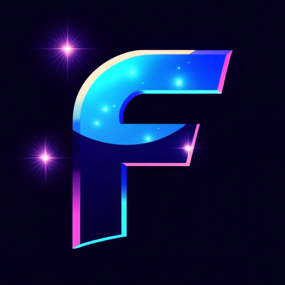

# 🎨 Fonana - Web3 Content Platform

<div align="center">
  
  
  [](https://nextjs.org/)
  [](https://www.typescriptlang.org/)
  [](https://solana.com/)
  [](https://tailwindcss.com/)
  
  **Децентрализованная платформа для контент-криейторов на блокчейне Solana**
  
  [Демо](https://fonana.app) • [Документация](./ROADMAP.md) • [Roadmap](./ROADMAP.md)
</div>

---

## 🚀 О проекте

Fonana - это современная Web3 платформа для монетизации контента, построенная на блокчейне Solana. Создатели могут публиковать эксклюзивный контент, а подписчики получают доступ через криптовалютные подписки.

### ✨ Ключевые особенности

- 🔐 **Вход через Solana кошелек** - безопасная аутентификация без паролей
- 💎 **3 уровня подписок** - Basic, Premium, VIP с разным доступом к контенту
- 📸 **Мультимедиа контент** - поддержка фото, видео, аудио и текста
- 💰 **Прямые выплаты** - создатели получают 95% от подписок напрямую
- 🎨 **Настраиваемые тарифы** - гибкая настройка подписок для каждого автора
- 🌐 **Полностью на русском** - интерфейс адаптирован для русскоязычной аудитории

## 🛠 Технологии

- **Frontend:** Next.js 14, TypeScript, Tailwind CSS
- **Blockchain:** Solana Web3.js, Wallet Adapter
- **Database:** PostgreSQL, Prisma ORM
- **UI/UX:** Headless UI, Hero Icons, React Hot Toast
- **Deployment:** Docker, Nginx

## 📦 Установка

### Требования
- Node.js 18+
- PostgreSQL 14+
- Solana CLI (опционально)

### Быстрый старт

```bash
# Клонировать репозиторий
git clone https://github.com/DukeDeSouth/Fonana.git
cd Fonana

# Установить зависимости
npm install

# Настроить PostgreSQL (автоматически для macOS/Linux)
./scripts/setup-local-postgres.sh
# Или вручную - см. LOCAL_SYNC.md

# Настроить переменные окружения
cp env.example .env.local
# Отредактируйте .env.local и добавьте DATABASE_URL

# Применить миграции БД
npx prisma migrate deploy

# Запустить в режиме разработки
npm run dev
```

Откройте [http://localhost:3000](http://localhost:3000) в браузере.

## 🏗 Структура проекта

```
Fonana/
├── app/                    # Next.js App Router
│   ├── api/               # API endpoints
│   ├── (routes)/          # Страницы приложения
│   └── layout.tsx         # Корневой layout
├── components/            # React компоненты
├── lib/                   # Утилиты и хуки
├── prisma/               # Схема БД и миграции
├── public/               # Статические файлы
└── scripts/              # Деплой скрипты
```

## 🚀 Деплой

### Docker

```bash
docker-compose up -d
```

### Традиционный деплой

```bash
npm run build
npm start
```

Подробные инструкции в [DEPLOYMENT.md](./DEPLOYMENT.md)

## 🗺 Roadmap

### v0.1.0-alpha (Текущая версия)
- ✅ Базовый функционал платформы
- ✅ Система подписок
- ✅ Создание и просмотр контента
- ✅ Профили пользователей

### v0.2.0 (MVP)
- 🔄 Интеграция с реальной БД
- 🔄 Solana Pay для платежей
- 🔄 Система доступа к контенту
- 🔄 Базовая аналитика

### v0.3.0
- 📋 Личные сообщения
- 📋 Расширенный поиск
- 📋 Push уведомления

Полный roadmap в [ROADMAP.md](./ROADMAP.md)

## 🤝 Вклад в проект

Мы приветствуем вклад в развитие Fonana! 

1. Fork репозитория
2. Создайте feature branch (`git checkout -b feature/AmazingFeature`)
3. Commit изменения (`git commit -m 'Add some AmazingFeature'`)
4. Push в branch (`git push origin feature/AmazingFeature`)
5. Откройте Pull Request

## 📄 Лицензия

Этот проект лицензирован под MIT License - см. файл [LICENSE](LICENSE) для деталей.

## 🙏 Благодарности

- [Solana](https://solana.com/) за быстрый и дешевый блокчейн
- [Next.js](https://nextjs.org/) за отличный фреймворк
- [Vercel](https://vercel.com/) за хостинг и инструменты

## 📞 Контакты

- GitHub: [@DukeDeSouth](https://github.com/DukeDeSouth)
- Email: duke@fonana.app
- Twitter: [@FonanaPlatform](https://twitter.com/FonanaPlatform)

---

<div align="center">
  Сделано с ❤️ для Web3 сообщества
</div> 