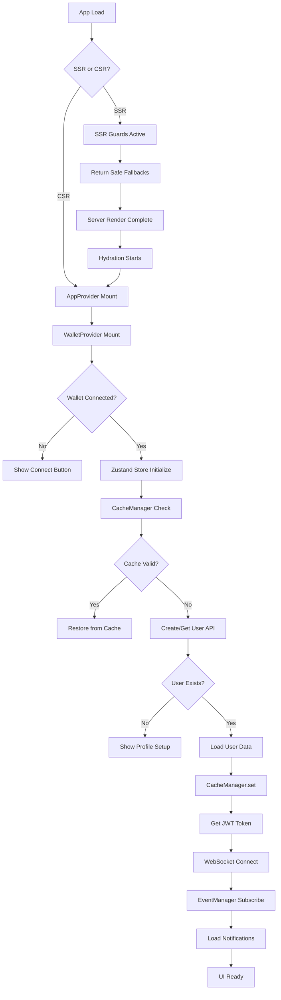
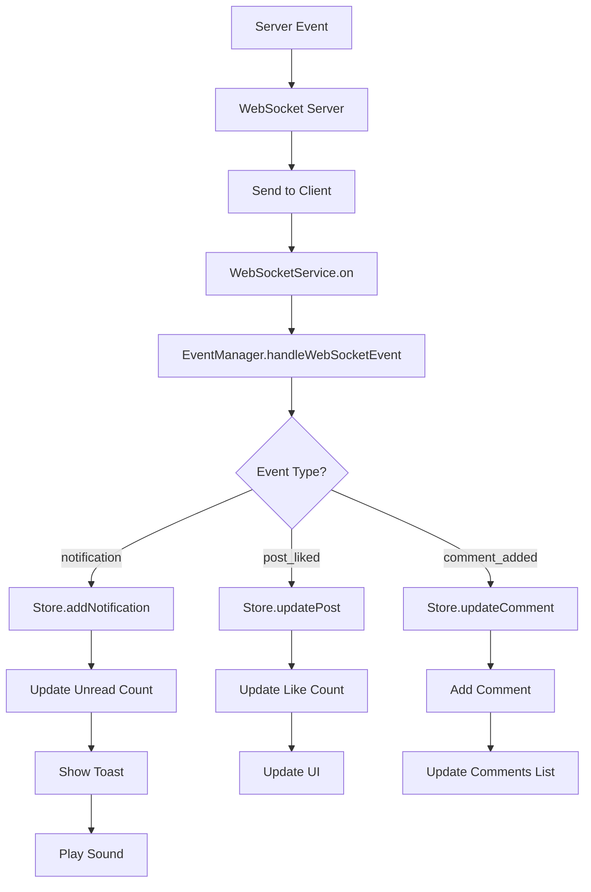

# Fonana Context Flows Documentation

## Схема связей компонентов

```
┌─────────────────┐    ┌─────────────────┐    ┌─────────────────┐
│   WalletProvider│    │  Zustand Store  │    │WebSocketEventManager│
│                 │    │                 │    │                 │
│ • publicKey     │───▶│ • user          │───▶│ • eventHandlers │
│ • connected     │    │ • notifications │    │ • subscriptions │
│ • wallet        │    │ • creatorData   │    │ • emit/on       │
└─────────────────┘    └─────────────────┘    └─────────────────┘
         │                       │                       │
         ▼                       ▼                       ▼
┌─────────────────┐    ┌─────────────────┐    ┌─────────────────┐
│  CacheManager   │    │  AppProvider    │    │  UI Components  │
│                 │    │                 │    │                 │
│ • localStorage  │    │ • initialization│    │ • PostCard      │
│ • TTL           │    │ • retry logic   │    │ • LikeButton    │
│ • fallback      │    │ • error handling│    │ • CommentSection│
└─────────────────┘    └─────────────────┘    └─────────────────┘
         │                       │
         ▼                       ▼
┌─────────────────┐    ┌─────────────────┐
│   API Routes    │    │  Retry System   │
│                 │    │                 │
│ • /api/user     │    │ • retryWithToast│
│ • /api/posts    │    │ • error handling│
│ • /api/notifications│ │ • fallback logic│
└─────────────────┘    └─────────────────┘
```

## Таблица зависимостей компонентов

| Компонент | Depends On | Provides | Subscribes | Triggers |
|-----------|------------|----------|------------|----------|
| **Zustand Store** | `useWallet()` | `user`, `notifications`, `creatorData` | - | `setUser()`, `addNotification()`, `setCreatorData()` |
| **WebSocketEventManager** | `wsService`, `store` | `eventHandlers`, `subscriptions` | `post_liked`, `notification`, `creator_update` | `emit()`, `subscribe()`, `unsubscribe()` |
| **CacheManager** | `localStorage` | `cached data`, `TTL` | - | `set()`, `get()`, `delete()`, `clear()` |
| **AppProvider** | `useWallet()`, `store` | `initialization` | - | `refreshUser()`, `retry logic` |
| **PostCard** | `store`, `eventManager` | `post display` | `post_liked`, `comment_added` | `handleLike()`, `handleComment()` |
| **LikeButton** | `store` | `like state` | - | `handleLike()`, `handleUnlike()` |
| **CommentSection** | `store`, `eventManager` | `comments list` | `comment_added`, `comment_deleted` | `addComment()`, `deleteComment()` |

## Потоки инициализации

### 1. Основной поток инициализации приложения (с SSR guards)



### 2. Поток обработки лайков

```mermaid
graph TD
    A[User Clicks Like] --> B{User in Store?}
    B -->|No| C[CacheManager.get]
    C --> D{Cache Valid?}
    D -->|No| E[Show "Connect Wallet"]
    D -->|Yes| F[Store.setUser]
    F --> G[Recursive Call handleLike]
    G --> H[retryWithToast API Request]
    H --> I[Update Database]
    I --> J[EventManager.emit post_liked]
    J --> K[Update UI Optimistically]
    K --> L[Show Success Toast]
    
    B -->|Yes| H
```

### 3. Поток WebSocket уведомлений



## Детальные связи компонентов

### Zustand Store Dependencies

```typescript
// Прямые зависимости
- useWallet() - Solana Wallet Adapter
  - publicKey: PublicKey | null
  - connected: boolean
  - wallet: Wallet | null

// Store slices
- userSlice: User | null, isLoading, error
- notificationSlice: Notification[], unreadCount
- creatorSlice: CreatorData | null, creatorLoading

// Actions
- setUser(user: User | null)
- refreshUser()
- addNotification(notification: Notification)
- setCreatorData(data: CreatorData | null)
```

### WebSocket Event Manager Dependencies

```typescript
// Сервисы
- wsService - WebSocket подключение
- store - Zustand store для обновлений

// Состояние
- eventHandlers: Map<string, Function[]>
- subscriptions: Set<string>

// Методы
- subscribe(event: string, handler: Function)
- unsubscribe(event: string, handler: Function)
- emit(event: string, data: any)
- handleWebSocketEvent(event: string, data: any)
```

### CacheManager Dependencies

```typescript
// Storage
- localStorage - браузерное хранилище

// TTL система
- CACHE_TTL: 7 * 24 * 60 * 60 * 1000 // 7 дней

// Методы
- set(key: string, value: any, ttl?: number)
- get(key: string): any
- delete(key: string): void
- clear(): void
- isValidCache(timestamp: number): boolean
```

## SSR Guards Architecture (КРИТИЧНО ДЛЯ ПРЕДОТВРАЩЕНИЯ React Error #185)

### SSR Guard Pattern
```typescript
// Обязательный паттерн для всех Zustand хуков
export const useUser = () => {
  // КРИТИЧНО: SSR guard предотвращает React Error #185
  if (typeof window === 'undefined') {
    return null // Безопасное значение для сервера
  }
  return useAppStore(state => state.user)
}

export const useUserActions = () => {
  if (typeof window === 'undefined') {
    // Безопасные заглушки для сервера
    return {
      setUser: () => {},
      refreshUser: async () => {},
      updateProfile: async () => {},
      deleteAccount: async () => {}
    }
  }
  return useAppStore(state => ({
    setUser: state.setUser,
    refreshUser: state.refreshUser,
    updateProfile: state.updateProfile,
    deleteAccount: state.deleteAccount
  }))
}
```

### 🚨 Защищенные хуки (ОБЯЗАТЕЛЬНЫЕ SSR guards)
- ✅ `useUser()` → `null` на сервере
- ✅ `useUserLoading()` → `false` на сервере  
- ✅ `useUserError()` → `null` на сервере
- ✅ `useUserActions()` → пустые функции на сервере
- ✅ `useNotifications()` → `[]` на сервере
- ✅ `useNotificationsLoading()` → `false` на сервере
- ✅ `useNotificationActions()` → пустые функции на сервере
- ✅ `useCreator()` → `null` на сервере
- ✅ `useCreatorLoading()` → `false` на сервере
- ✅ `useCreatorActions()` → пустые функции на сервере

## Цепочки инициализации

### 1. Цепочка подключения кошелька (с SSR защитой)

```
🖥️ SSR Phase:
SSR Guards активны → Все хуки возвращают безопасные значения
    ↓
Server Render завершен без ошибок
    ↓
HTML отправлен клиенту
    ↓
💻 Hydration Phase:
typeof window !== 'undefined'
    ↓
WalletProvider.connected = true
    ↓
AppProvider.useEffect([connected, publicKey])
    ↓
store.refreshUser()
    ↓
CacheManager.get('fonana_user_data')
    ↓
{Valid Cache?} → Yes: store.setUser(cachedData)
    ↓
API POST /api/user (retryWithToast)
    ↓
store.setUser(data.user) + CacheManager.set()
    ↓
EventManager.subscribe('notifications')
    ↓
store.setNotifications(notifications)
    ↓
UI готов к взаимодействию
```

### 2. Цепочка обработки ошибок

```
API Request Fails
    ↓
retryWithToast catches error
    ↓
{retries > 0?} → Yes: delay + retry
    ↓
{retries = 0?} → Yes: toast.error()
    ↓
CacheManager fallback (if available)
    ↓
Graceful degradation
```

### 3. Цепочка WebSocket событий

```
Server Event
    ↓
WebSocketService.on(event)
    ↓
EventManager.handleWebSocketEvent(event, data)
    ↓
{Event Type?}
    ↓
post_liked → store.updatePost()
notification → store.addNotification()
comment_added → store.updateComment()
    ↓
UI re-render (Zustand subscription)
    ↓
Toast notification (if applicable)
```

## Миграция с React Context

### Удаленные компоненты
- ❌ `UserContext` → ✅ `Zustand userSlice`
- ❌ `NotificationContext` → ✅ `Zustand notificationSlice`
- ❌ `CreatorContext` → ✅ `Zustand creatorSlice`

### Обновленные хуки
- `useUserContext()` → `useAppStore(state => state.user)`
- `useNotificationContext()` → `useAppStore(state => state.notifications)`
- `useCreatorData()` → `useAppStore(state => state.creatorData)`

### Новые компоненты
- ✅ `AppProvider` - единая точка инициализации
- ✅ `CacheManager` - централизованное кеширование
- ✅ `WebSocketEventManager` - управление событиями
- ✅ `retryWithToast` - обработка ошибок 