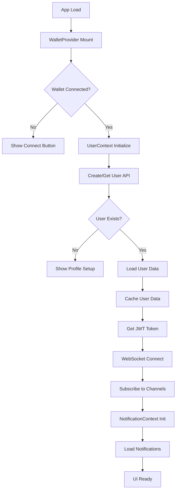
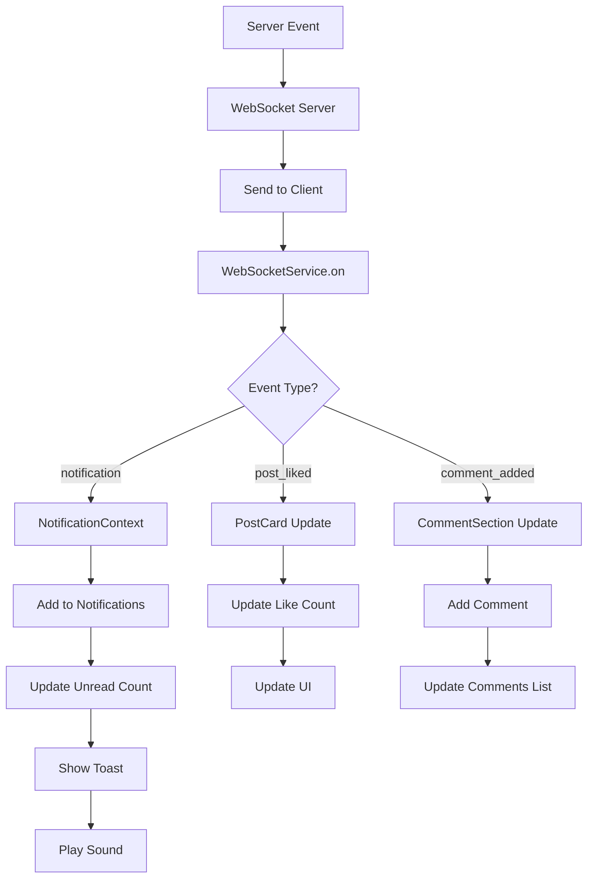

# Fonana Context Flows Documentation

## Схема связей компонентов

```
┌─────────────────┐    ┌─────────────────┐    ┌─────────────────┐
│   WalletProvider│    │  UserContext    │    │NotificationContext│
│                 │    │                 │    │                 │
│ • publicKey     │───▶│ • user          │───▶│ • notifications │
│ • connected     │    │ • isLoading     │    │ • unreadCount   │
│ • wallet        │    │ • error         │    │ • refresh       │
└─────────────────┘    └─────────────────┘    └─────────────────┘
         │                       │                       │
         ▼                       ▼                       ▼
┌─────────────────┐    ┌─────────────────┐    ┌─────────────────┐
│  WebSocketService│    │  CreatorContext │    │  ThemeContext   │
│                 │    │                 │    │                 │
│ • connection    │    │ • creator       │    │ • theme         │
│ • subscriptions │    │ • posts         │    │ • toggleTheme   │
│ • events        │    │ • analytics     │    │                 │
└─────────────────┘    └─────────────────┘    └─────────────────┘
         │                       │
         ▼                       ▼
┌─────────────────┐    ┌─────────────────┐
│   API Routes    │    │  UI Components  │
│                 │    │                 │
│ • /api/user     │    │ • PostCard      │
│ • /api/posts    │    │ • LikeButton    │
│ • /api/notifications│ │ • CommentSection│
└─────────────────┘    └─────────────────┘
```

## Таблица зависимостей компонентов

| Компонент | Depends On | Provides | Subscribes | Triggers |
|-----------|------------|----------|------------|----------|
| **UserContext** | `useWallet()` | `user`, `isLoading`, `error` | - | `createOrGetUser()`, `refreshUser()` |
| **NotificationContext** | `UserContext`, `wsService` | `notifications`, `unreadCount` | `notification`, `notification_read` | `refreshNotifications()`, `markAsRead()` |
| **WebSocketService** | `getJWTToken()` | `connection`, `events` | - | `connect()`, `subscribe()`, `emit()` |
| **CreatorContext** | `UserContext`, `wsService` | `creator`, `posts`, `analytics` | `creator_update`, `new_post` | `refreshCreator()`, `loadPosts()` |
| **ThemeContext** | - | `theme`, `isDark` | - | `toggleTheme()`, `setTheme()` |
| **PostCard** | `UserContext`, `wsService` | `post display` | `post_liked`, `comment_added` | `handleLike()`, `handleComment()` |
| **LikeButton** | `UserContext` | `like state` | - | `handleLike()`, `handleUnlike()` |
| **CommentSection** | `UserContext`, `wsService` | `comments list` | `comment_added`, `comment_deleted` | `addComment()`, `deleteComment()` |

## Потоки инициализации

### 1. Основной поток инициализации приложения



### 2. Поток обработки лайков

```mermaid
graph TD
    A[User Clicks Like] --> B{User Context Available?}
    B -->|No| C[Check LocalStorage Cache]
    C --> D{Cache Valid?}
    D -->|No| E[Show "Connect Wallet"]
    D -->|Yes| F[Restore User from Cache]
    F --> G[Recursive Call handleLike]
    G --> H[API Request /api/posts/like]
    H --> I[Update Database]
    I --> J[WebSocket Event post_liked]
    J --> K[Update UI Optimistically]
    K --> L[Show Success Toast]
    
    B -->|Yes| H
```

### 3. Поток WebSocket уведомлений



## Детальные связи компонентов

### UserContext Dependencies

```typescript
// Прямые зависимости
- useWallet() - Solana Wallet Adapter
  - publicKey: PublicKey | null
  - connected: boolean
  - wallet: Wallet | null

// Внутренние состояния
- user: User | null
- isLoading: boolean
- error: Error | null
- isNewUser: boolean

// Методы
- createOrGetUser(wallet: string)
- refreshUser()
- updateProfile(data: ProfileData)
- deleteAccount()
```

### WebSocket Service Dependencies

```typescript
// Аутентификация
- getJWTToken() - JWT токен для подключения

// Состояние подключения
- ws: WebSocket | null
- isConnecting: boolean
- reconnectAttempts: number

// Подписки
- subscribedChannels: Map<string, SubscriptionChannel>

// События
- EventEmitter (on, off, emit)
```

### NotificationContext Dependencies

```typescript
// Контексты
- useUserContext() - для получения user.id

// Сервисы
- wsService - для WebSocket подписки
- getJWTToken() - для API запросов

// Состояния
- notifications: Notification[]
- unreadCount: number
- isLoading: boolean
- error: string | null

// Методы
- refreshNotifications()
- markAsRead(id: string)
- markAllAsRead()
- deleteNotification(id: string)
```

## Цепочки инициализации

### 1. Цепочка подключения кошелька

```
WalletProvider.connected = true
    ↓
UserContext.useEffect([connected, publicKey])
    ↓
createOrGetUser(publicKey.toString())
    ↓
API POST /api/user
    ↓
setUser(data.user) + setCachedUserData()
    ↓
NotificationContext.useEffect([user?.id])
    ↓
wsService.subscribeToNotifications(user.id)
    ↓
refreshNotifications()
    ↓
UI готов к взаимодействию
```

### 2. Цепочка обработки лайка

```
User clicks LikeButton
    ↓
handleLike() проверяет user?.id
    ↓
Если user = null → fallback на localStorage
    ↓
API POST /api/posts/[id]/like
    ↓
Database update (likes table + post.likesCount)
    ↓
WebSocket emit('post_liked', {postId, userId, likesCount})
    ↓
PostCard получает событие через wsService.on('post_liked')
    ↓
Optimistic UI update
    ↓
Toast notification
```

### 3. Цепочка уведомлений

```
Server event (like, comment, subscription)
    ↓
WebSocket server broadcast
    ↓
Client WebSocketService.on('notification')
    ↓
NotificationContext.handleNewNotification()
    ↓
setNotifications(prev => [newNotification, ...prev])
    ↓
setUnreadCount(prev => prev + 1)
    ↓
showNotificationToast()
    ↓
playNotificationSound()
```

## Критические точки синхронизации

### 1. Синхронизация UserContext и WebSocket

```typescript
// Проблема: WebSocket подключается до загрузки пользователя
useEffect(() => {
  if (!user?.id) return // Критическая проверка
  
  wsService.subscribeToNotifications(user.id)
  wsService.subscribeToFeed(user.id)
}, [user?.id]) // Только user?.id в зависимостях
```

### 2. Синхронизация кеша и состояния

```typescript
// Проблема: Несоответствие кеша и состояния
const getCachedUserData = (wallet: string): User | null => {
  const savedData = localStorage.getItem('fonana_user_data')
  const savedWallet = localStorage.getItem('fonana_user_wallet')
  
  if (savedData && savedWallet === wallet) {
    return JSON.parse(savedData)
  }
  return null
}
```

### 3. Синхронизация WebSocket событий

```typescript
// Проблема: События приходят до готовности UI
const handlePostLikedThrottled = throttle((event) => {
  if (!user?.id) return // Защита от преждевременных событий
  
  batchUpdate(event.postId, {
    engagement: {
      likes: event.likesCount,
      isLiked: event.userId === user.id
    }
  })
}, 500)
```

## Правила взаимодействия

### 1. Правила для UserContext

- **НЕ использовать** UserContext до `user?.id` доступен
- **Всегда проверять** `isLoading` перед действиями
- **Использовать fallback** на кеш при `user = null`
- **Рекурсивно вызывать** функции после восстановления пользователя

### 2. Правила для WebSocket

- **Проверять подключение** перед отправкой событий
- **Throttle** частые события (лайки, комментарии)
- **Fallback на HTTP API** при недоступности WebSocket
- **Автоматически переподписываться** при переподключении

### 3. Правила для уведомлений

- **Загружать начальные данные** при инициализации
- **Обновлять в реальном времени** через WebSocket
- **Показывать toast** для важных событий
- **Воспроизводить звук** для новых уведомлений

### 4. Правила для UI компонентов

- **Проверять user?.id** перед любыми действиями
- **Показывать loading состояния** при `isLoading`
- **Обрабатывать ошибки** gracefully
- **Обновлять оптимистично** для лучшего UX

## Диагностика проблем

### 1. Проблема: "wallet есть, user нет"

```typescript
// Диагностика
console.log('Wallet state:', { connected, publicKey: publicKey?.toString() })
console.log('User state:', { user: user?.id, isLoading, error })

// Решение
if (!user && connected && publicKey) {
  const cachedUser = getCachedUserData(publicKey.toString())
  if (cachedUser) {
    setUser(cachedUser)
  } else {
    refreshUser() // Принудительное обновление
  }
}
```

### 2. Проблема: "WebSocket не подключается"

```typescript
// Диагностика
console.log('WebSocket status:', wsService.isConnected())
console.log('JWT token:', await getJWTToken())

// Решение
if (!wsService.isConnected()) {
  const token = await getJWTToken()
  if (token) {
    wsService.connect()
  }
}
```

### 3. Проблема: "Уведомления не приходят"

```typescript
// Диагностика
console.log('NotificationContext state:', { 
  user: user?.id, 
  wsConnected: wsService.isConnected(),
  notifications: notifications.length 
})

// Решение
if (user?.id && !wsService.isConnected()) {
  wsService.subscribeToNotifications(user.id)
  refreshNotifications() // Fallback на HTTP
}
``` 