# 🏗️ ARCHITECTURE CONTEXT: Fast Refresh Full Page Reloads

## 📅 Дата: 17.01.2025
## 🏷️ ID: [fast_refresh_reload_2025_017]

---

## 🔗 Affected Components

### 1. Root Layout (`app/layout.tsx`)
- **Issue**: Mixed exports pattern
- **Code**:
  ```typescript
  export const metadata: Metadata = { ... }  // Named export
  export default function RootLayout() { ... } // Default export
  ```
- **Impact**: Any change to layout.tsx forces full reload
- **Severity**: High - affects entire app

### 2. ErrorBoundary (`components/ErrorBoundary.tsx`)
- **Issue**: Class component with mixed exports
- **Code**:
  ```typescript
  export class ErrorBoundary extends React.Component
  export function useErrorHandler()
  export default ErrorBoundary
  ```
- **Impact**: Class components have limited Fast Refresh support
- **Severity**: Medium - only affects error handling

### 3. Messages Layout (`app/messages/layout.tsx`)
- **Issue**: New file created during session
- **Status**: Clean - no mixed exports
- **Impact**: Should support Fast Refresh

### 4. Provider Components
- **Files**: Multiple provider components with console logs
- **Pattern**: Initialization logs outside useEffect
- **Impact**: Potential re-initialization on updates

---

## 🌊 Hot Module Replacement Flow

```mermaid
flowchart TD
    A[File Change] --> B{Module Type?}
    B -->|Layout with metadata| C[Full Reload Required]
    B -->|Component Only| D{Has Side Effects?}
    D -->|Yes| E[Full Reload]
    D -->|No| F{Anonymous?}
    F -->|Yes| G[Full Reload]
    F -->|No| H[Fast Refresh ✓]
    
    style C fill:#f96,stroke:#333,stroke-width:4px
    style E fill:#f96,stroke:#333,stroke-width:4px
    style G fill:#f96,stroke:#333,stroke-width:4px
    style H fill:#9f6,stroke:#333,stroke-width:4px
```



---

## 📦 Module Analysis

### Next.js App Router Constraints
1. **Metadata Export**: Must be in layout/page files
2. **Server Components**: Different HMR behavior
3. **Client Components**: Need 'use client' directive
4. **Mixed Exports**: Break Fast Refresh

### Current Module Structure
```
app/
├── layout.tsx (metadata + component) ❌
├── page.tsx (component only) ✓
├── messages/
│   ├── layout.tsx (component only) ✓
│   └── [id]/
│       └── page.tsx (component only) ✓
└── feed/
    └── page.tsx (component only) ✓
```

---

## 🏛️ Fast Refresh Requirements

### From Next.js Documentation
1. **Named Function Components**
   ```typescript
   // ✓ Good
   export default function Component() {}
   
   // ❌ Bad
   export default () => {}
   ```

2. **Single Component Exports**
   ```typescript
   // ✓ Good
   export default function Page() {}
   
   // ❌ Bad
   export default function Page() {}
   export const helper = () => {}
   ```

3. **No Module Side Effects**
   ```typescript
   // ✓ Good
   function Component() {
     useEffect(() => {
       console.log('mounted')
     }, [])
   }
   
   // ❌ Bad
   console.log('module loaded')
   function Component() {}
   ```

---

## 🔌 Integration Points

### 1. Webpack HMR
```
_next/static/webpack/*.webpack.hot-update.json
_next/static/webpack/*.hot-update.js
```
- **Status**: Loading successfully
- **Issue**: Full reload triggered anyway

### 2. React Refresh Runtime
- **Location**: Injected by Next.js
- **Requirement**: Clean module boundaries
- **Current**: Broken by mixed exports

### 3. Development Server
- **File Watching**: Working
- **Module Updates**: Sent correctly
- **Application**: Full reload instead of patch

---

## 🚨 Architecture Issues

### 1. Metadata in Layout
- **Problem**: Next.js requires metadata export in layouts
- **Conflict**: Fast Refresh requires single export
- **Solution**: This is by design, layout changes require reload

### 2. Global State Re-initialization
- **Problem**: Providers re-initialize on every change
- **Evidence**: Double "Initializing..." logs
- **Impact**: Lost state, WebSocket reconnects

### 3. Class Component Usage
- **File**: `ErrorBoundary.tsx`
- **Issue**: Class components don't fully support Fast Refresh
- **Workaround**: Convert to functional with error hooks

### 4. Console Logging Pattern
- **Pattern**: Extensive logging for debugging
- **Location**: Inside components but frequent
- **Impact**: Visual noise, potential performance

---

## 🔍 Hidden Dependencies

### 1. Service Worker
```
[LOG] [SW] Skipping registration in development
```
- **Impact**: None - correctly disabled in dev

### 2. WebSocket Manager
- **Reconnects**: On every reload
- **State**: Lost connections
- **User Impact**: Delayed real-time updates

### 3. JWT Token Management
```
[LOG] [JWT] Loading token from localStorage...
[LOG] [JWT] No token found in localStorage
```
- **Re-runs**: Every reload
- **Storage**: Persistent but re-read

---

## 📊 Fast Refresh Compatibility Matrix

| File Type | Current Status | Fast Refresh Support | Action Needed |
|-----------|---------------|---------------------|---------------|
| app/layout.tsx | ❌ Mixed exports | No (by design) | None - expected |
| app/page.tsx | ✅ Clean | Yes | None |
| Components | ⚠️ Some class | Partial | Convert to functional |
| Providers | ⚠️ Side effects | Partial | Wrap logs in effects |
| Hooks | ✅ Clean | Yes | None |
| Utils | ✅ Not components | N/A | None |

---

## ✅ Architecture Context Summary

### Root Cause Identified
1. **Primary**: `app/layout.tsx` metadata export (unfixable - Next.js design)
2. **Secondary**: ErrorBoundary class component
3. **Minor**: Console logging patterns

### Expected vs Actual
- **Expected**: Layout changes = full reload ✓
- **Expected**: Component changes = Fast Refresh ✓
- **Actual**: Many component changes = full reload ❌

### Key Finding
The main issue is NOT the layout.tsx file - that's expected behavior. The problem is that Fast Refresh fails for other components too, suggesting additional issues.

**Next Step**: Create SOLUTION_PLAN.md focusing on fixable issues 