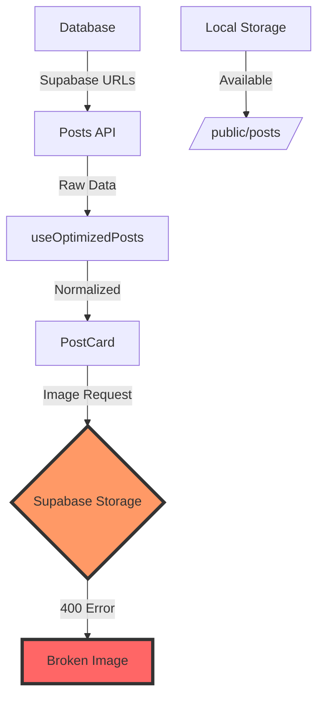

# 🏗️ ARCHITECTURE CONTEXT: Feed Page 400 Errors

## 📅 Дата: 17.01.2025
## 🏷️ ID: [feed_400_errors_2025_017]

---

## 🔗 Affected Components

### 1. PostCard Component
- **File**: Various (FeedCard, UnifiedPost components)
- **Role**: Renders post with thumbnail/media
- **Issue**: No error handling for failed images

### 2. OptimizedImage Component
- **File**: `components/OptimizedImage.tsx`
- **Role**: Next.js Image wrapper with lazy loading
- **Current**: Has onError prop but not utilized

### 3. useOptimizedPosts Hook
- **File**: `lib/hooks/useOptimizedPosts.ts`
- **Role**: Fetches and normalizes posts
- **Status**: Successfully loads posts, doesn't handle media URLs

### 4. Posts API
- **File**: `app/api/posts/route.ts`
- **Role**: Returns posts with Supabase URLs
- **Issue**: Doesn't validate/transform media URLs

---

## 🌊 Data Flow Analysis



---

## 📦 Storage Architecture

### Current State
```
Database URLs:
- thumbnail: "https://iwzfrnfemdeomowothhn.supabase.co/storage/v1/object/public/posts/images/thumb_*.webp"
- mediaUrl: "https://iwzfrnfemdeomowothhn.supabase.co/storage/v1/object/public/posts/*.jpg"

Local Storage:
- /public/posts/images/
  - thumb_*.webp (some files exist)
  - preview_*.webp 
  - *.JPG (original files)
```

### Database Statistics
- **Total Posts**: 279
- **Supabase Thumbnails**: 242 (87%)
- **Supabase Media**: 242 (87%)
- **Local URLs**: 37 (13%)

---

## 🏛️ Image Handling Patterns

### 1. Direct URL Usage
```typescript
// Current implementation

// No fallback, no error handling
```

### 2. OptimizedImage Component
```typescript
// Has error handling capability
<OptimizedImage
  src={thumbnail}
  alt={title}
  onError={(e) => { /* Not implemented */ }}
/>
```

### 3. Avatar Fallback Pattern
```typescript
// Working pattern from Avatar component
src={avatar || `/api/avatar/${nickname}`}
// Fallback to generated avatar
```

---

## 🔌 Integration Points

### 1. Image Loading Pipeline
```
PostCard → OptimizedImage → Next/Image → Browser → Supabase (FAIL)
                                              ↓
                                          Error Event
```

### 2. Potential Intervention Points
- **API Level**: Transform URLs before sending
- **Hook Level**: Normalize URLs in useOptimizedPosts
- **Component Level**: Handle errors in OptimizedImage
- **Global Level**: Next.js image loader configuration

### 3. Next.js Image Configuration
```javascript
// next.config.js
module.exports = {
  images: {
    domains: ['localhost', 'iwzfrnfemdeomowothhn.supabase.co'],
    // Could add custom loader
  }
}
```

---

## 🏷️ URL Patterns

### Supabase URL Structure
```
https://iwzfrnfemdeomowothhn.supabase.co/storage/v1/object/public/posts/
├── images/
│   ├── thumb_[hash].webp     // Thumbnails
│   └── preview_[hash].webp   // Previews
└── [hash].jpg               // Original media
```

### Local URL Structure
```
http://localhost:3000/
└── posts/
    └── images/
        ├── thumb_[hash].webp
        ├── preview_[hash].webp
        └── [hash].JPG
```

### Mapping Pattern
```
Supabase: .../storage/v1/object/public/posts/images/thumb_ABC.webp
Local:    /posts/images/thumb_ABC.webp
```

---

## 🚨 Architecture Issues

### 1. No Fallback Strategy
- Components expect URLs to always work
- No placeholder or error state
- Silent failures in UI

### 2. Mixed Storage Sources
- 87% Supabase (broken)
- 13% Local (working)
- No unified approach

### 3. Missing Abstraction Layer
- Direct URL usage throughout
- No centralized media handling
- Difficult to implement fixes

### 4. No Media Validation
- URLs not checked on save
- No migration performed
- No health checks

---

## 🔍 Hidden Dependencies

### 1. SEO/Meta Tags
- Open Graph images might be broken
- Twitter cards affected
- Search engine indexing impacted

### 2. Performance
- Failed requests still consume bandwidth
- Browser retry attempts
- Memory for broken image placeholders

### 3. User Upload Flow
```typescript
// From upload components
const uploadUrl = await uploadToSupabase()
// Still trying to use Supabase for new uploads?
```

---

## ✅ Architecture Context Checklist

- [x] All affected components mapped
- [x] Data flow documented
- [x] Storage architecture analyzed
- [x] Integration points identified
- [x] URL patterns decoded
- [x] Hidden dependencies found
- [x] Current statistics gathered

---

## 🎯 Key Findings

1. **Scale**: 242 of 279 posts (87%) have broken media
2. **Pattern**: Clear URL structure allows systematic fix
3. **Partial Solution**: Some images already exist locally
4. **Quick Win**: URL rewriting could work for existing local files

**Next Step**: Create SOLUTION_PLAN.md with phased approach 