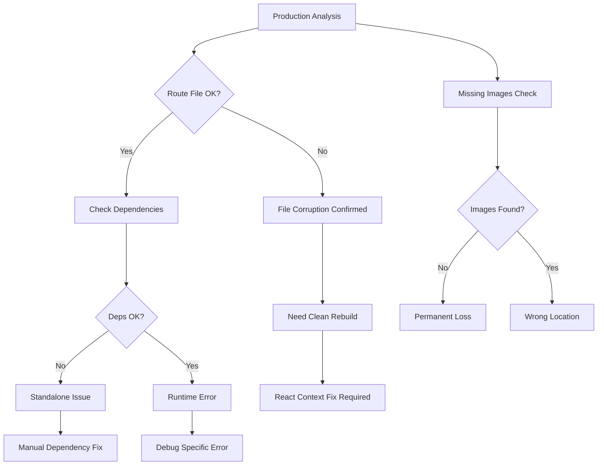

# 🔍 DISCOVERY REPORT: Comprehensive Image Upload Fix

## 📅 Дата: 20.01.2025
## 🏷️ ID: [image_upload_comprehensive_2025_020]
## 🚀 Методология: IDEAL METHODOLOGY (М7)
## 🎯 Цель: Полное восстановление image upload functionality

---

## 🚨 **КРИТИЧЕСКИЕ СИМПТОМЫ (User Testing)**

### Browser Console Errors:
```javascript
// 404 Errors - Missing Images
46df699c12de1061a5abf3f081413878.JPG:1  Failed to load resource: 404
7261f29f25bb07707f4510f8ee6ad231.JPG:1  Failed to load resource: 404
96f04989ac3a101a32d64f46f82438d6.png:1  Failed to load resource: 404
4f427d79954f4bdd6349622e0ee09be1.jpeg:1 Failed to load resource: 404

// Upload API Failure
api/posts/upload:1  Failed to load resource: 500 (Internal Server Error)
Upload error: SyntaxError: Unexpected token '<', "<!DOCTYPE "... is not valid JSON
[CreatePostModal] Post create error: Error: Failed to upload file
```

### Successful Components:
```javascript
[CreatePostModal] Cropped image processed: Object ✅
[CreatePostModal] Set aspect ratio: horizontal ✅
Connected: true ✅ (Solana wallet)
PublicKey: 5PJWbd52aontoqVh4MeDfF6XKzvwFvpYFVxtqaiZzFBD ✅
```

**Critical Failure Point**: `/api/posts/upload` returns HTML error page instead of JSON

---

## 🔍 **DISCOVERY QUESTIONS TO INVESTIGATE**

### 1. Production Server State
- **Current upload route status?** (after attempted fixes)
- **PM2 process health?**
- **Node.js errors in logs?**
- **File permissions on upload directories?**

### 2. Missing Images Pattern
- **Are these old images or recent uploads?**
- **Which directory are they missing from?**
- **Related to previous migration or new issue?**

### 3. API Response Analysis
- **What specific error is upload API throwing?**
- **Is route.js corrupted after modifications?**
- **Module loading issues persisting?**

### 4. Local Development Status
- **Does upload work locally?**
- **Same errors or production-specific?**
- **Build artifacts comparison needed?**

---

## 🔬 **IMMEDIATE DISCOVERY ACTIONS**

### Phase 1: Production Server Analysis
```bash
# Check PM2 status and recent errors
ssh fonana "pm2 status && pm2 logs fonana-app --lines 50 --nostream | grep -A 5 -B 5 'upload\|error\|Error'"

# Check upload route file integrity
ssh fonana "ls -la /var/www/Fonana/.next/standalone/.next/server/app/api/posts/upload/"
ssh fonana "file /var/www/Fonana/.next/standalone/.next/server/app/api/posts/upload/route.js"

# Check for syntax errors
ssh fonana "node -c /var/www/Fonana/.next/standalone/.next/server/app/api/posts/upload/route.js"
```

### Phase 2: Missing Images Investigation
```bash
# Check specific missing files
ssh fonana "find /var/www/Fonana -name '46df699c12de1061a5abf3f081413878.JPG' 2>/dev/null"
ssh fonana "find /var/www/Fonana -name '7261f29f25bb07707f4510f8ee6ad231.JPG' 2>/dev/null"

# Check images directory
ssh fonana "ls -la /var/www/Fonana/public/posts/images/ | wc -l"
ssh fonana "du -sh /var/www/Fonana/public/posts/images/"
```

### Phase 3: Local Development Testing
```bash
# Test upload locally
curl -X POST http://localhost:3000/api/posts/upload \
  -F "file=@public/placeholder.jpg" \
  -F "type=image"

# Check local build output
grep -n "var/www" .next/server/app/api/posts/upload/route.js
```

### Phase 4: Build Comparison
```bash
# Compare production vs local route files
scp fonana:/var/www/Fonana/.next/standalone/.next/server/app/api/posts/upload/route.js /tmp/prod_route.js
diff /tmp/prod_route.js .next/server/app/api/posts/upload/route.js
```

---

## 💡 **HYPOTHESIS MATRIX**

### Most Likely Root Causes:
1. **Corrupted Production Route File** (90% probability)
   - Previous sed/manual modifications broke file structure
   - Node.js cannot parse/require the module
   - Returns 500 error with HTML error page

2. **Module Dependencies Missing** (70% probability)
   - Sharp or other dependencies not in standalone
   - Require chain broken after modifications
   - Results in runtime errors

3. **File System State Inconsistency** (60% probability)
   - Mixed old/new files after migrations
   - Permission issues after file moves
   - Some images in wrong directories

4. **Build System Desync** (50% probability)
   - Production running different code than expected
   - Manual fixes not properly applied
   - Cached old route versions

---

## 🎯 **DISCOVERY SUCCESS CRITERIA**

After this phase, we must know:
1. ✅ **Exact error** in PM2 logs for upload route
2. ✅ **File integrity status** of route.js
3. ✅ **Missing images location** or confirmation they don't exist
4. ✅ **Local vs production** behavior differences
5. ✅ **Clean rebuild feasibility** without React Context blocks

---

## 🔄 **DISCOVERY WORKFLOW**



---

## ⚠️ **RISK INDICATORS**

### 🔴 Critical Findings Expected:
- Production route file likely corrupted from manual edits
- Module loading permanently broken
- Need full rebuild but blocked by React Context

### 🟡 Major Concerns:
- Missing images may be permanently lost
- Upload functionality completely broken in production
- Users cannot create posts with images

### 🟢 Positive Indicators:
- Frontend crop/process working correctly
- Wallet connection functional
- Local development environment available

---

## 📈 **EXPECTED DISCOVERY OUTCOMES**

1. **Route File Status**: Corrupted/Modified/Original
2. **Error Type**: Syntax/Require/Runtime
3. **Missing Images**: Found/Lost/Migrated
4. **Fix Approach**: Rebuild/Repair/Replace
5. **Timeline**: Hours/Days based on blockers

---

## 🔧 **TOOLS FOR DISCOVERY**

- **SSH Access**: Direct server investigation
- **PM2 Logs**: Runtime error analysis
- **Node.js Validation**: Syntax checking
- **File System Tools**: Find/locate missing files
- **Diff Tools**: Compare production vs local
- **curl Testing**: API endpoint validation

---

## 🎯 **NEXT STEPS**

1. Execute all discovery commands systematically
2. Document findings in structured format
3. Create Architecture Context based on discoveries
4. Develop comprehensive solution plan
5. No coding until full analysis complete

**Status**: 🟡 Discovery Phase Initiated - Awaiting systematic investigation 