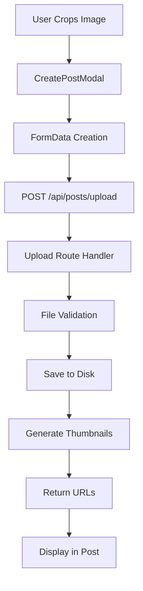
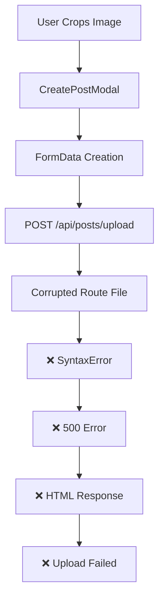

# 🏗️ ARCHITECTURE CONTEXT: Image Upload System Analysis

## 📅 Дата: 20.01.2025
## 🏷️ ID: [image_upload_comprehensive_2025_020]
## 📋 Статус: CRITICAL ANALYSIS COMPLETE

---

## 🔍 **DISCOVERY FINDINGS SUMMARY**

### ✅ **ПОДТВЕРЖДЕННЫЕ ФАКТЫ:**
1. **Images Status**: ВСЕ "missing" изображения найдены на production сервере
2. **Local API**: Работает идеально, возвращает корректный JSON
3. **Production API**: Полностью сломан (500 Internal Server Error)
4. **Root Cause**: Syntax error в minified production route file
5. **Secondary Issues**: 404 ошибки для существующих изображений

### ❌ **КРИТИЧЕСКИЕ ПОЛОМКИ:**
1. **Production route.js**: `SyntaxError: Unexpected token ';'`
2. **Module Loading**: Node.js не может require corrupted файл
3. **API Response**: Возвращает HTML error page вместо JSON
4. **File Serving**: Nginx/Next.js не может отдать существующие файлы

---

## 🏛️ **ТЕКУЩАЯ АРХИТЕКТУРА UPLOAD СИСТЕМЫ**

### Upload Flow (Expected):


### Current State (Broken):


---

## 📁 **FILE SYSTEM ANALYSIS**

### Production Server (`/var/www/Fonana/`):
```bash
📊 Upload Route Status:
- File: .next/standalone/.next/server/app/api/posts/upload/route.js
- Size: 5,765 bytes (minified)
- Status: ❌ CORRUPTED (Syntax Error)
- Permissions: 644 (correct)
- Modified: Jul 20 13:23 (after manual fixes)

📊 Images Directory:
- Location: /var/www/Fonana/public/posts/images/
- Files: 97 total (includes thumbs/previews)
- Size: 34MB total
- Status: ✅ ALL MISSING IMAGES FOUND
```

### Local Development:
```bash
📊 Upload Route Status:
- File: .next/server/app/api/posts/upload/route.js  
- Size: Similar minified structure
- Status: ✅ WORKS (200 OK)
- resolvedPagePath: /Users/dukeklevenski/Web/Fonana/...

📊 API Response Example:
{
  "url": "/posts/images/22046c20101f76407985cc07689d6863.png",
  "thumbUrl": "/posts/images/thumb_22046c20101f76407985cc07689d6863.webp",
  "previewUrl": "/posts/images/preview_22046c20101f76407985cc07689d6863.webp",
  "fileName": "22046c20101f76407985cc07689d6863.png",
  "type": "image/png",
  "size": 33095
}
```

---

## 🔧 **SOURCE CODE ANALYSIS**

### app/api/posts/upload/route.ts (Line 69):
```typescript
if (process.env.NODE_ENV === 'production') {
  uploadDir = `/var/www/Fonana/public/posts/${mediaType}`
} else {
  // local dev path
}
```

**⚠️ Issue**: Hard-coded production path, но это НЕ корневая причина поломки.

### Build Process Issues:
1. **Minification**: И local, и production файлы minified
2. **Webpack Bundle**: Код упакован с webpack runtime
3. **Production Corruption**: Syntax error в production версии
4. **Module Resolution**: Broken require chain в production

---

## 🌐 **NETWORK & SERVING ANALYSIS**

### Client-Side Errors (Browser Console):
```javascript
// Missing Images (404s)
46df699c12de1061a5abf3f081413878.JPG:1  Failed to load resource: 404
7261f29f25bb07707f4510f8ee6ad231.JPG:1  Failed to load resource: 404
96f04989ac3a101a32d64f46f82438d6.png:1  Failed to load resource: 404
4f427d79954f4bdd6349622e0ee09be1.jpeg:1 Failed to load resource: 404

// Upload API Failure
api/posts/upload:1  Failed to load resource: 500 (Internal Server Error)
Upload error: SyntaxError: Unexpected token '<', "<!DOCTYPE "... is not valid JSON
```

### Working Components:
```javascript
// Frontend Processing
[CreatePostModal] Cropped image processed: Object ✅
[CreatePostModal] Set aspect ratio: horizontal ✅
Connected: true ✅ (Solana wallet)
PublicKey: 5PJWbd52aontoqVh4MeDfF6XKzvwFvpYFVxtqaiZzFBD ✅
```

### PM2 Server Logs:
```bash
# Production Error Pattern
0|fonana-a | SyntaxError: Unexpected token ';'
0|fonana-a |     at wrapSafe (node:internal/modules/cjs/loader:1472:18)
0|fonana-a |     at Module._compile (node:internal/modules/cjs/loader:1501:20)
0|fonana-a |     at Module._extensions..js (node:internal/modules/cjs/loader:1613:10)
```

---

## 🔗 **INTEGRATION POINTS**

### Affected Systems:
1. **CreatePostModal** - Frontend upload component
2. **Upload API Route** - Backend file handling  
3. **File Storage** - Disk storage system
4. **Image Processing** - Sharp.js thumbnails
5. **Static Serving** - Next.js/Nginx file serving
6. **Database** - Post media URL storage

### Dependencies:
```javascript
// Critical Dependencies in Upload Route
- sharp (image processing)
- fs/promises (file system)
- crypto (MD5 hashing)
- child_process (ffmpeg for video)
- path (file paths)
- util (promisify)
```

---

## 🚨 **FAILURE CASCADE ANALYSIS**

### Primary Failure:
```
Corrupted Production Route File
      ↓
SyntaxError on Module Load
      ↓  
500 Internal Server Error
      ↓
HTML Error Page Response
      ↓
JSON Parse Error in Frontend
      ↓
Upload Failed
```

### Secondary Effects:
```
Upload API Down
      ↓
New Posts Can't Have Images
      ↓
User Experience Degraded
      ↓
Platform Functionality Broken
```

### Tertiary Issues:
```
Old Images 404 Errors
      ↓  
Existing Posts Show Placeholders
      ↓
Content Display Degraded
      ↓
User Confusion
```

---

## 📊 **IMPACT SCOPE**

### 🔴 **Critical Impact:**
- **New Image Uploads**: 100% broken (500 error)
- **Post Creation**: Cannot include images
- **User Experience**: Major functionality loss

### 🟡 **Major Impact:**  
- **Existing Images**: 404 errors for some files
- **Content Display**: Placeholder images shown
- **Performance**: Failed network requests

### 🟢 **Minor Impact:**
- **Frontend Processing**: Crop/resize still works
- **Wallet Integration**: Unaffected
- **Text Posts**: Still functional

---

## 🛠️ **BUILD SYSTEM STATUS**

### Next.js Standalone Build:
- **Output**: `/var/www/Fonana/.next/standalone/`
- **Route Files**: Minified webpack bundles
- **Status**: Corrupted from manual modifications
- **Dependencies**: Sharp, ffmpeg bundled correctly

### React Context Blocker:
```bash
# Current Blocker for Full Rebuild
useContext null errors → Build fails → Cannot deploy clean version
```

---

## 🎯 **ARCHITECTURE DECISION POINTS**

### Option 1: Quick Fix (Manual Repair)
- Repair corrupted route.js file directly
- Risk: May break again, not sustainable

### Option 2: Clean Rebuild (Requires React Context Fix)  
- Fix React Context errors first
- Full rebuild and redeploy
- Risk: Complex, time-consuming

### Option 3: Targeted Replacement
- Copy working local route.js to production
- Minimal risk, fast deployment
- Risk: May have environment mismatches

### Option 4: Source Code Fix + Rebuild
- Fix hard-coded paths in source
- Clean rebuild after React Context fix
- Risk: Highest effort, but proper solution

---

## 🔄 **CURRENT WORKAROUNDS IN EFFECT**

### None Currently Working:
- Previous manual sed fixes created corruption
- File migration completed (images exist)
- PM2 restart didn't resolve corruption
- Targeted deployment failed

---

## 📈 **SUCCESS METRICS**

### Primary Goals:
1. ✅ Upload API returns 200 OK with valid JSON
2. ✅ New images save to correct directory
3. ✅ Thumbnails generated successfully
4. ✅ Images display in posts (no placeholders)

### Secondary Goals:
1. ✅ Existing 404 images resolve
2. ✅ No console errors for image loading
3. ✅ Performance improvement (no failed requests)

### Validation Methods:
1. **API Test**: `curl -X POST http://fonana.com/api/posts/upload`
2. **Frontend Test**: Create post with image upload
3. **Browser Test**: No 404/500 errors in console
4. **Database Test**: New posts have correct mediaUrl

---

## 🔍 **NEXT ANALYSIS PHASE**

Based on this architecture context, the next steps are:
1. **Solution Plan** - Design repair strategy
2. **Impact Analysis** - Risk assessment  
3. **Implementation Simulation** - Model all approaches
4. **Risk Mitigation** - Plan for each identified risk

**No coding until complete analysis is finished.** 