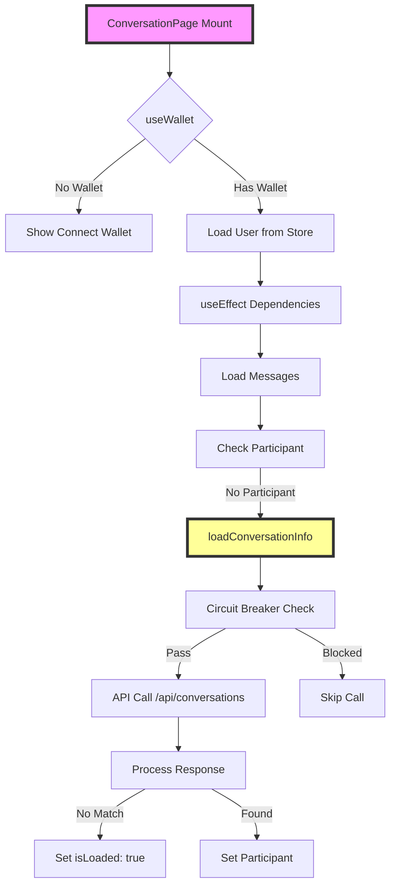

# 🏗️ ARCHITECTURE CONTEXT: Infinite Conversations API Loop

## 📅 Дата: 17.01.2025
## 🏷️ ID: [infinite_loop_2025_017]

---

## 🔗 Affected Components

### 1. ConversationPage Component (`app/messages/[id]/page.tsx`)
- **Роль**: Client-side страница для отображения диалога
- **Размер**: 1339 строк
- **Проблема**: Missing import causing component crash

### 2. Conversations API (`app/api/conversations/route.ts`)
- **Роль**: Server-side API endpoint
- **Поведение**: Отвечает корректно, но вызывается слишком часто
- **Результат**: Always returns 0 conversations for user "lafufu"

### 3. AppStore (Zustand)
- **Файл**: `lib/store/appStore.ts`
- **Роль**: Global state management
- **Использование**: `useUser()` hook в ConversationPage

### 4. JWT Manager
- **Файл**: `lib/utils/jwt.ts`
- **Роль**: Token management
- **Статус**: Работает корректно (token verified in logs)

---

## 🌊 Data Flow Analysis



---

## 🏛️ Architecture Patterns

### 1. Client-Side Rendering (CSR)
- **Pattern**: 'use client' directive
- **Impact**: All logic runs in browser
- **Risk**: Errors cause full re-renders

### 2. Polling Pattern
```typescript
const interval = setInterval(loadMessages, 5000)
```
- **Frequency**: Every 5 seconds
- **Problem**: Not related to infinite loop (different timing)

### 3. Circuit Breaker Pattern (Implemented but Broken)
```typescript
// Max 10 calls per minute
if (callCount >= 10) {
  // Block for 1 minute
}
```
- **Status**: Code exists but not executing due to import error

### 4. Missing Error Boundary
- **Current**: No error boundary wrapping ConversationPage
- **Result**: Errors bubble up, causing page re-renders

---

## 🔌 Integration Points

### 1. Solana Wallet Integration
```typescript
const { publicKey, sendTransaction } = useWallet()
```
- **Error**: Trying to read publicKey before context check
- **Impact**: 8 console errors on mount

### 2. WebSocket Integration (Not Active)
- **Port**: 3002
- **Status**: Not connected in this flow
- **Impact**: None on current issue

### 3. Database Relations
```
users -> conversations (via _UserConversations)
conversations -> messages
messages -> MessagePurchase
```

---

## 📦 Dependencies & Versions

### React Ecosystem
- **react**: 18.x (from Next.js 14.1.0)
- **@solana/wallet-adapter-react**: Unknown version
- **zustand**: For state management

### Key Imports Analysis
```typescript
// Current (BROKEN)
import { useState, useEffect, useRef } from 'react'

// Required
import { useState, useEffect, useRef, useCallback } from 'react'
```

---

## 🏷️ State Management

### Component State (16 pieces)
1. `messages` - Message array
2. `participant` - Other user in conversation
3. `isLoading` - Loading state
4. `circuitBreakerState` - Protection state
5. `conversationLoadState` - Dedup state
6. ... (10 more UI states)

### Global State
- `user` from Zustand store
- `publicKey` from Wallet context

---

## 🚨 Identified Architecture Issues

### 1. No Error Recovery Mechanism
- Component crashes → Fast Refresh → Re-mount → Crash again
- No error boundary to catch and handle

### 2. useCallback Dependencies
- Functions recreated on every render
- Without useCallback, circuit breaker doesn't work properly

### 3. Early Hook Usage
```typescript
// Line 49: Too early!
const { publicKey, sendTransaction } = useWallet()
```
- Should be after render guards

### 4. Missing Suspense Boundary
- No loading state coordination
- Multiple async operations without proper orchestration

---

## 🔍 Hidden Dependencies

### 1. Browser APIs
- `Notification` API for browser notifications
- `FileReader` for media preview
- `localStorage` via JWT manager

### 2. External Services
- `/api/upload` for media
- `/api/creators/[id]` for full creator data
- `/api/tips` for tip transactions

### 3. Timing Dependencies
```typescript
// Give transaction time to get into network
await new Promise(resolve => setTimeout(resolve, 10000))
```

---

## ✅ Architecture Context Checklist

- [x] All components mapped
- [x] Data flow documented
- [x] Integration points identified
- [x] Dependencies versioned where known
- [x] Hidden dependencies found
- [x] State management analyzed
- [x] Error propagation paths traced

---

## 🎯 Key Findings

1. **Root Cause**: Missing `useCallback` import causes syntax error
2. **Amplification**: No error boundary causes full page re-render
3. **Cascade**: Each re-render triggers new ConversationPage mount
4. **Loop**: Mount → Error → Refresh → Mount (repeat)

**Next Step**: Create SOLUTION_PLAN.md with phased approach 