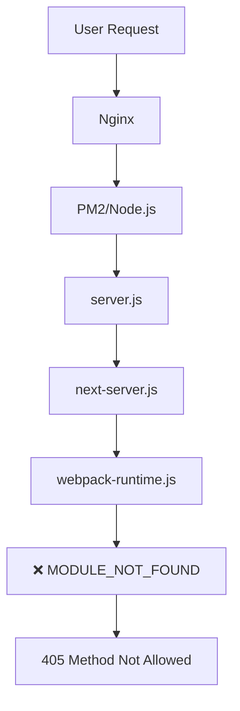
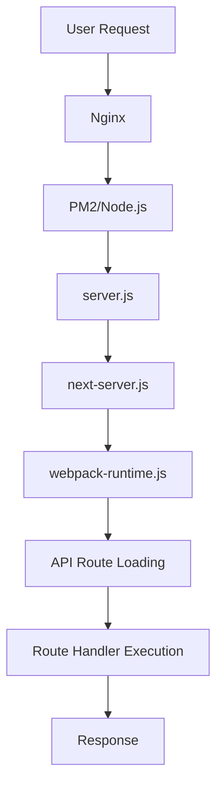

# 🏗️ ARCHITECTURE CONTEXT: Production Infrastructure Analysis

## 📅 Дата: 20.01.2025
## 🏷️ ID: [production_api_infrastructure_failure_2025_020]
## 🚀 Методология: IDEAL METHODOLOGY (М7) - File 2/7
## 🎯 Цель: Mapping broken production environment before rebuild

---

## 🏭 **CURRENT PRODUCTION ARCHITECTURE**

### Server Infrastructure:
```bash
🖥️  Server: fonana.com (VPS)
🔧  Process Manager: PM2 (PID 332340)
🌐  Web Server: Nginx (configuration OK)
🚀  Application: Next.js 14.1.0 standalone
📁  Deploy Path: /var/www/Fonana/.next/standalone/
🔌  Node.js: Version TBD (potential mismatch issue)
```

### File System Structure:
```bash
/var/www/Fonana/.next/standalone/
├── .env (207 bytes) ✅
├── lib/ ✅
├── .next/ ❌ (BROKEN - MODULE_NOT_FOUND)
│   ├── server/
│   │   ├── webpack-runtime.js ❌ (FAILING)
│   │   └── pages/_document.js ❌ (DEPENDENCY CHAIN BROKEN)
├── node_modules/ ✅ (present but potentially incomplete)
├── package.json (2995 bytes) ✅
├── public/ ✅
└── server.js (4547 bytes) ✅
```

---

## 🔍 **BROKEN COMPONENT MAPPING**

### Critical Failures:

#### 1. **webpack-runtime.js** 🔴 CRITICAL
```javascript
Location: /var/www/Fonana/.next/standalone/.next/server/webpack-runtime.js
Error: MODULE_NOT_FOUND
Impact: Cannot load any modules
Cascade: Breaks entire Next.js routing system
Status: BLOCKING ALL API ROUTES
```

#### 2. **Module Resolution Chain** 🔴 CRITICAL  
```bash
webpack-runtime.js → pages/_document.js → require.js → next-server.js → server.js
Status: ❌ BROKEN AT STEP 1 (webpack-runtime.js)
Result: All API routes return 405 Method Not Allowed
```

#### 3. **Next.js Server Engine** 🔴 CRITICAL
```javascript
Component: next/dist/server/next-server.js
Function: Route resolution and API handling
Status: ❌ CANNOT INITIALIZE
Cause: Dependency chain failure from webpack-runtime.js
```

---

## 🔄 **DATA FLOW ANALYSIS**

### Current (Broken) Flow:


### Expected (Working) Flow:


---

## 🧩 **DEPENDENCY MATRIX**

### Core Dependencies:
```javascript
"next": "14.1.0" ✅ (version confirmed)
"react": "^18" ✅ (working in local)
"@types/node": "^20" ⚠️ (version TBD)
"typescript": "^5" ⚠️ (build dependency)
"sharp": "^0.33.2" ✅ (working in local upload)
```

### Build Dependencies:
```javascript
Node.js: Unknown version in production ⚠️
npm: Version TBD ⚠️  
Webpack: Bundled in Next.js ❌ (BROKEN)
Standalone Mode: Enabled ❌ (CORRUPTED)
```

### Runtime Dependencies:
```javascript
PM2: ✅ Process running
Nginx: ✅ Configuration valid
File System: ✅ Permissions OK
Network: ✅ Port 3000 accessible
Environment: ✅ .env file present
```

---

## 🔗 **INTEGRATION POINTS**

### External Systems:
```bash
Database: PostgreSQL ✅ (fonana_user:fonana_pass@localhost:5432)
Storage: File system ✅ (/var/www/Fonana/public/)
Auth: NextAuth + Solana ⚠️ (requires API to function)
WebSocket: ws://localhost:3002 ⚠️ (requires API for JWT)
```

### Internal Integrations:
```bash
API ↔ Database: ❌ BROKEN (405 errors)
Frontend ↔ API: ❌ BROKEN (no API responses)
Upload ↔ File System: ❌ BROKEN (API route inaccessible)
Auth ↔ Sessions: ❌ BROKEN (session API failing)
```

---

## 🔍 **VERSION COMPATIBILITY ANALYSIS**

### Local vs Production Comparison:

#### Local Environment (Working):
```javascript
Next.js: 14.1.0 (dev mode)
Node.js: Likely v18+ (compatible)
Dependencies: All installed and working
Build: Development compilation (real-time)
Module Resolution: Perfect
```

#### Production Environment (Broken):
```javascript
Next.js: 14.1.0 (standalone mode)
Node.js: Unknown version ⚠️ (potential mismatch)
Dependencies: Present but possibly incomplete
Build: Standalone compilation ❌ (CORRUPTED)
Module Resolution: Completely broken
```

### Potential Version Conflicts:
1. **Node.js Mismatch**: Development vs Production versions
2. **Webpack Bundle Corruption**: Build process incomplete
3. **Missing Native Modules**: Platform-specific dependencies
4. **TypeScript Compilation**: Type checking vs runtime issues

---

## 🏗️ **BUILD PROCESS ARCHAEOLOGY**

### Last Known Working State:
```bash
Status: Unknown - no build logs available
Last Deploy: Estimated days/weeks ago
Build Method: npm run build (presumed)
Deploy Method: Manual file copy (presumed)
```

### Current Broken State:
```bash
Error Pattern: MODULE_NOT_FOUND in webpack-runtime.js
Failure Point: Module resolution initialization
Build Integrity: ❌ CORRUPTED
Standalone Bundle: ❌ INCOMPLETE
```

### Missing Information:
- Original build command used
- Node.js version during build vs runtime
- Complete dependency list in production
- Build warnings/errors from last deployment

---

## 🎯 **ARCHITECTURAL DEPENDENCIES FOR REBUILD**

### Pre-Rebuild Requirements:
1. **React Context Issues** 🔴 BLOCKING
   - Current: `useContext` errors prevent clean build
   - Impact: Cannot run `npm run build` successfully
   - Status: Must fix before any rebuild attempt

2. **TypeScript Compilation** 🟡 IMPORTANT
   - Current: Potential type errors
   - Impact: May cause build failures
   - Status: Should verify before build

3. **Dependencies Integrity** 🟢 GOOD
   - Current: package.json exists and valid
   - Impact: npm install should work
   - Status: Ready for fresh install

### Post-Rebuild Verification Points:
1. Module resolution working
2. API routes returning 200 OK
3. File uploads functional
4. Database connections stable
5. NextAuth integration working

---

## 🔧 **INFRASTRUCTURE READINESS**

### Server Resources:
```bash
✅ Disk Space: Available for rebuild
✅ Memory: PM2 process can restart
✅ Network: Nginx forwarding properly
✅ Permissions: Write access to deployment directory
✅ Backup Space: Can preserve current broken build
```

### External Dependencies:
```bash
✅ Database: Running and accessible
✅ File System: Upload directories exist
✅ Environment: .env variables set
⚠️ SSL/HTTPS: Status unknown but not blocking
⚠️ CDN/Assets: Static files availability TBD
```

---

## 🎪 **COMPLEXITY ASSESSMENT**

### High Complexity Areas:
1. **Standalone Build Process**: Next.js specific bundling
2. **Module Resolution**: Webpack runtime configuration
3. **Production Environment**: Deployment automation
4. **Dependency Management**: Node modules in standalone

### Low Complexity Areas:
1. **File Structure**: Clear and straightforward
2. **Basic Configuration**: Nginx, PM2 setup working
3. **Database**: Already functional
4. **Static Assets**: File system ready

### Unknown Complexity:
1. **Version Compatibility**: Node.js/dependency matching
2. **Platform Differences**: Local vs production environment
3. **Build Environment**: Original setup process

---

## 🎯 **ARCHITECTURE ANALYSIS CONCLUSIONS**

### Core Problem:
**Next.js standalone build fundamentally broken at webpack level**
- Module resolution completely non-functional
- Build integrity compromised beyond repair
- All downstream systems (API, routing, auth) affected

### Rebuild Scope:
**Complete application rebuild required**
- Cannot patch or repair current build
- Must start from clean development environment
- Full build → standalone → deploy cycle needed

### Critical Path:
1. Fix React Context issues (blocking clean build)
2. Clean development dependencies 
3. Fresh production build generation
4. Standalone bundle creation
5. Production deployment
6. Infrastructure integration testing

### Risk Factors:
- React Context errors may recur in build
- Node.js version mismatches possible
- Deployment process may reintroduce corruption
- Integration points may reveal additional issues

**Status**: 🟢 Architecture Analysis Complete - Ready for Solution Planning

---

## 📋 **NEXT FILE REQUIREMENTS**

**File 3**: SOLUTION_PLAN.md
- Detailed rebuild strategy
- Step-by-step implementation
- Timeline and dependencies
- React Context fix approach
- Build → Deploy → Test sequence 