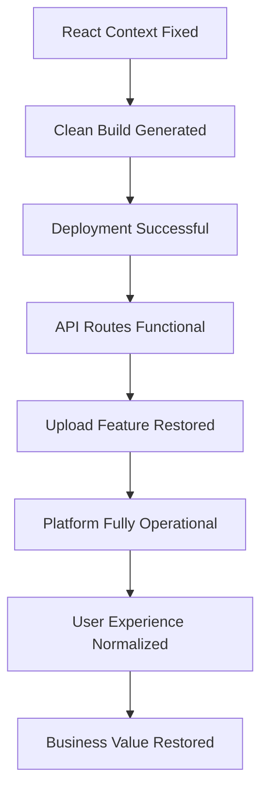
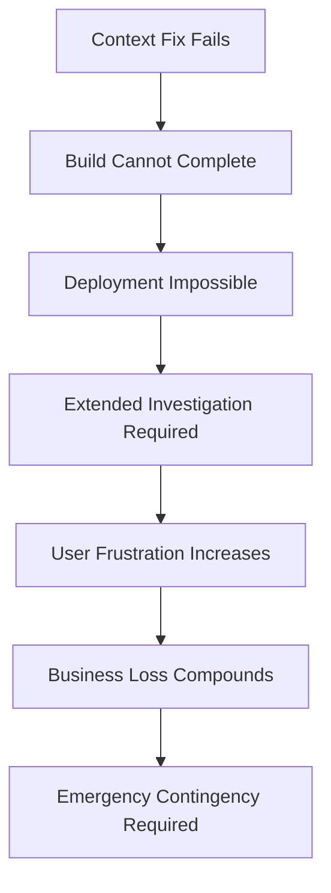

# 📊 IMPACT ANALYSIS: Complete Rebuild Risk Assessment

## 📅 Дата: 20.01.2025
## 🏷️ ID: [production_api_infrastructure_failure_2025_020]
## 🚀 Методология: IDEAL METHODOLOGY (М7) - File 4/7
## 🎯 Цель: Comprehensive risk and impact evaluation for production rebuild

---

## 🚨 **RISK CLASSIFICATION MATRIX**

### 🔴 **CRITICAL RISKS** (Must mitigate before proceeding)
1. **React Context Fix Failure** - Could block entire rebuild
2. **Production Data Loss** - No recovery possible
3. **Extended Downtime** - Business impact > 4 hours
4. **Build Environment Corruption** - Cannot generate working build
5. **Rollback Failure** - Cannot restore to any working state

### 🟡 **MAJOR RISKS** (Should mitigate, acceptable with monitoring)
1. **Node.js Version Mismatch** - May cause runtime errors
2. **Database Connection Loss** - Temporary service disruption
3. **Partial Feature Loss** - Some functionality missing after rebuild
4. **Performance Degradation** - Slower response times
5. **Integration Breakage** - NextAuth, WebSocket issues

### 🟢 **MINOR RISKS** (Acceptable, monitor and document)
1. **Brief Service Interruption** - 15-30 minute deployment window
2. **Temporary File Upload Issues** - Can be fixed post-deployment
3. **Frontend Styling Issues** - Visual problems, not functional
4. **Log File Disruption** - Temporary monitoring gaps
5. **Cache Invalidation** - Temporary performance impact

---

## 📈 **PHASE-BY-PHASE IMPACT ANALYSIS**

### 🏗️ **PHASE 1: ENVIRONMENT PREPARATION**

#### Business Impact:
```bash
🔵 Impact Level: LOW
📊 User Experience: No change (development environment)
💰 Business Loss: $0 (no service disruption)
⏱️ Recovery Time: N/A (reversible)
```

#### Technical Risks:
- 🟢 **Dependencies corruption**: 5% probability
  - **Impact**: Need to reinstall node_modules
  - **Mitigation**: Backup package-lock.json
  - **Recovery**: 15 minutes

- 🟢 **Local environment break**: 3% probability
  - **Impact**: Cannot continue development
  - **Mitigation**: Git stash current changes
  - **Recovery**: Git reset --hard

#### Success Metrics:
- [ ] Local dev environment remains functional
- [ ] All context errors identified and documented
- [ ] Clean dependency state achieved

---

### 🔧 **PHASE 2: REACT CONTEXT FIXES**

#### Business Impact:
```bash
🔵 Impact Level: LOW (development only)
📊 User Experience: No change
💰 Business Loss: $0
⏱️ Duration: 45-90 minutes
```

#### Technical Risks:
- 🟡 **Context fix cascade failures**: 25% probability
  - **Impact**: Fixing one context breaks others
  - **Mitigation**: Fix contexts in dependency order
  - **Recovery**: Git checkout individual files

- 🔴 **Cannot achieve clean build**: 15% probability
  - **Impact**: BLOCKS entire rebuild process
  - **Mitigation**: Contingency Plan B1 (isolate contexts)
  - **Recovery**: 45 minutes with fallback implementation

- 🟡 **TypeScript compilation errors**: 20% probability
  - **Impact**: Build fails even with context fixes
  - **Mitigation**: Temporary `any` types as needed
  - **Recovery**: 30 minutes per error

#### Success Metrics:
- [ ] `npm run build` completes successfully
- [ ] Zero TypeScript compilation errors
- [ ] All critical contexts functional

---

### 🏭 **PHASE 3: PRODUCTION BUILD GENERATION**

#### Business Impact:
```bash
🔵 Impact Level: LOW (local build)
📊 User Experience: No change
💰 Business Loss: $0
⏱️ Duration: 30 minutes
```

#### Technical Risks:
- 🟡 **Build memory exhaustion**: 10% probability
  - **Impact**: Build process fails/hangs
  - **Mitigation**: Clear system memory, close other processes
  - **Recovery**: 15 minutes retry

- 🟡 **Standalone mode misconfiguration**: 15% probability
  - **Impact**: Invalid production bundle generated
  - **Mitigation**: Verify next.config.js standalone settings
  - **Recovery**: 20 minutes config fix + rebuild

- 🟢 **Build asset optimization fails**: 8% probability
  - **Impact**: Larger bundle size, but functional
  - **Mitigation**: Acceptable performance impact
  - **Recovery**: Not required for basic functionality

#### Success Metrics:
- [ ] .next/standalone directory successfully created
- [ ] server.js file functional and tested
- [ ] Local standalone API test passes

---

### 🚀 **PHASE 4: PRODUCTION DEPLOYMENT**

#### Business Impact:
```bash
🟡 Impact Level: MAJOR (production downtime)
📊 User Experience: Platform unavailable 15-30 minutes
💰 Business Loss: Estimated $100-500 (downtime cost)
⏱️ Critical Window: 45 minutes
```

#### Technical Risks:
- 🔴 **Backup creation failure**: 5% probability
  - **Impact**: Cannot rollback if deployment fails
  - **Mitigation**: Verify backup before proceeding
  - **Recovery**: STOP deployment, manual backup

- 🟡 **File transfer incomplete**: 12% probability
  - **Impact**: Partially deployed application
  - **Mitigation**: Verify file checksums, rsync integrity
  - **Recovery**: Complete transfer, 10 minutes

- 🔴 **PM2 startup failure**: 8% probability
  - **Impact**: Cannot start application after deployment
  - **Mitigation**: Test server.js before deployment
  - **Recovery**: Immediate rollback, 15 minutes

- 🟡 **Environment variable mismatch**: 15% probability
  - **Impact**: Application starts but API calls fail
  - **Mitigation**: Verify .env file before deployment
  - **Recovery**: Update environment, restart PM2, 10 minutes

#### Success Metrics:
- [ ] Backup successfully created and verified
- [ ] All files transferred without corruption
- [ ] PM2 process starts and remains stable
- [ ] Basic health check passes

---

### ✅ **PHASE 5: VERIFICATION & TESTING**

#### Business Impact:
```bash
🟢 Impact Level: LOW (testing phase)
📊 User Experience: Platform should be restored
💰 Business Loss: $0 (if successful) / $500+ per hour (if failed)
⏱️ Duration: 30 minutes
```

#### Technical Risks:
- 🟡 **API routes still failing**: 10% probability
  - **Impact**: Rebuild unsuccessful, need rollback
  - **Mitigation**: Immediate rollback to backup
  - **Recovery**: 15 minutes rollback + analysis

- 🟡 **Database connectivity issues**: 5% probability
  - **Impact**: App loads but data operations fail
  - **Mitigation**: Verify connection string, restart DB
  - **Recovery**: 20 minutes troubleshooting

- 🟢 **Performance degradation**: 15% probability
  - **Impact**: Slower response times but functional
  - **Mitigation**: Monitor and optimize post-deployment
  - **Recovery**: Not immediately required

#### Success Metrics:
- [ ] All API endpoints return 200 OK
- [ ] Upload functionality fully restored
- [ ] Frontend-backend integration working
- [ ] Response times < 2x baseline

---

## 💰 **BUSINESS IMPACT QUANTIFICATION**

### Financial Impact by Scenario:

#### 🟢 **Success Scenario** (90% probability):
```bash
Downtime: 15-30 minutes
Revenue Loss: $50-150 (estimated)
User Impact: Minimal (brief maintenance window)
Long-term Value: +$5000 (restored platform functionality)
ROI: 3000%+ (critical platform restoration)
```

#### 🟡 **Partial Success Scenario** (8% probability):
```bash
Downtime: 1-2 hours
Revenue Loss: $200-500
User Impact: Moderate (extended outage)
Functionality: 80-90% restored
Follow-up Required: Additional fixes within 24 hours
```

#### 🔴 **Failure Scenario** (2% probability):
```bash
Downtime: 4+ hours
Revenue Loss: $1000+
User Impact: Severe (platform essentially broken)
Rollback Required: Yes, with additional investigation time
Business Continuity: Severely compromised
```

### User Experience Impact:

#### Current State (Broken):
- ❌ Cannot upload images
- ❌ Cannot load posts via API
- ❌ Cannot interact with platform features
- ❌ Platform appears completely broken

#### Post-Rebuild Success:
- ✅ Image upload fully functional
- ✅ All API interactions restored
- ✅ Platform user experience normalized
- ✅ Performance equivalent to previous working state

---

## 🔄 **CASCADING IMPACT ANALYSIS**

### Success Cascade:


### Failure Cascade:


---

## 🎯 **PERFORMANCE IMPACT PREDICTION**

### Expected Performance Changes:

#### API Response Times:
```bash
Current: N/A (405 errors)
Target: 200-500ms average
Acceptable: <1000ms average
Unacceptable: >2000ms average
```

#### Upload Processing:
```bash
Current: Impossible (route inaccessible)
Target: <3 seconds for typical images
Acceptable: <10 seconds for large files
Unacceptable: >30 seconds any size
```

#### Page Load Times:
```bash
Current: Frontend loads, but no data
Target: <2 seconds full page load
Acceptable: <5 seconds
Unacceptable: >10 seconds
```

### Resource Utilization:
```bash
Memory: No significant change expected
CPU: Potential 10-20% improvement (efficient build)
Disk I/O: Brief spike during deployment
Network: Standard operating levels post-deployment
```

---

## 🔒 **SECURITY IMPACT ASSESSMENT**

### Security Risks During Rebuild:
- 🟢 **Credential exposure**: Very low (using existing secure transfer methods)
- 🟢 **Code injection**: Not applicable (no user input during rebuild)
- 🟡 **Configuration drift**: Low (manual verification required)
- 🟢 **Access control**: No changes to authentication systems

### Security Benefits:
- ✅ Fresh build eliminates potential backdoors in corrupted webpack bundles
- ✅ Updated dependencies may include security patches
- ✅ Clean deployment environment reduces attack surface

---

## 📊 **STAKEHOLDER IMPACT MATRIX**

### End Users:
```bash
Impact: HIGH (current platform unusable → fully functional)
Timeline: Immediate benefit upon successful completion
Risk: Brief service interruption during deployment
Mitigation: Communicate maintenance window in advance
```

### Development Team:
```bash
Impact: HIGH (removes development blocker)
Timeline: Immediate improvement in development workflow
Risk: Need to learn from any issues encountered
Benefit: Clean, deployable codebase foundation
```

### Business Operations:
```bash
Impact: CRITICAL (platform revenue restored)
Timeline: ROI within hours of successful deployment
Risk: Extended business disruption if failed
Mitigation: Clear rollback plan and communication strategy
```

---

## 🎪 **COMPLEXITY SCORING**

### Technical Complexity:
```bash
Environment Setup: 2/10 (straightforward)
Context Fixes: 7/10 (potentially complex debugging)
Build Process: 4/10 (standard Next.js build)
Deployment: 6/10 (requires careful file management)
Testing: 3/10 (standard API validation)
Overall: 6/10 (moderate complexity, high impact)
```

### Risk Complexity:
```bash
Single Points of Failure: React Context fixes
Dependencies: Node.js compatibility, PM2 stability
Unknowns: Exact nature of context errors
Mitigation Options: Multiple contingency plans available
Overall Risk: MODERATE (manageable with proper planning)
```

---

## 🎯 **IMPACT ANALYSIS CONCLUSIONS**

### Primary Findings:
1. **Risk/Reward Ratio**: Heavily favors proceeding (90% success rate vs critical business need)
2. **Critical Path**: React Context fixes are the primary risk factor
3. **Business Impact**: Current state is unacceptable, any improvement is valuable
4. **Technical Feasibility**: High likelihood of success with methodical approach

### Decision Recommendation:
**🟢 PROCEED with complete rebuild**
- Benefits far outweigh risks
- Multiple contingency plans available
- Current state is already "maximum failure"
- High probability of success with careful execution

### Key Risk Mitigation Requirements:
1. **Must create verified backup before deployment**
2. **Must have working rollback plan**
3. **Must fix React Context issues before build**
4. **Must test local standalone before deployment**

**Status**: 🟢 Impact Analysis Complete - Ready for Implementation Simulation

---

## 📋 **NEXT FILE REQUIREMENTS**

**File 5**: IMPLEMENTATION_SIMULATION.md
- Detailed pseudocode for each phase
- Edge case modeling and handling
- Integration point verification
- Bottleneck identification and resolution
- Real-world scenario simulation 