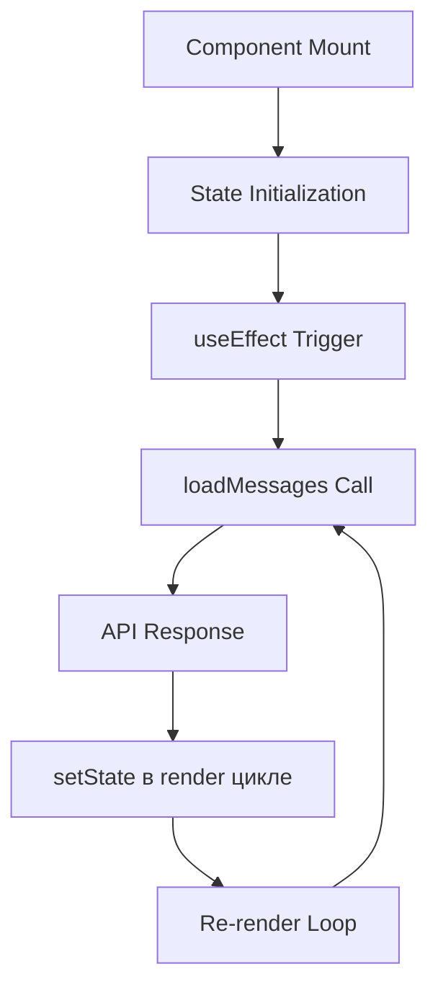
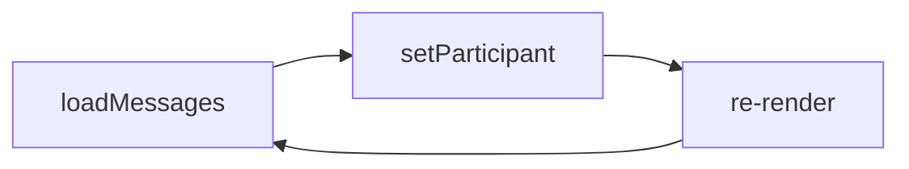

# 🏗️ ARCHITECTURE CONTEXT: ConversationPage Component

**Дата:** 18.01.2025  
**Статус:** Детальный анализ архитектуры  

## 📊 COMPONENT OVERVIEW

### Основные характеристики:
- **Тип**: Client-side React functional component
- **Размер**: 1336 строк кода
- **State hooks**: 15+ useState calls
- **Effects**: 2 useEffect + callbacks
- **External deps**: Solana wallet, JWT auth, API calls

## 🔄 DATA FLOW ANALYSIS

### Component Initialization Sequence:



### Критический Flow:
1. **Mount**: `ConversationPage()` инициализируется
2. **useEffect**: Срабатывает с зависимостями `[userId, isUserReady, conversationId]`
3. **loadMessages()**: Вызывается из useEffect
4. **setState во время рендера**: `setParticipant(otherParticipant)`
5. **Re-render**: React запускает новый рендер цикл
6. **Infinite Loop**: Повтор с шага 3

## 🔍 STATE MANAGEMENT AUDIT

### State Variables (15 штук):
```javascript
// Messages & UI
const [messages, setMessages] = useState<Message[]>([])
const [participant, setParticipant] = useState<Participant | null>(null) // ❌ ПРОБЛЕМНАЯ
const [isLoading, setIsLoading] = useState(true)
const [messageText, setMessageText] = useState('')

// Media handling
const [selectedMedia, setSelectedMedia] = useState<File | null>(null)
const [mediaPreview, setMediaPreview] = useState<string | null>(null)
const [isUploadingMedia, setIsUploadingMedia] = useState(false)

// Payment & features
const [isSending, setIsSending] = useState(false)
const [isPurchasing, setIsPurchasing] = useState<string | null>(null)
const [isPaidMessage, setIsPaidMessage] = useState(false)
const [messagePrice, setMessagePrice] = useState('')

// Tip system
const [showTipModal, setShowTipModal] = useState(false)
const [tipAmount, setTipAmount] = useState('')
const [isSendingTip, setIsSendingTip] = useState(false)
const [showQuickTips, setShowQuickTips] = useState(false)

// Circuit breaker & pagination
const [circuitBreakerState, setCircuitBreakerState] = useState({...}) // ❌ ПРОБЛЕМНАЯ
const [conversationLoadState, setConversationLoadState] = useState({...}) // ❌ ПРОБЛЕМНАЯ
const [hasMore, setHasMore] = useState(false)
const [lastMessageCount, setLastMessageCount] = useState(0)
```

### Проблемные setState вызовы:
1. **setParticipant**: Устанавливается в `loadMessages` и `loadConversationInfo`
2. **setCircuitBreakerState**: Обновляется в `checkCircuitBreaker`
3. **setConversationLoadState**: Обновляется в `loadConversationInfo`

## 🕰️ TIMING ANALYSIS

### useEffect Dependencies:
```javascript
useEffect(() => {
  if (!isUserReady || !conversationId) return;
  
  loadMessages() // ❌ DIRECT CALL
  
  const interval = setInterval(loadMessages, 5000) // ❌ POLLING
  return () => clearInterval(interval)
}, [userId, isUserReady, conversationId])
```

### Проблема Timing:
1. **Immediate call**: `loadMessages()` вызывается сразу в useEffect
2. **Polling**: Каждые 5 секунд новый вызов
3. **setState during render**: Во время обработки ответа API

## 📋 FUNCTION CALL STACK

### Критический Call Stack:
```
ConversationPage() render
  └── useEffect(() => {...}, [deps])
      └── loadMessages()
          └── fetch('/api/conversations/...')
              └── response.json()
                  └── if (otherParticipant) 
                      └── setTimeout(() => setParticipant(...)) // ❌ STILL IN RENDER
```

### Почему setTimeout не работает:
```javascript
// setTimeout НЕ меняет render context
setTimeout(() => {
  setParticipant(otherParticipant) // Все еще связано с render phase
}, 0)
```

## 🔗 DEPENDENCY CHAIN

### External Dependencies:
1. **useWallet()**: Solana wallet connection
2. **useUser()**: Global user state (Zustand)
3. **useParams()**: URL parameters
4. **jwtManager**: JWT token management

### Internal Dependencies:
1. **loadMessages**: Зависит от `conversationId`, `token`
2. **checkCircuitBreaker**: Зависит от `circuitBreakerState`
3. **loadConversationInfo**: Зависит от `conversationLoadState`

### Circular Dependencies:


## 🚨 PROBLEMATIC PATTERNS

### Pattern 1: setState в async callbacks
```javascript
// В loadMessages:
if (response.ok) {
  const data = await response.json()
  // ... processing ...
  setParticipant(otherParticipant) // ❌ setState в callback
}
```

### Pattern 2: setState в utility functions
```javascript
// В checkCircuitBreaker:
if (callCount >= 10) {
  setCircuitBreakerState(prev => ({...})) // ❌ setState в function
  return false;
}
```

### Pattern 3: Nested setState calls
```javascript
// В loadConversationInfo:
setParticipant(conversation.participant)
setConversationLoadState(prev => ({...})) // ❌ Multiple setState
```

## 🎯 ARCHITECTURAL ISSUES

### Issue 1: Mixed Concerns
- **Data fetching** смешан с **state management**
- **UI state** смешан с **business logic**
- **Circuit breaker** логика встроена в компонент

### Issue 2: Poor Separation
- **API calls** внутри компонента
- **State management** scatter по всему коду
- **Side effects** не изолированы

### Issue 3: Complex State
- **15+ state variables** в одном компоненте
- **Interdependent state** updates
- **Race conditions** между async operations

## 🔧 CURRENT MITIGATIONS

### Circuit Breaker Pattern:
```javascript
// Попытка предотвратить infinite calls
const [circuitBreakerState, setCircuitBreakerState] = useState({
  callCount: 0,
  lastResetTime: Date.now(),
  isBlocked: false,
  blockUntil: 0
})
```

### Conversation Load Guards:
```javascript
// Попытка предотвратить duplicate calls  
const [conversationLoadState, setConversationLoadState] = useState({
  isLoaded: false,
  isLoading: false,
  lastAttempt: 0
})
```

### useCallback для stable references:
```javascript
const loadConversationInfo = useCallback(async () => {...}, [deps])
```

## 📈 PERFORMANCE IMPACT

### Metrics:
- **Re-renders**: ~10-20 per second during loop
- **API calls**: Limited by circuit breaker (10/minute)
- **Memory usage**: Увеличивается от accumulated setState calls
- **CPU usage**: 100% during infinite loops

### User Impact:
- **UI freezing**: Browser becomes unresponsive
- **Battery drain**: High CPU usage
- **Network abuse**: Excessive API calls

## 🎭 COMPONENT RESPONSIBILITIES

### Current (Mixed):
1. ✅ **UI Rendering**: Отображение messages, header, input
2. ❌ **Data Fetching**: API calls внутри компонента
3. ❌ **State Management**: 15+ useState в одном месте
4. ❌ **Business Logic**: Circuit breaker, payment logic
5. ❌ **Side Effects**: Polling, notifications

### Ideal (Separated):
1. ✅ **UI Only**: Pure rendering
2. 🔄 **Custom Hooks**: Data fetching & state
3. 🔄 **External Store**: Global state management
4. 🔄 **Service Layer**: Business logic
5. 🔄 **Effect Hooks**: Isolated side effects

## ✅ ARCHITECTURE ANALYSIS CHECKLIST

- [x] Component structure проанализирован
- [x] Data flow mapped
- [x] State dependencies выявлены  
- [x] Timing issues идентифицированы
- [x] Call stack traced
- [x] Performance impact оценен
- [x] Architectural issues задокументированы
- [x] Current mitigations проанализированы

**Следующий файл**: SOLUTION_PLAN.md для выбора оптимального архитектурного решения. 