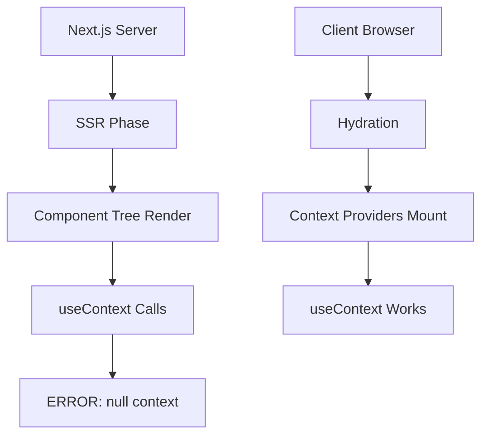

# 🏗️ Architecture Context: SSR UseContext Errors

## 📊 Текущая архитектура

### 1. Структура приложения
```
Next.js 14.1.0 App Router
├── app/                 # App Router pages
├── components/          # React components  
├── lib/                 # Utilities & hooks
│   ├── contexts/       # React Contexts
│   ├── hooks/          # Custom hooks
│   ├── providers/      # Provider components
│   └── store/          # Zustand stores
└── types/              # TypeScript types
```

### 2. Рендеринг Pipeline


## 🔄 Context/State Management

### 1. React Context Providers

#### ThemeContext
- **Расположение**: `lib/contexts/ThemeContext.tsx`
- **Провайдер**: ThemeProvider
- **Хук**: useTheme()
- **SSR защита**: Частичная (проверка window)
- **Проблема**: useContext вызывается без null-check

#### PricingContext  
- **Расположение**: `lib/pricing/PricingProvider.tsx`
- **Провайдер**: PricingProvider
- **Хук**: usePricing()
- **SSR защита**: НЕТ
- **Проблема**: Прямой вызов useContext без защиты

#### WalletContext (от @solana/wallet-adapter-react)
- **Провайдер**: WalletProvider из библиотеки
- **Хук**: useWallet() из библиотеки
- **SSR защита**: НЕТ в оригинале
- **Решение**: Частичная миграция на Zustand

### 2. Zustand Stores

#### walletStore
- **Расположение**: `lib/store/walletStore.ts`
- **Назначение**: SSR-safe proxy для wallet-adapter
- **Хук**: useWalletStore()
- **Статус**: Работает, но не везде используется

#### appStore
- **Расположение**: `lib/store/appStore.ts`
- **Использование**: Общее состояние приложения
- **SSR**: Безопасен

### 3. Third-party Context использование

#### react-hot-toast
```typescript
// Внутренняя структура:
ToastContext -> useContext() -> SSR ERROR
├── Toaster component
└── toast() function
```

#### @headlessui/react
```typescript
// Каждый компонент использует внутренний Context:
DialogContext -> useContext() -> SSR ERROR
TransitionContext -> useContext() -> SSR ERROR
MenuContext -> useContext() -> SSR ERROR
```

#### @solana/wallet-adapter-react
```typescript
WalletContext -> useContext() -> SSR ERROR
├── useWallet()
├── useConnection()
└── useAnchorWallet()
```

## 🗺️ Карта зависимостей

### 1. Критические пути рендеринга

#### AppProvider дерево
```
app/layout.tsx
└── ClientShell.tsx
    └── AppProvider.tsx
        ├── ThemeProvider
        ├── PricingProvider
        ├── WalletProvider
        │   ├── ConnectionProvider
        │   ├── SolanaWalletProvider
        │   └── WalletModalProvider
        └── Toaster (react-hot-toast) ❌ Прямой импорт
```

#### Модальные окна
```
Components using modals:
├── ProfileSetupModal
│   └── Dialog (@headlessui) ❌ Прямой импорт
├── SubscriptionModal
│   ├── Dialog (@headlessui) ❌ Прямой импорт
│   └── Transition (@headlessui) ❌ Прямой импорт
└── PurchaseModal
    ├── Dialog (dynamic) ✅
    └── Transition (dynamic) ✅
```

### 2. Hook dependencies

#### Wallet hooks цепочка
```
useWallet (original) -> WalletContext -> ERROR
    ↓
useSafeWallet -> walletStore -> Zustand ✅
    ↓
Components:
├── Navbar
├── BottomNav
├── CreatorsExplorer
├── FeedPageClient
└── 20+ other components
```

#### Toast использование
```
toast() function
    ↓
Imported in 25+ files:
├── components/
├── lib/hooks/
├── app/pages/
└── Везде прямые импорты ❌
```

## 🏭 Build Process

### 1. Next.js SSR фазы
1. **Server render**: Node.js environment
   - Нет window/document
   - Нет browser APIs
   - React Context = null до mount

2. **HTML generation**: Static markup
   - Компоненты рендерятся в строки
   - useContext вызовы fail

3. **Client hydration**: Browser
   - Providers монтируются
   - Context становится доступен

### 2. Проблемные точки
```
Server Build:
1. Import phase - модули загружаются
2. Component parse - useContext обнаруживается
3. Render attempt - Context = null
4. ERROR: Cannot read property 'useContext' of null
```

## 🔍 Паттерны использования

### 1. Прямые импорты (проблемные)
```typescript
// ❌ Плохо - выполняется на сервере
import { toast } from 'react-hot-toast'
import { Dialog } from '@headlessui/react'
import { useWallet } from '@solana/wallet-adapter-react'
```

### 2. Dynamic imports (решение)
```typescript
// ✅ Хорошо - только на клиенте
const Dialog = dynamic(
  () => import('@headlessui/react').then(mod => mod.Dialog),
  { ssr: false }
)
```

### 3. Смешанные подходы (текущее состояние)
- Некоторые компоненты используют dynamic imports
- Большинство всё ещё использует прямые импорты
- Нет единого паттерна

## 📈 Статистика использования

### Количество импортов по библиотекам:
- **react-hot-toast**: 26 файлов
- **@headlessui/react**: 3 файла (критичные)
- **@solana/wallet-adapter-react**: 10 файлов  
- **@solana/wallet-adapter-react-ui**: 4 файла
- **@radix-ui**: Неизвестно (требует анализа)

### Критичность по компонентам:
1. **AppProvider.tsx** - блокирует всё приложение
2. **Модалки** - блокируют важный функционал
3. **Wallet hooks** - блокируют финансовые операции
4. **Toast** - некритично, но массово используется

## 🎯 Ключевые выводы

### Архитектурные проблемы:
1. **Отсутствие SSR стратегии** для third-party библиотек
2. **Разрозненные решения** без единого подхода
3. **Глубокие зависимости** от Context-based библиотек
4. **Смешение паттернов** (Zustand + Context)

### Технические долги:
1. Незавершённая миграция wallet на Zustand
2. Прямые импорты UI библиотек
3. Отсутствие абстракций над third-party
4. Нет SSR-safe wrappers

### Точки отказа:
1. AppProvider импортирует всё напрямую
2. Модалки используют Context-heavy компоненты
3. Toast система не имеет SSR защиты
4. Кастомные Context без null checks 