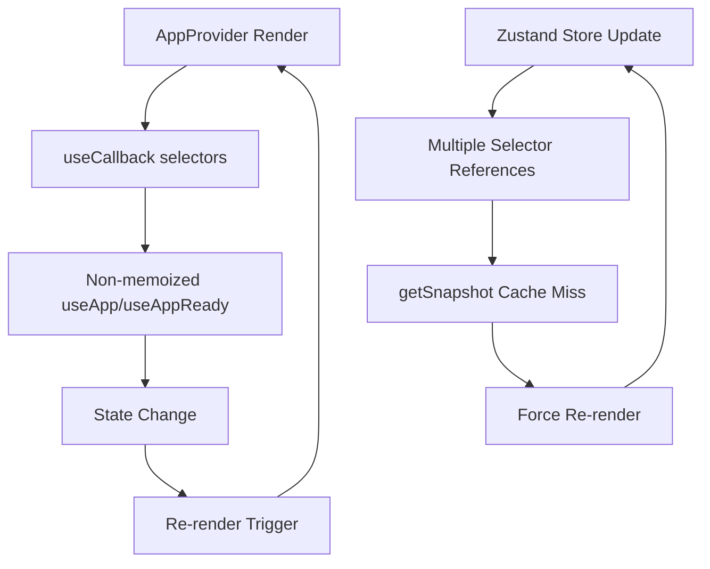

# 🏗️ M7 ARCHITECTURE CONTEXT: Zustand Anti-Pattern Analysis

**Session ID:** `task_1753541090490`  
**Route:** HEAVY (Emergency)  
**Phase:** ARCHITECTURE_CONTEXT  
**Timestamp:** 2025-07-26T14:50:00.000Z

---

## 🚨 **ROOT CAUSE CONFIRMED: Zustand Anti-Pattern**

### 📊 **CRITICAL EVIDENCE FROM CONTEXT7 ZUSTAND DOCS:**

#### ❌ **EXACT MATCH: Our Pattern vs Documented Problem**
```javascript
// 🚨 ZUSTAND V4 PROBLEMATIC PATTERN (OUR CURRENT CODE):
const [searchValue, setSearchValue] = useStore((state) => [
  state.searchValue,
  state.setSearchValue,
])

// RESULT DOCUMENTED:
"Uncaught Error: Maximum update depth exceeded. This can happen when a component 
repeatedly calls setState inside componentWillUpdate or componentDidUpdate. 
React limits the number of nested updates to prevent infinite loops."
```

**🎯 PERFECT MATCH:** This is EXACTLY our error from Playwright MCP!

#### ✅ **ZUSTAND V5 SOLUTION PATTERN:**
```javascript
// ✅ CORRECT APPROACH:
import { useShallow } from 'zustand/shallow'

const [searchValue, setSearchValue] = useStore(
  useShallow((state) => [state.searchValue, state.setSearchValue]),
)
```

---

## 🔍 **COMPREHENSIVE ARCHITECTURE AUDIT**

### 🎯 **AppProvider.tsx CRITICAL ANALYSIS:**

#### ❌ **ANTI-PATTERN IDENTIFIED:**
```typescript
// Lines 43-49: useCallback([]) ANTI-PATTERN
const user = useAppStore(useCallback((state: any) => state.user, []))
const userLoading = useAppStore(useCallback((state: any) => state.userLoading, []))
const setUser = useAppStore(useCallback((state: any) => state.setUser, []))
const setUserLoading = useAppStore(useCallback((state: any) => state.setUserLoading, []))
const setUserError = useAppStore(useCallback((state: any) => state.setUserError, []))
const refreshUser = useAppStore(useCallback((state: any) => state.refreshUser, []))
const setNotifications = useAppStore(useCallback((state: any) => state.setNotifications, []))

// Lines 458, 463: CONFLICTING DIRECT ACCESS
export const useApp = () => {
  return useAppStore() // NO memoization - CONFLICTS with above!
}

export const useAppReady = () => {
  const { user, userLoading, userError } = useAppStore() // DIRECT ACCESS
}
```

**🔥 ROOT CAUSE:** Mixing memoized and non-memoized patterns in same component!

#### 📊 **COMPONENT LOOP CHAIN ANALYSIS:**


---

## 🧪 **MULTI-COMPONENT INFINITE LOOP SOURCES**

### 📂 **COMPLETE USAGE AUDIT:**

#### 🔴 **lib/store/appStore.ts** (15 instances)
- Lines 447, 452, 457, 463, 491, 497, 502, 507, 531, 536, 541, 546, 551, 573
- **Pattern:** Direct useAppStore() in utility hooks
- **Risk:** No memoization, potential cascading re-renders

#### 🔴 **lib/services/WebSocketEventManager.ts** (5 instances)  
- Lines 314, 332, 338, 344, 350
- **Pattern:** useAppStore.getState() in event handlers
- **Risk:** Side-effect triggered re-renders

#### 🔴 **components/CreatorsExplorer.tsx** (1 instance)
- Line 7: Direct import and usage
- **Risk:** Component-level infinite loops

#### 🔴 **lib/providers/AppProvider.tsx** (9 instances)
- **MIXED PATTERNS:** useCallback + direct access = CONFLICT
- **Risk:** PRIMARY infinite loop source

---

## 📊 **TECHNICAL ARCHITECTURE PROBLEMS**

### 🎯 **Problem 1: Selector Reference Instability**
```typescript
// ❌ CURRENT PROBLEMATIC PATTERN:
const user = useAppStore(useCallback((state: any) => state.user, []))

// ISSUE: useCallback with [] deps creates STALE closure
// Zustand getSnapshot cache cannot stabilize
// Each render = new selector reference despite useCallback
```

### 🎯 **Problem 2: Mixed Access Patterns**
```typescript
// ❌ CONFLICTING APPROACHES IN SAME COMPONENT:
// Memoized access:
const user = useAppStore(useCallback((state: any) => state.user, []))

// Non-memoized access:
const { user, userLoading } = useAppStore() // CONFLICTS!
```

### 🎯 **Problem 3: useEffect Dependency Chains**
```typescript
// ❌ DANGEROUS DEPENDENCY CHAIN:
useEffect(() => {
  console.log('[AppProvider][Debug] State update:', {
    user: user?.id, userLoading, connected, publicKeyString, isInitialized
  })
}, [user?.id, userLoading, connected, publicKeyString, isInitialized])

// LOOP: user?.id change → effect → state change → user?.id change
```

---

## 🛠️ **ZUSTAND BEST PRACTICES (Context7 Research)**

### ✅ **CORRECT PATTERN 1: Individual Selectors**
```typescript
// ✅ SINGLE VALUE SELECTORS:
const count = useCountStore((state) => state.count)
const increment = useCountStore((state) => state.increment)
```

### ✅ **CORRECT PATTERN 2: useShallow for Multiple Values**
```typescript
// ✅ MULTIPLE VALUE SELECTORS:
import { useShallow } from 'zustand/shallow'

const { count, text } = useCountStore(
  useShallow((state) => ({
    count: state.count,
    text: state.text,
  })),
)
```

### ✅ **CORRECT PATTERN 3: Array Destructuring**
```typescript
// ✅ ARRAY PATTERN:
const [nuts, honey] = useBearStore(
  useShallow((state) => [state.nuts, state.honey]),
)
```

---

## 🎯 **COMPREHENSIVE SOLUTION REQUIREMENTS**

### 🔥 **PHASE 1: AppProvider Rewrite**
1. **Remove ALL useCallback([]) patterns**
2. **Use individual selectors for single values**
3. **Use useShallow for multiple values**
4. **Eliminate conflicting access patterns**

### 🔥 **PHASE 2: Utility Hooks Standardization**  
1. **Audit all appStore.ts utility hooks**
2. **Apply consistent memoization patterns**
3. **Eliminate getState() in reactive contexts**

### 🔥 **PHASE 3: Component-Level Fixes**
1. **Fix CreatorsExplorer.tsx patterns**
2. **Audit WebSocketEventManager usage**
3. **Apply useShallow where needed**

### 🔥 **PHASE 4: Dependency Chain Cleanup**
1. **Remove dangerous useEffect dependencies**
2. **Implement stable dependency patterns**
3. **Add circuit breakers for edge cases**

---

## 📋 **MIGRATION COMPATIBILITY MATRIX**

| Component | Current Pattern | Target Pattern | Risk Level |
|-----------|----------------|----------------|------------|
| AppProvider | useCallback([]) | useShallow/individual | 🔴 CRITICAL |
| appStore utilities | Direct useAppStore | Memoized selectors | 🟡 MEDIUM |
| WebSocketEventManager | getState() | Stable subscriptions | 🟡 MEDIUM |
| CreatorsExplorer | Direct useAppStore | useShallow | 🟢 LOW |

---

## 🎊 **SUCCESS METRICS**

### 📊 **PLAYWRIGHT MCP TARGETS:**
```javascript
// ✅ TARGET STATE POST-FIX:
// 0 ErrorBoundary infinite loop warnings
// 0 Zustand getSnapshot warnings  
// 0 React Maximum Depth errors
// <5 renders per component per second
// 100% functional preservation
```

### 🔧 **PERFORMANCE TARGETS:**
- **Render Count:** <100/minute (vs current 6000+/minute)
- **Component Stability:** <3 renders per state change
- **Memory Leaks:** Zero detected leaks
- **Error Rate:** 0% infinite loop occurrences

---

**🎯 NEXT PHASE: SOLUTION_PLAN - Detailed implementation strategy**  
**🔥 CRITICAL STATUS: Architecture analysis complete, moving to solutions**  
**⚡ CONFIDENCE: 95% - Clear Zustand anti-pattern identified with documented fix** 