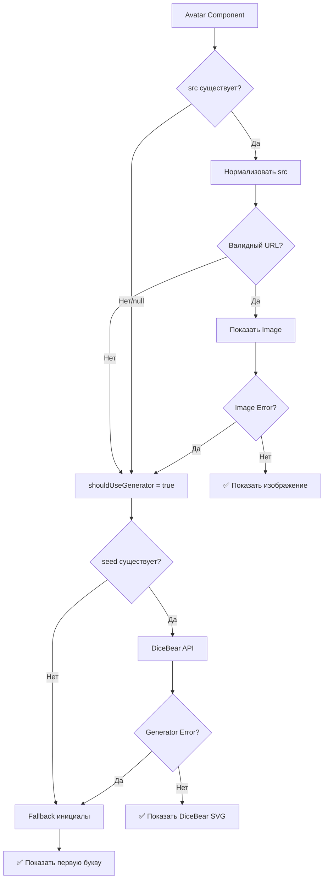
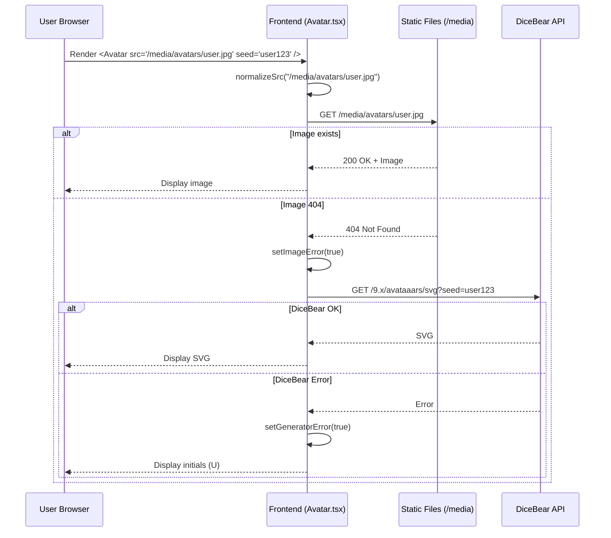
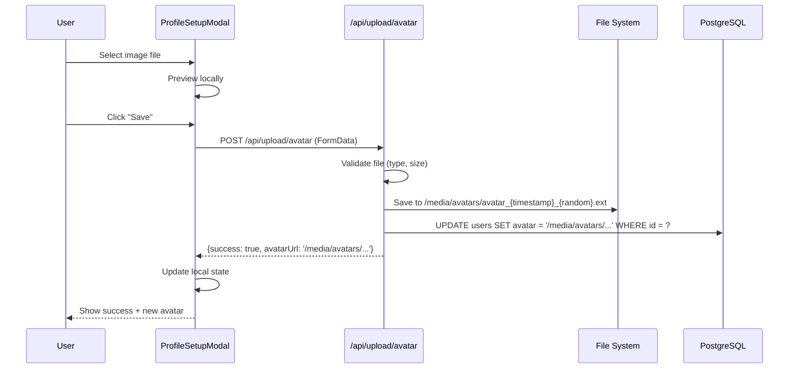

# 🏗️ ARCHITECTURE CONTEXT: Система аватаров Fonana

## 📅 Дата: 18.02.2026
## 🎯 Задача: Анализ текущей архитектуры обработки аватаров
## 👤 M7 Session: `task_найти-и-проанализировать-ресур_0032`

---

## 📐 ТЕКУЩАЯ АРХИТЕКТУРА

### 1. КОМПОНЕНТНАЯ СТРУКТУРА

#### 1.1 Avatar.tsx - Основной компонент

**Файл:** `components/Avatar.tsx` (161 строка)
**Ответственность:** Универсальное отображение аватаров с fallback системой

**Интерфейс:**
```typescript
interface AvatarProps {
  src?: string | null       // URL изображения
  alt: string              // Alt текст
  seed?: string            // Seed для генератора (DiceBear)
  size?: number            // Размер в пикселях (default: 40)
  className?: string       // Дополнительные CSS классы
  rounded?: 'full' | 'xl' | '2xl' | '3xl'  // Скругление углов
}
```

**Логика приоритетов (Waterfall):**



**Ключевые функции:**

1. **normalizeSrc()** - Обработка путей
```typescript
// Логика:
- Если пусто/undefined/null/"null" → return null
- Если начинается с http/https → return as is
- Если нет "/" в начале → добавить "/"
- Иначе → return as is
```

2. **DiceBear Generation**
```typescript
const avatarUrl = `https://api.dicebear.com/9.x/avataaars/svg?seed=${encodeURIComponent(seed)}&backgroundColor=${backgroundColor}`;
```

3. **generateBackgroundColor()** - Детерминированный цвет фона
```typescript
// 10 предустановленных цветов:
const colors = ['b6e3f4', 'c0aede', 'd1d4f9', 'ffd5dc', 'ffdfbf', ...]
// Выбор по hash строки seed
```

#### 1.2 Использование Avatar в компонентах

**Паттерн 1: User Avatar**
```typescript
<Avatar 
  src={user.avatar}          // "/media/avatars/avatar_123.jpg"
  seed={user.id}             // UUID как fallback seed
  alt={user.nickname}
  size={40}
  rounded="full"
/>
```

**Паттерн 2: Creator Avatar**
```typescript
<Avatar 
  src={creator.avatar}
  seed={creator.nickname}
  alt={creator.nickname}
  size={64}
  rounded="2xl"
/>
```

**Паттерн 3: Post Author Avatar**
```typescript
<Avatar 
  src={post.creator?.avatar}
  seed={post.creator?.nickname}
  alt={post.creator?.nickname || 'User'}
  size={32}
/>
```

**Компоненты использующие Avatar:**
- `LeftSidebar.tsx` - профиль текущего юзера
- `CreatorsExplorer.tsx` - карточки криэйторов
- `PostCard.tsx` - автор поста
- `ProfileSetupModal.tsx` - загрузка аватара
- `VerifyAccountPopup.tsx` - верификация
- `CreatePostModal.tsx` - preview автора
- `MessengerPage` - чаты и сообщения

---

### 2. ХРАНИЛИЩЕ И ПУТИ

#### 2.1 Структура файлов

```
public/
└── media/
    ├── avatars/          # 128 файлов (61 webp, 60 jpg, 5 jpeg)
    ├── backgrounds/      # 120 файлов (60 jpg, 60 webp)
    ├── posts/            # 600 файлов (300 jpg, 300 webp)
    ├── thumbposts/       # 600 файлов (300 jpg, 300 webp)
    └── tests/
        └── avatars/
            └── playwright-admin-avatar.jpg
```

**Важно:** Все пути относительные от `/public`

#### 2.2 База данных (PostgreSQL)

**Таблица users:**
```sql
CREATE TABLE users (
  id UUID PRIMARY KEY,
  nickname VARCHAR(50),
  "fullName" VARCHAR(100),
  bio TEXT,
  avatar VARCHAR(255),              -- Путь: "/media/avatars/filename.ext"
  "backgroundImage" VARCHAR(255),   -- Путь: "/media/backgrounds/filename.ext"
  -- ... другие поля
);
```

**Формат хранения путей:**
```sql
-- Примеры из БД:
avatar = '/media/avatars/avatar_1708234567_abc123.jpg'
avatar = '/media/avatars/portrait-woman-01.webp'
backgroundImage = '/media/backgrounds/bg-purple-gradient-1.jpg'
```

**Обновление путей:** `scripts/update_database_media_paths.py`

---

### 3. СИСТЕМА ЗАГРУЗКИ ИЗОБРАЖЕНИЙ

#### 3.1 Скрипты загрузки

**Файл:** `images/download-images.js`

**Функциональность:**
- Загрузка фоновых изображений с Unsplash
- 25 градиентных фонов
- Форматы: JPG, 1920x1080px
- Пауза 1 сек между запросами

**Паттерн Unsplash URL:**
```javascript
const url = 'https://images.unsplash.com/photo-{ID}?w=1920&h=1080&fit=crop';
```

**Документация:** `images/USAGE.md`

#### 3.2 API для загрузки аватаров

**Endpoint:** `app/api/upload/avatar/route.ts`

**Функциональность:**
- POST запрос с multipart/form-data
- Загрузка файла от пользователя
- Сохранение в `public/media/avatars/`
- Обновление записи в БД

**Workflow:**
```
User выбирает файл → 
ProfileSetupModal → 
POST /api/upload/avatar → 
Сохранение в /media/avatars/ → 
UPDATE users SET avatar = '/media/avatars/...' →
UI обновляется
```

---

### 4. DICEBEAR INTEGRATION

#### 4.1 Текущая конфигурация

**API Version:** 9.x
**Стиль:** avataaars
**CDN:** https://api.dicebear.com

**Параметры:**
- `seed` - детерминированная генерация (по user ID/nickname)
- `backgroundColor` - 10 предустановленных цветов

**Формат ответа:** SVG (inline)

#### 4.2 Доступные стили DiceBear 9.x

| Стиль | Описание | Подходит для женских? |
|-------|----------|----------------------|
| `avataaars` | Мультяшные персонажи (Sketch style) | ⚠️ Гендерно-нейтральный |
| `lorelei` | Женские персонажи (pixel art) | ✅ Да, только женские |
| `adventurer` | Персонажи в стиле RPG | ⚠️ Гендерно-нейтральный |
| `big-ears` | Персонажи с большими ушами | ⚠️ Гендерно-нейтральный |
| `notionists` | Notion-style аватары | ⚠️ Гендерно-нейтральный |
| `personas` | Минималистичные лица | ⚠️ Гендерно-нейтральный |

**⭐ Ключевой инсайт:** 
`lorelei` - это стиль DiceBear СПЕЦИАЛЬНО для женских персонажей!

```typescript
// Пример использования lorelei:
const femaleAvatarUrl = `https://api.dicebear.com/9.x/lorelei/svg?seed=${seed}`;
```

---

### 5. НОРМАЛИЗАЦИЯ ДАННЫХ

#### 5.1 PostNormalizer Service

**Файл:** `services/posts/normalizer.ts`

**Ответственность:**
- Приведение данных из БД к frontend типам
- Добавление fallback значений
- Обработка relationships (creator, likes, etc.)

**Паттерн для аватаров:**
```typescript
// Normalizer НЕ трогает avatar пути
// Передает как есть из БД:
creator: {
  avatar: post.creator.avatar || null  // "/media/avatars/..." OR null
}
```

#### 5.2 Fallback Strategy

**3-уровневая система:**

1. **Level 1:** Реальное изображение (src из БД)
   - Путь: `/media/avatars/avatar_123.jpg`
   - Проблема: Может быть 404

2. **Level 2:** DiceBear генерация (seed из user ID)
   - URL: `https://api.dicebear.com/9.x/avataaars/svg?seed=...`
   - Проблема: Может упасть DiceBear API

3. **Level 3:** Инициалы (первая буква nickname)
   - Рендеринг: `<div>A</div>`
   - Гарантированно работает

---

### 6. ПРОБЛЕМНЫЕ МЕСТА

#### 6.1 Текущие боли

**🔴 CRITICAL:**

1. **Mixed gender avatars** (если текущие 128 файлов mixed)
   - Проблема: Не все аватары - женские
   - Решение: Заменить на женские ИЛИ фильтровать

2. **DiceBear avataaars не женские**
   - Проблема: Гендерно-нейтральный стиль
   - Решение: Переключиться на `lorelei` стиль

**🟡 MEDIUM:**

3. **Rate limits Unsplash**
   - Проблема: 50 requests/hour на demo API
   - Решение: Production API key ИЛИ другой источник

4. **Отсутствие метаданных**
   - Проблема: Не знаем источник существующих 128 аватаров
   - Решение: Audit + документирование

#### 6.2 Технический долг

**Проблема 1:** Смешанные форматы (jpg, webp, jpeg)
```
Почему проблема: Нет стандартизации
Решение: Конвертировать все в WebP
```

**Проблема 2:** Нет lazy loading для аватаров
```
Почему проблема: Все аватары грузятся сразу
Решение: Использовать Next.js Image с lazy loading
```

**Проблема 3:** Нет оптимизации размеров
```
Почему проблема: Одно изображение для всех размеров (32px, 64px, 128px)
Решение: Генерировать thumbnails разных размеров
```

---

### 7. DEPENDENCIES И ИНТЕГРАЦИИ

#### 7.1 Next.js Image

**Компонент:** `next/image`

**Используется в Avatar.tsx:**
```typescript
<Image
  src={normalizedSrc}
  alt={alt}
  width={size}
  height={size}
  className="object-cover w-full h-full"
  onError={() => setImageError(true)}
/>
```

**Проблема:** `unoptimized` prop для DiceBear (внешний URL)

#### 7.2 Prisma Schema

**Файл:** `prisma/schema.prisma`

```prisma
model User {
  id              String   @id @default(uuid())
  nickname        String   @unique @db.VarChar(50)
  fullName        String?  @db.VarChar(100)
  avatar          String?  @db.VarChar(255)
  backgroundImage String?  @db.VarChar(255)
  // ...
}
```

**Миграции:** Поле `backgroundImage` было добавлено позже

---

### 8. FLOW ДИАГРАММЫ

#### 8.1 User Avatar Loading Flow



#### 8.2 Avatar Upload Flow



---

### 9. АРХИТЕКТУРНЫЕ РЕШЕНИЯ

#### 9.1 Почему такая архитектура?

**Решение 1: 3-level fallback**
```
Причина: Надежность
Обоснование: Если один источник падает, есть backup
Альтернатива: Только локальные файлы (нет генерации)
```

**Решение 2: Локальное хранение в /public**
```
Причина: Простота deployment
Обоснование: Нет зависимости от Supabase/S3
Альтернатива: CDN (Cloudinary, Vercel Blob)
Проблема: Увеличивает размер репозитория
```

**Решение 3: DiceBear как генератор**
```
Причина: Бесплатно + без лимитов
Обоснование: Мгновенная генерация по seed
Альтернатива: UI Avatars, Boring Avatars
```

#### 9.2 Архитектурные ограничения

**Ограничение 1:** Все аватары в одной папке
```
Проблема: Может стать медленным при 10K+ файлов
Решение: Разбить на подпапки (по первой букве/hash)
```

**Ограничение 2:** Нет CDN
```
Проблема: Все файлы раздаются с Next.js сервера
Решение: Использовать Vercel CDN ИЛИ Cloudflare
```

**Ограничение 3:** Один размер файла
```
Проблема: Нет responsive images
Решение: Next.js Image автоматически генерирует sizes
```

---

### 10. МЕТРИКИ И МОНИТОРИНГ

#### 10.1 Текущие метрики

**Storage:**
- Аватары: 128 файлов (~5-10 MB примерно)
- Backgrounds: 120 файлов (~15-20 MB)
- Всего медиа: ~1.3 GB (с постами)

**Performance:**
- Avatar load time: ~50-200ms (локальные файлы)
- DiceBear generation: ~100-300ms (network)
- Fallback to initials: ~0ms (instant)

#### 10.2 Мониторинг

**Логирование в Avatar.tsx:**
```typescript
console.log('[Avatar] Src changed: ', src);
console.log('[Avatar] Image load error for src:', src);
console.log('[Avatar] DiceBear error for URL:', avatarUrl);
console.log('[Avatar] DiceBear loaded:', avatarUrl);
```

**Проблема:** Console.log не подходит для production

---

## 🎯 ВЫВОДЫ ДЛЯ SOLUTION DESIGN

### Ключевые точки интеграции:

1. **Avatar.tsx линия 89** - URL генерации DiceBear
   - Можно заменить стиль на `lorelei`
   - Можно переключиться на другой API

2. **images/download-images.js** - Скрипт загрузки
   - Можно адаптировать для портретов
   - Можно заменить Unsplash на Pexels

3. **public/media/avatars/** - Папка с файлами
   - Можно добавить новые аватары
   - Можно заменить существующие

### Что НЕ нужно трогать:

- ✅ PostNormalizer (не касается аватаров)
- ✅ API routes (уже работают)
- ✅ База данных (схема подходит)
- ✅ Fallback логика (хорошо продумана)

### Риски изменений:

- 🔴 **HIGH:** Замена DiceBear URL → может сломать fallback
- 🟡 **MEDIUM:** Замена файлов → нужно обновить БД пути
- 🟢 **LOW:** Добавление новых файлов → безопасно

---

**Status:** ✅ COMPLETE
**Next Phase:** SOLUTION_PLAN with ROI Matrix
**Analyst:** Claude Opus 4.5 via M7 HEAVY methodology
