# ARCHITECTURE CONTEXT - COMPLETE SYSTEM MAPPING
**Task ID:** complete-infinite-loop-architectural-analysis-2025-024  
**Route:** HEAVY  
**Date:** 2025-01-24  
**Status:** COMPREHENSIVE_MAPPING  

## 🏗️ SYSTEM ARCHITECTURE OVERVIEW

### **Component Hierarchy with API Dependencies**

```mermaid
graph TD
    A[AppProvider] --> B[useWallet Hook]
    B --> C[publicKey Object]
    C --> D[20+ Components]
    
    D --> E[CreatorsExplorer ✅FIXED]
    D --> F[CategoryPage ❌UNFIXED]
    D --> G[PurchaseModal ❌UNFIXED]
    D --> H[CreateFlashSale ❌UNFIXED]
    D --> I[SubscribeModal ❌UNFIXED]
    D --> J[useOptimizedPosts ✅FIXED]
    D --> K[useUnifiedPosts ✅FIXED]
    
    L[Zustand Store] --> M[refreshCreator]
    L --> N[loadCreator]
    L --> O[loadPosts]
    
    M --> P[API Calls]
    N --> P
    O --> P
    
    P --> Q[Server Overload]
    
    style F fill:#FF6B6B
    style G fill:#FF6B6B
    style H fill:#FF6B6B
    style I fill:#FF6B6B
    style Q fill:#FF6B6B
```



## 📊 COMPLETE COMPONENT ANALYSIS

### **🔴 CRITICAL PATH COMPONENTS (Causing Infinite Loops)**

#### **1. CategoryPage Component**
**File:** `app/category/[slug]/page.tsx`
**Lines:** 55-88
**Problem:** Unstable loadCreators function

```typescript
// CURRENT PROBLEMATIC CODE:
export default function CategoryPage({ params }: CategoryPageProps) {
  const categorySlug = params.slug.toLowerCase()
  
  useEffect(() => {
    loadCreators() // ❌ Function recreated every render
  }, [categorySlug])

  const loadCreators = async () => { // ❌ NOT MEMOIZED
    const response = await fetch('/api/creators')
    // ... 
  }
}
```

**Data Flow:**
```
CategoryPage render → loadCreators created → useEffect triggers →
fetch('/api/creators') → setState → re-render → NEW loadCreators → LOOP!
```

#### **2. PurchaseModal Component**
**File:** `components/PurchaseModal.tsx`
**Lines:** 94, 150
**Problem:** Direct publicKey.toBase58() usage

```typescript
// LINE 150:
const checkResponse = await fetch(
  `/api/flash-sales/apply/check?flashSaleId=${post.flashSale.id}&userId=${publicKey.toBase58()}&price=${post.price}`
)
```

**Data Flow:**
```
PurchaseModal render → useWallet() → NEW publicKey object →
useEffect with publicKey dependency → API call with publicKey.toBase58() →
Component re-render → NEW publicKey → LOOP!
```

#### **3. SubscribeModal Component**
**File:** `components/SubscribeModal.tsx`
**Lines:** 514, 521, 543
**Problem:** Multiple publicKey!.toString() calls

```typescript
// LINE 514:
const userResponse = await fetch(`/api/user?wallet=${publicKey!.toString()}`)

// LINE 521:
body: JSON.stringify({
  wallet: publicKey!.toString(),
  // ...
})
```

### **🟡 SECONDARY PATH COMPONENTS (Contributing to Loops)**

#### **4. Store Actions Chain**
**File:** `lib/store/appStore.ts`

```typescript
// PATTERN: Store actions calling APIs
refreshCreator: async () => {
  const response = await fetch(`/api/creators/${creator.id}`)
  set({ creator: data.creator }) // ← Triggers re-renders
}

loadCreator: async (creatorId: string) => {
  const response = await fetch(`/api/creators/${creatorId}`)
  set({ creator: data.creator }) // ← Triggers re-renders
}
```

**Chain Reaction:**
```
Component uses creator from store → Store updates → Component re-renders →
Might trigger refreshCreator again → API call → Store update → LOOP!
```

#### **5. DashboardPageClient**
**File:** `components/DashboardPageClient.tsx`
**Lines:** 68-76
**Problem:** Multiple API calls in single useEffect

```typescript
useEffect(() => {
  if (user?.id) {
    fetchDashboardData()
  }
}, [user?.id, period]) // ← period changes trigger ALL API calls

const fetchDashboardData = async () => {
  // 3 API calls executed together:
  await fetch(`/api/creators/analytics?creatorId=${user?.id}&period=${period}`)
  await fetch(`/api/posts?creatorId=${user?.id}`)
  await fetch(`/api/subscriptions?creatorId=${user?.id}`)
}
```

## 🔄 DATA FLOW PATTERNS

### **Pattern 1: Wallet Dependency Cascade**


### **Pattern 2: Store Update Cascade**


### **Pattern 3: Function Recreation Loop**


## 🎯 ARCHITECTURAL WEAKNESSES

### **1. No API Call Management Layer**
```typescript
// CURRENT: Direct API calls everywhere
const response = await fetch('/api/creators')

// NEEDED: Centralized API service
const creators = await apiService.getCreators() // With caching, deduplication
```

### **2. Missing Wallet Abstraction**
```typescript
// CURRENT: Direct wallet hook usage
const { publicKey } = useWallet()
useEffect(() => {}, [publicKey]) // ❌ UNSTABLE

// NEEDED: Stable wallet abstraction
const { publicKeyString } = useStableWallet()
useEffect(() => {}, [publicKeyString]) // ✅ STABLE
```

### **3. No Request Deduplication**
```typescript
// CURRENT: Multiple identical requests
Component1: fetch('/api/creators')
Component2: fetch('/api/creators')
Component3: fetch('/api/creators')
// All fire simultaneously!

// NEEDED: Request deduplication
apiCache.get('/api/creators') // Returns same promise for concurrent requests
```

### **4. Uncontrolled Store Updates**
```typescript
// CURRENT: Any component can trigger store updates
store.refreshCreator() // No throttling
store.refreshCreator() // Called again immediately
store.refreshCreator() // And again...

// NEEDED: Controlled store updates
store.refreshCreator() // Throttled/debounced
```

## 📈 PERFORMANCE IMPACT ANALYSIS

### **Resource Consumption per Component:**

| Component | API Calls/sec | DB Queries/sec | Impact |
|-----------|--------------|----------------|---------|
| CategoryPage | 2 | 110 | 🔴 CRITICAL |
| PurchaseModal | 0.5 | 27 | 🟡 HIGH |
| SubscribeModal | 0.3 | 16 | 🟡 HIGH |
| Store Actions | 0.2 | 11 | 🟡 MEDIUM |
| DashboardPageClient | 0.1 | 5 | 🟢 LOW |

### **Cumulative Server Impact:**
- **Total API calls:** 7,200+/hour
- **Database connections:** Exhausting pool
- **CPU usage:** 40-60% from API processing
- **Memory:** Growing due to unresolved promises
- **Network:** 500KB/sec wasted bandwidth

## 🏗️ REQUIRED ARCHITECTURAL CHANGES

### **1. Global API Management Service**
```typescript
// services/apiManager.ts
class APIManager {
  private cache = new Map()
  private pending = new Map()
  
  async get(url: string, options?: RequestInit) {
    // Check cache first
    if (this.cache.has(url)) {
      return this.cache.get(url)
    }
    
    // Check pending requests
    if (this.pending.has(url)) {
      return this.pending.get(url)
    }
    
    // Make request
    const promise = fetch(url, options)
    this.pending.set(url, promise)
    
    try {
      const result = await promise
      this.cache.set(url, result)
      return result
    } finally {
      this.pending.delete(url)
    }
  }
}
```

### **2. Stable Wallet Provider**
```typescript
// providers/StableWalletProvider.tsx
export function StableWalletProvider({ children }) {
  const wallet = useWallet()
  
  const value = useMemo(() => ({
    ...wallet,
    publicKeyString: wallet.publicKey?.toBase58(),
    publicKeyShort: wallet.publicKey?.toBase58().slice(0, 8)
  }), [wallet.publicKey])
  
  return (
    <StableWalletContext.Provider value={value}>
      {children}
    </StableWalletContext.Provider>
  )
}
```

### **3. Component Refactoring Pattern**
```typescript
// BEFORE: Problematic component
export function ProblematicComponent() {
  const { publicKey } = useWallet()
  
  const loadData = async () => { // ❌ Recreated
    await fetch(`/api/data?wallet=${publicKey.toBase58()}`)
  }
  
  useEffect(() => {
    loadData()
  }, [publicKey]) // ❌ Unstable
}

// AFTER: Fixed component
export function FixedComponent() {
  const { publicKeyString } = useStableWallet()
  
  const loadData = useCallback(async () => {
    await apiManager.get(`/api/data?wallet=${publicKeyString}`)
  }, [publicKeyString]) // ✅ Stable
  
  useEffect(() => {
    loadData()
  }, [loadData]) // ✅ Stable
}
```

---
**STATUS:** Architecture fully mapped - ready for solution design 