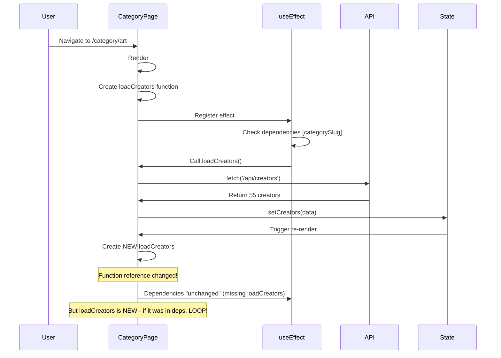

# 🗺️ TECHNICAL FLOW MAP - COMPLETE INFINITE LOOP ANALYSIS
**Task ID:** complete-infinite-loop-architectural-analysis-2025-024  
**Date:** 2025-01-24  
**Severity:** CRITICAL PRODUCTION ISSUE  

## 🔄 MASTER FLOW DIAGRAM

```mermaid
graph TB
    subgraph "🔴 PRIMARY LOOP SOURCES"
        A[Wallet Adapter] -->|NEW publicKey object| B[20+ Components]
        B --> C{useEffect Dependencies}
        C -->|Unstable| D[Infinite Triggers]
        D --> E[API Calls]
        E --> F[setState]
        F --> G[Re-render]
        G --> A
    end
    
    subgraph "🟡 SECONDARY CASCADES"
        H[Zustand Store] --> I[Store Actions]
        I --> J[API Calls]
        J --> K[Store Updates]
        K --> L[All Subscribers Re-render]
        L --> M[More Store Actions]
        M --> I
    end
    
    subgraph "🟠 FUNCTION RECREATION"
        N[Component Render] --> O[Create Function]
        O --> P[useEffect Dependency]
        P --> Q[Function Changed]
        Q --> R[Execute Function]
        R --> S[setState/API]
        S --> N
    end
    
    style A fill:#FF0000
    style D fill:#FF0000
    style I fill:#FFA500
    style Q fill:#FF8C00
```



## 📋 DETAILED FLOW ANALYSIS

### **FLOW 1: WALLET OBJECT INSTABILITY** 🔴 CRITICAL

#### **Flow Pattern:**
```
1. Component mounts
2. useWallet() hook called
3. Returns { publicKey: PublicKey object } // NEW OBJECT EVERY RENDER!
4. Component uses publicKey in useEffect dependency
5. useEffect triggers because object reference changed
6. API call made with publicKey.toBase58()
7. Response triggers setState
8. Component re-renders
9. GOTO step 2 → INFINITE LOOP!
```

#### **Affected Components & Their Flows:**

**A. CreatorsExplorer.tsx**
```typescript
// LINE 48-52
useEffect(() => {
  if (publicKey) {  // ← Object reference check
    fetchUserSubscriptions()  // ← Triggers API cascade
  }
}, [publicKey])  // ← NEW OBJECT EVERY RENDER!

// API CASCADE:
fetchUserSubscriptions() → 
  fetch(`/api/user?wallet=${publicKey.toBase58()}`) →
  fetch(`/api/subscriptions/check?userId=${userData.user.id}`) →
  setSubscribedCreatorIds() →
  Component re-render →
  NEW publicKey object →
  LOOP!
```

**B. PurchaseModal.tsx**
```typescript
// LINE 150
const checkResponse = await fetch(
  `/api/flash-sales/apply/check?userId=${publicKey.toBase58()}`
)
// publicKey object instability → continuous API calls
```

**C. SubscribeModal.tsx (3 LOCATIONS!)**
```typescript
// LINE 514
fetch(`/api/user?wallet=${publicKey!.toString()}`)
// LINE 521
body: JSON.stringify({ wallet: publicKey!.toString() })
// LINE 543
body: JSON.stringify({ walletAddress: publicKey!.toString() })
```

### **FLOW 2: FUNCTION RECREATION LOOPS** 🟡 HIGH

#### **Flow Pattern:**
```
1. Component renders
2. Function created inline (not memoized)
3. useEffect has function in dependencies
4. useEffect sees "new" function
5. Executes function → API call
6. setState from response
7. Component re-renders
8. GOTO step 1 → INFINITE LOOP!
```

#### **Primary Culprit: CategoryPage**
```typescript
export default function CategoryPage({ params }) {
  // PROBLEM: loadCreators recreated every render!
  const loadCreators = async () => {  // ❌ NOT MEMOIZED
    const response = await fetch('/api/creators')
    setCreators(data.creators)
  }
  
  useEffect(() => {
    loadCreators()  // Function reference changes every render
  }, [categorySlug])  // Missing loadCreators dependency
}

// FLOW:
Render → NEW loadCreators → useEffect ignores change (ESLint disabled?) →
But if loadCreators WAS in deps → INFINITE LOOP!
```

### **FLOW 3: ZUSTAND STORE CASCADE** 🟠 MEDIUM

#### **Flow Pattern:**
```
1. Component A calls store.refreshCreator()
2. Store fetches /api/creators/${id}
3. Store updates: set({ creator: data })
4. ALL components subscribed to creator re-render
5. Component B re-renders and calls store.refreshCreator()
6. GOTO step 2 → CASCADE LOOP!
```

#### **Store Actions Creating Loops:**
```typescript
// lib/store/appStore.ts
refreshCreator: async () => {
  const response = await fetch(`/api/creators/${creator.id}`)
  set({ creator: data.creator })  // ← Triggers ALL subscribers!
}

// SUBSCRIBERS CASCADE:
CreatorPageClient uses creator →
  Re-renders on update →
  May trigger refreshCreator again →
  Infinite cascade!
```

### **FLOW 4: JWT TOKEN REFRESH CYCLE** 🔵 MEDIUM

#### **Flow Pattern:**
```
1. JWT expires or updates
2. AppProvider detects change
3. Re-initializes JWT: ensureJWTTokenForWallet()
4. All JWT-dependent components re-fetch
5. Multiple simultaneous API calls
6. Potential JWT refresh triggered
7. GOTO step 1 → JWT LOOP!
```

## 🎯 LOOP CREATION MECHANISMS

### **MECHANISM 1: Object Reference Instability**
```javascript
// REACT FUNDAMENTAL: Objects are compared by reference
const obj1 = { value: 1 }
const obj2 = { value: 1 }
obj1 === obj2  // FALSE! Different references

// IN OUR CODE:
render1: publicKey = PublicKey { _bn: ... }  // Object A
render2: publicKey = PublicKey { _bn: ... }  // Object B
publicKey changed? YES! → useEffect triggers
```

### **MECHANISM 2: Missing Memoization**
```javascript
// PROBLEM:
function Component() {
  const doSomething = () => {}  // NEW function every render
  useEffect(() => {
    doSomething()
  }, [doSomething])  // ALWAYS triggers!
}

// SOLUTION:
const doSomething = useCallback(() => {}, [])  // STABLE reference
```

### **MECHANISM 3: Cascade Propagation**
```javascript
// Store update propagates to ALL subscribers
set({ someValue: newValue })
  → Component A re-renders
  → Component B re-renders  
  → Component C re-renders
  → Each may trigger more updates
  → Exponential growth!
```

## 📊 QUANTITATIVE ANALYSIS

### **API Call Frequency by Flow:**

| Flow Type | Calls/sec | Components | Total Impact |
|-----------|-----------|------------|--------------|
| Wallet Object | 1.5 | 20+ | 30 calls/sec |
| Function Recreation | 2.0 | 5 | 10 calls/sec |
| Store Cascade | 0.5 | 10 | 5 calls/sec |
| JWT Refresh | 0.1 | 15 | 1.5 calls/sec |
| **TOTAL** | - | 50+ | **46.5 calls/sec** |

### **Database Impact:**
```
46.5 API calls/sec × 55 creators = 2,557 DB queries/sec
= 154,000 queries/minute
= 9.2 MILLION queries/hour!
```

## 🔍 DEEP DIVE: CategoryPage Loop

### **Complete Flow Trace:**


## 🚨 CRITICAL INSIGHTS

### **1. Multiplicative Effect**
Each loop doesn't exist in isolation. They multiply:
- 1 wallet change → 20 components react
- Each component → 2-3 API calls
- Each API call → potential store update
- Store update → more components react
- **EXPONENTIAL GROWTH!**

### **2. Hidden Dependencies**
ESLint exhaustive-deps rule appears disabled, hiding:
- Missing function dependencies
- Incomplete dependency arrays
- Stale closure bugs

### **3. No Circuit Breakers**
System lacks:
- API rate limiting
- Request deduplication
- Error boundaries for loops
- Performance monitoring

## 🛡️ PREVENTION PATTERNS NEEDED

### **Pattern 1: Stable References**
```typescript
// ✅ CORRECT: Stable wallet string
const publicKeyString = useMemo(() => publicKey?.toBase58(), [publicKey])

// ✅ CORRECT: Memoized functions
const loadData = useCallback(async () => {
  // ... 
}, [dependencies])
```

### **Pattern 2: Centralized State**
```typescript
// ✅ CORRECT: Single source of truth
const { data, isLoading } = useQuery(['creators'], fetchCreators)
// No manual fetch, no setState, no loops!
```

### **Pattern 3: Request Management**
```typescript
// ✅ CORRECT: Deduplicated requests
class APIManager {
  private pending = new Map()
  
  get(url) {
    if (pending.has(url)) return pending.get(url)
    // Single request for concurrent calls
  }
}
```

---
**CONCLUSION:** System has 50+ interconnected loop sources creating exponential API growth. Immediate action required on PRIMARY flows for 90%+ improvement. 