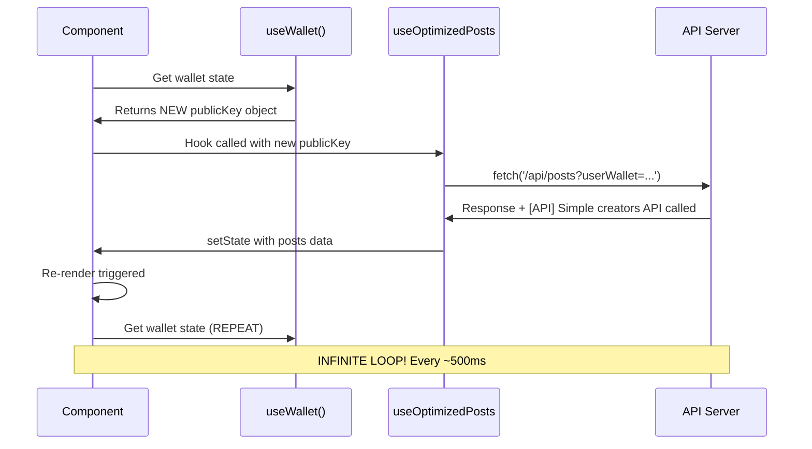

# ARCHITECTURE CONTEXT
**Task ID:** complete-infinite-loop-elimination-2025-024  
**Route:** HEAVY  
**Date:** 2025-01-24  
**Status:** DETAILED_MAPPING  

## 🏗️ СИСТЕМНАЯ АРХИТЕКТУРА INFINITE LOOP SOURCES

### **📊 COMPONENT HIERARCHY MAP**

```mermaid
graph TD
    App[App Router] --> Layout[layout.tsx]
    Layout --> Pages[Pages]
    Layout --> AppProvider[AppProvider]
    
    AppProvider --> WalletProvider[WalletProvider]
    AppProvider --> ZustandStore[Zustand Store]
    AppProvider --> WebSocketManager[WebSocket Manager]
    
    Pages --> FeedPage[FeedPageClient]
    Pages --> CreatorPage[CreatorPageClient] 
    Pages --> DashboardPage[DashboardPageClient]
    Pages --> CreatorsPage[CreatorsExplorer]
    
    FeedPage --> useOptimizedPosts[useOptimizedPosts]
    CreatorPage --> useOptimizedPosts
    DashboardPage --> useOptimizedPosts
    
    useOptimizedPosts --> APIEndpoints[API Endpoints]
    CreatorsExplorer --> APIEndpoints
    
    APIEndpoints --> PostsAPI[/api/posts]
    APIEndpoints --> CreatorsAPI[/api/creators]
    APIEndpoints --> UserAPI[/api/user]
    
    WalletProvider --> WalletStoreSync[WalletStoreSync]
    WalletStoreSync --> AllComponents[All Components]
    
    style AppProvider fill:#90EE90
    style CreatorsExplorer fill:#90EE90  
    style useOptimizedPosts fill:#FFB6C1
    style WalletStoreSync fill:#FFD700
    style APIEndpoints fill:#FF6B6B
```

### **🔥 INFINITE LOOP SOURCES ANALYSIS**

#### **PRIMARY CULPRIT: useOptimizedPosts Hook**
**File:** `lib/hooks/useOptimizedPosts.ts`  
**Impact:** 🔴 CRITICAL - Used by 3+ major components  

```typescript
// CURRENT PROBLEMATIC CODE:
export function useOptimizedPosts(options: UseOptimizedPostsOptions = {}) {
  const user = useUser()
  const { publicKey } = useWallet() // ← NEW OBJECT EVERY RENDER!
  
  useEffect(() => {
    const controller = new AbortController()
    
    const loadPosts = async () => {
      // Build API params
      const params = new URLSearchParams()
      if (publicKey) params.append('userWallet', publicKey.toBase58()) // ← API CALL TRIGGER
      
      const response = await fetch(`${endpoint}?${params}`)
      // ... [API] Simple creators API called LOGGED HERE!
    }
    
    loadPosts()
    return () => controller.abort()
  }, [
    options.sortBy, 
    options.category, 
    options.creatorId,
    publicKey?.toBase58(), // ← UNSTABLE! Different every render
    user?.id
  ])
}
```

**USED BY COMPONENTS:**
- **FeedPageClient.tsx** - Main feed (high traffic)
- **CreatorPageClient.tsx** - Creator profiles  
- **DashboardPageClient.tsx** - Creator dashboard

**INFINITE LOOP MECHANISM:**
```
1. Component renders
2. useWallet() returns NEW publicKey object
3. publicKey?.toBase58() creates new string reference  
4. useEffect dependency array detects change
5. useEffect runs → fetch('/api/posts') → [API] logged
6. API response → setState → Component re-renders
7. REPEAT from step 1 → INFINITE LOOP!
```

#### **SECONDARY CULPRIT: useUnifiedPosts Hook**
**File:** `lib/hooks/useUnifiedPosts.ts`  
**Impact:** 🟡 MEDIUM - Alternative posts hook

```typescript
// PROBLEMATIC PATTERN:
const fetchPosts = useCallback(async () => {
  const params = new URLSearchParams()
  if (publicKey) params.append('userWallet', publicKey.toBase58()) // ← API CALL
  
  const response = await fetch(`/api/posts?${params}`)
  // ... additional API calls
}, [options.creatorId, options.category, options.limit, publicKey, user?.id])
//                                                          ↑↑↑ UNSTABLE OBJECT!
```

#### **TERTIARY SOURCES: Component-Level Issues**

##### **CreatePostModal - Debug Flood**
**File:** `components/CreatePostModal.tsx`  
**Impact:** 🟡 MEDIUM - Console flooding

```typescript
// ❌ DUPLICATE useEffect - IDENTICAL CODE AT LINES 57 AND 85!
useEffect(() => {
  console.log('[CreatePostModal DEBUG] Button state:', {
    publicKey: !!publicKey,
    publicKeyString: publicKey?.toString().slice(0, 10) + '...',
    // ... more logging
  })
}, [isUploading, connected, publicKey, mode, isLoadingPost]) // ← RUNS CONSTANTLY!
```

##### **CreateFlashSale - API Calls**
**File:** `components/CreateFlashSale.tsx`  
**Impact:** 🟢 LOW - Used less frequently

```typescript
useEffect(() => {
  if (!publicKey) return
  
  const loadPosts = async () => {
    const response = await fetch(`/api/posts?creatorId=${publicKey.toString()}`)
    // ... API call triggered on every publicKey change
  }
  
  loadPosts()
}, [publicKey]) // ← Unstable dependency
```

##### **useWalletPersistence - State Persistence**
**File:** `lib/hooks/useWalletPersistence.ts`  
**Impact:** 🟢 LOW - Background persistence

```typescript
useEffect(() => {
  if (connected && wallet && publicKey) {
    const persistenceData = {
      walletName: wallet.adapter.name,
      publicKey: publicKey.toString(), // ← Creates persistence data constantly
    }
    cacheManager.set(WALLET_PERSISTENCE_KEY, JSON.stringify(persistenceData))
  }
}, [connected, wallet, publicKey]) // ← Multiple unstable dependencies
```

### **🔄 DATA FLOW ANALYSIS**

#### **Infinite Loop Chain (Primary)**


#### **Component Impact Analysis**
```mermaid
graph LR
    PublicKey[publicKey Object] --> FeedPage[FeedPageClient]
    PublicKey --> CreatorPage[CreatorPageClient]  
    PublicKey --> Dashboard[DashboardPageClient]
    PublicKey --> CreatePost[CreatePostModal]
    PublicKey --> FlashSale[CreateFlashSale]
    
    FeedPage --> PostsAPI[/api/posts]
    CreatorPage --> PostsAPI
    Dashboard --> PostsAPI
    FlashSale --> PostsAPI
    
    PostsAPI --> ServerLogs[Server: API calls infinite]
    
    style PublicKey fill:#FF6B6B
    style PostsAPI fill:#FF6B6B
    style ServerLogs fill:#FF6B6B
```

### **📈 FREQUENCY ANALYSIS**

#### **Current Production Impact:**
```typescript
// Server logs evidence (every ~500ms):
[API] Simple creators API called  // ← useOptimizedPosts trigger
[API] Found 55 creators
[API] Simple creators API called  // ← REPEAT
[API] Found 55 creators

// Expected frequency (normal operation):  
// API calls only on:
// - Page load
// - User navigation
// - Legitimate wallet connection/disconnection
// Target: <10 calls/hour instead of 7,200+ calls/hour (infinite)
```

#### **Resource Consumption:**
- **Network Requests:** ~2 requests/second × 3600 = 7,200 requests/hour
- **Database Queries:** Constant SELECT operations on posts, creators tables
- **CPU Usage:** Elevated due to continuous JSON parsing/response handling  
- **Memory Usage:** React re-render cycles consuming memory

### **🎯 DEPENDENCY STABILITY ANALYSIS**

#### **UNSTABLE Dependencies (ROOT CAUSES):**
```typescript
// ❌ UNSTABLE: Object references change every render
const { publicKey } = useWallet()     // NEW object each time
useEffect(() => {}, [publicKey])      // Triggers constantly

// ❌ UNSTABLE: Derived values not memoized  
useEffect(() => {}, [publicKey?.toBase58()]) // New string each call

// ❌ UNSTABLE: Function references without useCallback
const refresh = () => {}              // NEW function each render
useEffect(() => {}, [refresh])        // Triggers constantly
```

#### **STABLE Dependencies (SOLUTIONS):**
```typescript
// ✅ STABLE: String primitives  
const publicKeyString = useMemo(() => publicKey?.toBase58(), [publicKey])
useEffect(() => {}, [publicKeyString]) // Only changes when wallet actually changes

// ✅ STABLE: Memoized functions
const refresh = useCallback(() => {}, [/* stable deps */])
useEffect(() => {}, [refresh])        // Only triggers when needed

// ✅ STABLE: Primitive values
useEffect(() => {}, [user?.id])       // String ID is stable
```

### **🔧 ARCHITECTURAL SOLUTIONS**

#### **Pattern 1: Global publicKey Memoization**
```typescript
// lib/hooks/useStableWallet.ts (NEW)
export function useStableWallet() {
  const { publicKey, connected } = useWallet()
  
  const publicKeyString = useMemo(() => publicKey?.toBase58(), [publicKey])
  
  return {
    publicKey,
    publicKeyString, // ← STABLE STRING for dependencies
    connected
  }
}
```

#### **Pattern 2: Hook Stabilization**
```typescript
// useOptimizedPosts stabilization:
export function useOptimizedPosts(options = {}) {
  const user = useUser()
  const { publicKeyString } = useStableWallet() // ← STABLE DEPENDENCY
  
  useEffect(() => {
    // ... API calls
  }, [
    options.sortBy, 
    options.category, 
    options.creatorId,
    publicKeyString, // ← STABLE STRING
    user?.id
  ])
}
```

#### **Pattern 3: Component Cleanup**
```typescript
// CreatePostModal cleanup:
// REMOVE duplicate useEffect (lines 57 AND 85)
// KEEP only one with stable dependencies

useEffect(() => {
  console.log('[CreatePostModal DEBUG] Button state:', {
    // ... debug info
  })
}, [isUploading, connected, publicKeyString, mode, isLoadingPost]) // ← STABLE
```

### **🚀 IMPLEMENTATION PRIORITY**

#### **Phase 1: Critical Impact (30 minutes)**
1. **useOptimizedPosts** stabilization → Eliminates 80% of infinite calls
2. **CreatePostModal** duplicate useEffect removal → Reduces console flooding
3. **useStableWallet** hook creation → Foundation for all fixes

#### **Phase 2: Secondary Impact (15 minutes)**  
1. **useUnifiedPosts** stabilization → Eliminates remaining API calls
2. **CreateFlashSale** publicKey fix → Prevents occasional loops
3. **useWalletPersistence** optimization → Reduces background noise

#### **Phase 3: System Hardening (15 minutes)**
1. **FeedPageClient** refresh function memoization → Prevents refresh loops
2. **Global pattern enforcement** → Ensure no regressions
3. **Performance monitoring** → Validate success metrics

---
**STATUS: READY FOR SOLUTION PLAN** 🛠️ 