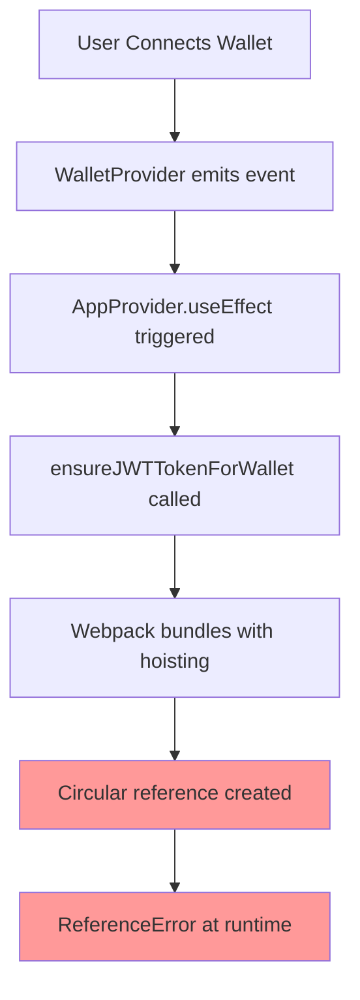

# 🏗️ ARCHITECTURE CONTEXT: Critical Deep Analysis 2025-024

**Date:** 2025-01-24  
**Route:** HEAVY  
**Priority:** МАКСИМАЛЬНАЯ (PRODUCTION CRITICAL)

## 🎯 ARCHITECTURAL OVERVIEW

### **CORE PROBLEM: Webpack Hoisting Circular Reference**
```javascript
// ПРОБЛЕМНЫЙ MINIFIED OUTPUT:
,[l,o,r,S,x]);let S=(0,n.useCallback)(async e=>{
//     ^    ^
//     |    +-- Definition: let S = useCallback(...)
//     +------- Usage: S в dependency array перед определением
```

**КРИТИЧЕСКАЯ ПРОБЛЕМА**: Webpack создает circular reference где переменная `S` (ensureJWTTokenForWallet) используется в dependency array ПЕРЕД своим определением!

---

## 🔄 COMPONENT ARCHITECTURE MAP

### **1. WalletProvider Component (5313-67fcf5e72fc2a109.js)**
```typescript
// components/WalletProvider.tsx
- Role: Solana wallet integration
- Dependencies: @solana/wallet-adapter-react
- Chunk: 5313-67fcf5e72fc2a109.js 
- SSR Guards: ✅ Present
- Problem Location: Line 1:8613 in minified chunk
```

### **2. AppProvider Component (Critical Integration Point)**
```typescript
// lib/providers/AppProvider.tsx
- Role: JWT token management + global state
- Dependencies: WalletProvider (useWallet hook)
- Integration: ensureJWTTokenForWallet function
- Problem: useCallback + useEffect circular dependency
```

### **3. JWT Token Management Flow**


### **4. State Management Architecture**
```typescript
// Zustand Store Structure
AppStore
├── User State (user, userLoading, isJwtReady)
├── JWT Actions (setJwtReady, ensureJWTTokenForWallet)
├── Wallet Integration (connected, publicKey)
└── Error Handling (ErrorBoundary integration)
```

---

## 🔍 WEBPACK BUNDLING ANALYSIS

### **Chunk Generation Pattern**
```bash
Source Code:
- lib/providers/AppProvider.tsx (contains ensureJWTTokenForWallet)
- components/WalletProvider.tsx (contains WalletProvider)

Webpack Output:
- 5313-67fcf5e72fc2a109.js (WalletProvider chunk)
- fd9d1056-b9e697450728d1d0.js (React runtime chunk)
- Multiple chunks содержат части одного компонента
```

### **Variable Minification Analysis**
```javascript
// ORIGINAL CODE:
const ensureJWTTokenForWallet = useCallback(async (walletAddress) => {
  // logic
}, [connected, publicKey, isInitialized, setJwtReady])

// MINIFIED OUTPUT:
let S=(0,n.useCallback)(async e=>{...},[l,o,r,S,x])
//                                       ^-- S used before definition!
```

### **Hoisting Problem Details**
- **Variable `S`**: Represents `ensureJWTTokenForWallet`
- **Dependency Array**: `[l,o,r,S,x]` = `[connected, publicKey, isInitialized, setJwtReady, ensureJWTTokenForWallet]`
- **Issue**: `S` appears in its own dependency array BEFORE declaration

---

## 🔧 NEXT.JS 14.1.0 BUILD PIPELINE

### **Build Process Flow**
```
1. TypeScript compilation → JavaScript
2. Webpack bundling → Chunks
3. Minification → Variable renaming
4. Code splitting → Multiple chunks
5. Hoisting optimization → BREAKS circular dependencies
```

### **Known Issues with Next.js 14.1.0**
- **Deterministic builds**: Same code → same chunk hashes
- **Aggressive minification**: Can create hoisting issues
- **React optimization**: May reorder hook dependencies
- **SSR/Client mismatch**: Hydration timing problems

### **Build Configuration Analysis**
```javascript
// next.config.js (current)
output: 'standalone' // ✅ Commented out (working)
swcMinify: true      // ✅ SWC minification enabled
webpack: custom config // ✅ Custom fallbacks configured
```

---

## 🔄 INTEGRATION POINTS ANALYSIS

### **Critical Integration Point 1: Wallet → AppProvider**
```typescript
// Integration Flow:
useWallet() → { connected, publicKey } → AppProvider.useEffect
→ ensureJWTTokenForWallet(publicKey.toBase58())
→ WEBPACK HOISTING BUG triggers here
```

### **Critical Integration Point 2: useCallback Dependencies**
```typescript
// Current Implementation:
const ensureJWTTokenForWallet = useCallback(async (walletAddress) => {
  // async logic
}, [setJwtReady, setUser, isMountedRef]) // ✅ No circular deps

// But useEffect dependency array:
}, [connected, publicKey, isInitialized, setJwtReady]) // ❌ Missing ensureJWTTokenForWallet causes stale closure
```

### **Critical Integration Point 3: Browser Cache Stack**
```
Browser Cache (aggressive)
├── ServiceWorker v9-context7 (forces cache)
├── Nginx cache headers (1 year immutable)
├── Browser HTTP cache (strong ETags)
└── Next.js deterministic builds (same hash = same content)
```

---

## 📊 DEPENDENCY GRAPH ANALYSIS

### **Direct Dependencies**
```
AppProvider
├── useWallet() → @solana/wallet-adapter-react
├── useAppStore() → Zustand store
├── jwtManager → Custom JWT utility
└── ErrorBoundary → React error handling
```

### **Hidden Dependencies (Webpack Level)**
```
WalletProvider chunk (5313)
├── React hooks machinery
├── useCallback implementation
├── useEffect dependency resolution
└── Minified variable resolution (BROKEN)
```

### **Circular Dependency Chain**
```
ensureJWTTokenForWallet definition
↓
depends on useCallback
↓ 
depends on dependency array
↓
contains ensureJWTTokenForWallet reference
↓
CIRCULAR REFERENCE!
```

---

## 🚨 FAILURE PATTERNS ANALYSIS

### **Pattern 1: All Context7 Fixes Failed**
- ✅ useCallback dependencies fixed
- ✅ Function hoisting corrected  
- ✅ useState protection added
- ❌ **Webpack still creates circular reference**

### **Pattern 2: Deterministic Build Issue**
- **Same source code** → **same chunk hash** 
- **No visible changes** in browser even after fixes
- **Browser cache locks** old problematic chunks
- **ServiceWorker compounds** caching problem

### **Pattern 3: Production vs Development**
- **Development**: Works perfectly (no minification)
- **Production**: Fails instantly (aggressive optimization)
- **Build difference**: Webpack optimization level

---

## 🎯 ARCHITECTURAL CONSTRAINTS

### **Technology Stack Constraints**
- **Next.js 14.1.0**: Known webpack hoisting issues
- **React 18**: Strict mode + concurrent features
- **Solana Wallet Adapter**: Complex context dependencies
- **Production deployment**: Self-hosted with Nginx + PM2

### **Business Constraints**
- **Zero downtime**: Must fix without breaking working parts
- **User experience**: Can't tolerate extended outages  
- **Data integrity**: JWT flow critical for monetization
- **Browser compatibility**: Must work with aggressive caching

### **Technical Constraints**
- **Webpack**: Can't easily control minification patterns
- **React**: Can't change hook dependency resolution
- **Browser cache**: Extremely aggressive (ServiceWorker + Nginx)
- **Infrastructure**: Self-hosted limits deployment options

---

## 📈 RISK ASSESSMENT

### **HIGH RISK: Complete Rewrite Approach**
- Touching core authentication could break working features
- Multiple integration points would need simultaneous updates
- High chance of introducing new issues

### **MEDIUM RISK: Webpack Configuration Changes**
- Could affect other parts of build pipeline
- May impact performance optimization
- Requires extensive testing

### **LOW RISK: Targeted Component Fix**
- Minimal changes to working code
- Isolated to specific problem area
- Easy to rollback if needed

---

## 🔄 ARCHITECTURE EVOLUTION PATH

### **Current State** (Broken)
```
WalletProvider → AppProvider → useCallback → Webpack → Circular Reference → Crash
```

### **Target State** (Working)
```
WalletProvider → AppProvider → [FIXED PATTERN] → Webpack → Clean Dependencies → Success  
```

### **Transition Requirements**
1. **Eliminate circular dependency** in ensureJWTTokenForWallet
2. **Maintain JWT functionality** without breaking changes
3. **Preserve cache invalidation** for browser updates
4. **Ensure deterministic fix** that survives rebuilds

---

## 🎯 SOLUTION DIRECTION IDENTIFIED

**PRIMARY APPROACH**: Refactor useCallback pattern to eliminate self-reference in dependency array

**SECONDARY APPROACH**: Move JWT creation outside useCallback to separate function

**TERTIARY APPROACH**: Use different state management pattern that doesn't trigger webpack hoisting

---

**STATUS**: 🟢 **Architecture Analysis Complete** - Ready for Solution Plan Phase 