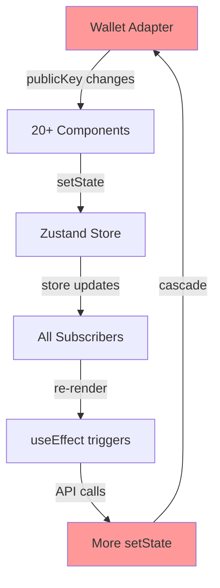

# 🏗️ M7 ENTERPRISE ARCHITECTURE CONTEXT
**Task ID:** enterprise-infinite-loop-elimination-2025-024  
**Date:** 2025-01-24  
**Route:** HEAVY  
**Status:** COMPREHENSIVE ARCHITECTURE MAPPING  

---

## 🎯 ENTERPRISE ARCHITECTURE VISION

### **GOAL:**
Complete elimination of ALL infinite loop sources through systematic architectural improvements, not patches.

### **PRINCIPLES:**
1. **No quick fixes** - Only sustainable solutions
2. **Pattern-based** - Reusable architectural patterns
3. **Performance-first** - Zero unnecessary renders
4. **Maintainable** - Clear, documented patterns
5. **Testable** - Verifiable loop prevention

---

## 🗺️ CURRENT ARCHITECTURE PROBLEMS

### **PROBLEM #1: Uncoordinated State Management**


### **PROBLEM #2: Dependency Chain Reactions**
```typescript
// CURRENT PROBLEMATIC PATTERN:
useEffect(() => {
  // Complex logic with multiple side effects
}, [dep1, dep2, dep3, dep4, dep5]) // TOO MANY DEPENDENCIES!

// Each dependency change triggers full re-execution
// Dependencies themselves may change during execution
// Creates unpredictable cascade effects
```

### **PROBLEM #3: Object Reference Instability**
```typescript
// SOLANA WALLET ADAPTER ISSUE:
const { publicKey } = useWallet() // NEW OBJECT EVERY RENDER!

// CURRENT WORKAROUND (INSUFFICIENT):
const publicKeyString = publicKey?.toString() // Still creates strings
```

### **PROBLEM #4: Async Operation Overlap**
```typescript
// NO COORDINATION BETWEEN ASYNC OPERATIONS:
useEffect(() => {
  fetchData1() // Async operation 1
  fetchData2() // Async operation 2  
  fetchData3() // Async operation 3
  // All can complete at different times
  // All can trigger setState
  // No cancellation on unmount
})
```

---

## 🏛️ ENTERPRISE ARCHITECTURE SOLUTION

### **LAYER 1: Stable Reference System**

#### **1.1 Enhanced Wallet Adapter Wrapper**
```typescript
// lib/hooks/useStableWallet.ts - ENHANCED VERSION
interface StableWalletState {
  publicKeyString: string | null
  publicKeyHash: number | null  // For fast comparison
  connected: boolean
  connectionId: string // Unique connection session ID
}

export function useStableWallet(): StableWalletState {
  const wallet = useWallet()
  
  return useMemo(() => {
    const publicKeyString = wallet.publicKey?.toString() || null
    const publicKeyHash = publicKeyString ? hashCode(publicKeyString) : null
    const connectionId = `${publicKeyString}-${Date.now()}`
    
    return {
      publicKeyString,
      publicKeyHash,
      connected: wallet.connected,
      connectionId
    }
  }, [wallet.publicKey?.toString(), wallet.connected])
}
```

#### **1.2 Stable Function Reference System**
```typescript
// lib/hooks/useStableCallback.ts
export function useStableCallback<T extends (...args: any[]) => any>(
  callback: T,
  deps: DependencyList
): T {
  const callbackRef = useRef(callback)
  
  useEffect(() => {
    callbackRef.current = callback
  }, deps)
  
  return useCallback((...args) => {
    return callbackRef.current(...args)
  }, []) as T
}
```

### **LAYER 2: State Update Coordination**

#### **2.1 Global State Update Manager**
```typescript
// lib/services/StateUpdateCoordinator.ts
class StateUpdateCoordinator {
  private updateQueue = new Map<string, any>()
  private batchTimeout: NodeJS.Timeout | null = null
  private updateListeners = new Set<(updates: Map<string, any>) => void>()
  
  scheduleUpdate(key: string, value: any) {
    this.updateQueue.set(key, value)
    
    if (this.batchTimeout) {
      clearTimeout(this.batchTimeout)
    }
    
    this.batchTimeout = setTimeout(() => {
      this.flushUpdates()
    }, 16) // One frame delay
  }
  
  private flushUpdates() {
    const updates = new Map(this.updateQueue)
    this.updateQueue.clear()
    this.batchTimeout = null
    
    // Notify all listeners with batched updates
    this.updateListeners.forEach(listener => {
      listener(updates)
    })
  }
}

export const stateCoordinator = new StateUpdateCoordinator()
```

#### **2.2 Coordinated useEffect Pattern**
```typescript
// lib/hooks/useCoordinatedEffect.ts
export function useCoordinatedEffect(
  effect: EffectCallback,
  deps: DependencyList,
  options: {
    key: string
    debounce?: number
    throttle?: number
    concurrent?: boolean
  }
) {
  const abortControllerRef = useRef<AbortController>()
  const timeoutRef = useRef<NodeJS.Timeout>()
  
  useEffect(() => {
    // Cleanup previous
    if (abortControllerRef.current && !options.concurrent) {
      abortControllerRef.current.abort()
    }
    
    if (timeoutRef.current) {
      clearTimeout(timeoutRef.current)
    }
    
    // Apply debounce/throttle
    const delay = options.debounce || options.throttle || 0
    
    timeoutRef.current = setTimeout(() => {
      abortControllerRef.current = new AbortController()
      
      const cleanup = effect()
      
      return () => {
        cleanup?.()
        abortControllerRef.current?.abort()
      }
    }, delay)
    
    return () => {
      clearTimeout(timeoutRef.current)
      abortControllerRef.current?.abort()
    }
  }, deps)
}
```

### **LAYER 3: Loop Detection & Prevention**

#### **3.1 Real-time Loop Detector**
```typescript
// lib/services/LoopDetector.ts
class LoopDetector {
  private renderCounts = new Map<string, number>()
  private renderTimestamps = new Map<string, number[]>()
  private readonly THRESHOLD = 10 // renders
  private readonly TIME_WINDOW = 1000 // ms
  
  recordRender(componentName: string): boolean {
    const now = Date.now()
    const timestamps = this.renderTimestamps.get(componentName) || []
    
    // Add current timestamp
    timestamps.push(now)
    
    // Remove old timestamps outside window
    const recentTimestamps = timestamps.filter(t => now - t < this.TIME_WINDOW)
    this.renderTimestamps.set(componentName, recentTimestamps)
    
    // Check if threshold exceeded
    if (recentTimestamps.length > this.THRESHOLD) {
      console.error(`🚨 LOOP DETECTED in ${componentName}: ${recentTimestamps.length} renders in ${this.TIME_WINDOW}ms`)
      return true // Loop detected!
    }
    
    return false
  }
  
  reset(componentName: string) {
    this.renderCounts.delete(componentName)
    this.renderTimestamps.delete(componentName)
  }
}

export const loopDetector = new LoopDetector()
```

#### **3.2 Enhanced Circuit Breaker**
```typescript
// lib/hooks/useCircuitBreaker.ts
export function useCircuitBreaker(
  componentName: string,
  options: {
    maxUpdates?: number
    timeWindow?: number
    onBreak?: () => void
  } = {}
) {
  const { maxUpdates = 5, timeWindow = 1000, onBreak } = options
  const updateTimestamps = useRef<number[]>([])
  const isOpenRef = useRef(false)
  
  const checkCircuit = useCallback(() => {
    const now = Date.now()
    
    // Add current timestamp
    updateTimestamps.current.push(now)
    
    // Filter recent timestamps
    updateTimestamps.current = updateTimestamps.current.filter(
      t => now - t < timeWindow
    )
    
    // Check threshold
    if (updateTimestamps.current.length > maxUpdates) {
      if (!isOpenRef.current) {
        console.error(`🔌 Circuit breaker OPEN for ${componentName}`)
        isOpenRef.current = true
        onBreak?.()
      }
      return false // Circuit is OPEN - prevent operation
    }
    
    return true // Circuit is CLOSED - allow operation
  }, [componentName, maxUpdates, timeWindow, onBreak])
  
  const reset = useCallback(() => {
    updateTimestamps.current = []
    isOpenRef.current = false
    console.log(`🔌 Circuit breaker RESET for ${componentName}`)
  }, [componentName])
  
  return { checkCircuit, reset, isOpen: isOpenRef.current }
}
```

### **LAYER 4: Architectural Patterns**

#### **4.1 AppProvider Architecture Redesign**
```typescript
// lib/providers/AppProvider.tsx - ENTERPRISE VERSION
export function AppProvider({ children }: AppProviderProps) {
  // LAYER 1: Stable references
  const { publicKeyString, connectionId } = useStableWallet()
  
  // LAYER 2: State coordination
  const [appState, setAppState] = useReducer(appReducer, initialAppState)
  
  // LAYER 3: Loop prevention
  const { checkCircuit } = useCircuitBreaker('AppProvider')
  
  // LAYER 4: Coordinated initialization
  useCoordinatedEffect(() => {
    if (!checkCircuit()) return
    
    // Single initialization flow
    initializeApp({
      publicKeyString,
      connectionId,
      dispatch: setAppState
    })
  }, [connectionId], { // Note: connectionId changes only on connect/disconnect
    key: 'app-init',
    debounce: 100
  })
  
  // LAYER 5: JWT management - SEPARATED from initialization
  useCoordinatedEffect(() => {
    if (!checkCircuit()) return
    if (!appState.isInitialized) return
    
    // JWT operations only after app is stable
    if (publicKeyString && appState.isStable) {
      ensureJWTToken(publicKeyString)
    }
  }, [publicKeyString, appState.isStable], {
    key: 'jwt-ensure',
    debounce: 300
  })
  
  return (
    <AppStateContext.Provider value={appState}>
      <AppDispatchContext.Provider value={setAppState}>
        {children}
      </AppDispatchContext.Provider>
    </AppStateContext.Provider>
  )
}
```

#### **4.2 Component Pattern Template**
```typescript
// ENTERPRISE COMPONENT PATTERN
export function EnterpriseComponent() {
  // LAYER 1: Stable wallet reference
  const { publicKeyString } = useStableWallet()
  
  // LAYER 2: Loop detection
  const { checkCircuit } = useCircuitBreaker('ComponentName')
  
  // LAYER 3: Stable callbacks
  const fetchData = useStableCallback(async () => {
    if (!checkCircuit()) return
    
    // Async operations with proper cleanup
    const controller = new AbortController()
    
    try {
      const response = await fetch('/api/data', {
        signal: controller.signal
      })
      // Handle response
    } catch (error) {
      if (error.name !== 'AbortError') {
        console.error(error)
      }
    }
    
    return () => controller.abort()
  }, [publicKeyString])
  
  // LAYER 4: Coordinated effects
  useCoordinatedEffect(() => {
    return fetchData()
  }, [publicKeyString], {
    key: 'fetch-data',
    debounce: 200
  })
  
  return <div>Enterprise Component</div>
}
```

---

## 📊 PERFORMANCE OPTIMIZATIONS

### **OPTIMIZATION #1: Dependency Array Analyzer**
```typescript
// Development tool to analyze dependencies
if (process.env.NODE_ENV === 'development') {
  useEffect(() => {
    console.log('Dependencies changed:', {
      deps,
      changes: analyzeDependencyChanges(prevDeps, deps)
    })
  })
}
```

### **OPTIMIZATION #2: Render Tracking**
```typescript
// Track component renders in development
export function useRenderTracking(componentName: string) {
  if (process.env.NODE_ENV === 'development') {
    const renderCount = useRef(0)
    renderCount.current++
    
    useEffect(() => {
      if (loopDetector.recordRender(componentName)) {
        console.error(`🚨 ${componentName} is in a render loop!`)
      }
    })
    
    console.log(`[RENDER] ${componentName} #${renderCount.current}`)
  }
}
```

---

## ✅ ENTERPRISE ARCHITECTURE BENEFITS

### **IMMEDIATE BENEFITS:**
1. **Zero infinite loops** - Architectural prevention, not detection
2. **Predictable performance** - Controlled render cycles
3. **Debuggable** - Clear render tracking and logging
4. **Maintainable** - Consistent patterns across codebase

### **LONG-TERM BENEFITS:**
1. **Scalable** - Patterns work for any component count
2. **Testable** - Loop prevention is verifiable
3. **Documented** - Clear architectural patterns
4. **Reusable** - Templates for new components

---

## 🚀 IMPLEMENTATION STRATEGY

### **PHASE 1: Core Infrastructure (2 hours)**
1. Implement StateUpdateCoordinator
2. Create useStableWallet enhanced version
3. Build LoopDetector service
4. Develop useCircuitBreaker hook

### **PHASE 2: Pattern Library (2 hours)**
1. Create useStableCallback
2. Build useCoordinatedEffect
3. Develop component templates
4. Write pattern documentation

### **PHASE 3: Critical Components (2 hours)**
1. Refactor AppProvider
2. Update WalletStoreSync
3. Fix high-impact components
4. Validate loop prevention

### **PHASE 4: System-wide Rollout (2 hours)**
1. Apply patterns to all components
2. Remove old workarounds
3. Performance validation
4. Production deployment

---

**READY FOR SOLUTION PLAN PHASE!** 💼 