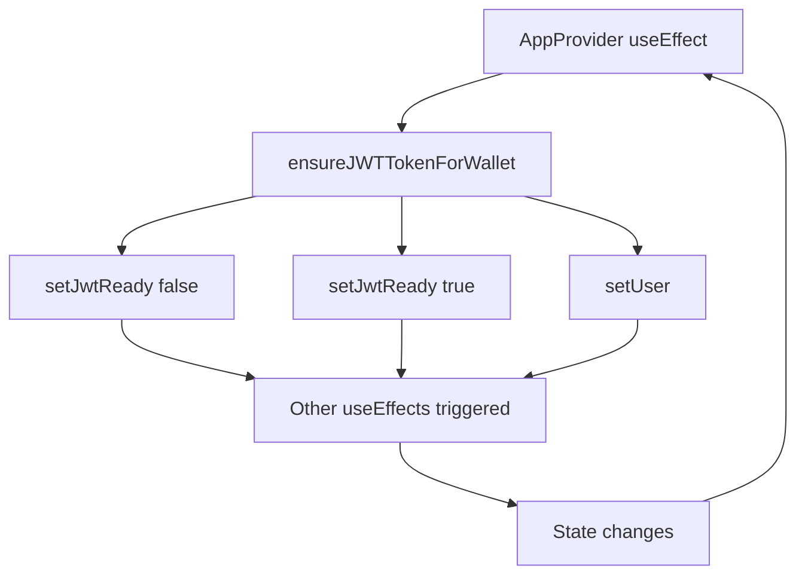

# 🏗️ M7 ARCHITECTURE CONTEXT: Infinite Loop Analysis

**Task ID:** infinite-loop-regression-deep-research  
**Date:** 2025-01-24  
**Analysis Phase:** ARCHITECTURE MAPPING  

## 🔄 INFINITE LOOP ROOT CAUSE ANALYSIS

### CURRENT ARCHITECTURE PROBLEM

**useEffect Chain Reaction:**
```typescript
// LINE 86-99: ПРОБЛЕМНЫЙ useEffect
useEffect(() => {
  if (connected && publicKey && isInitialized) {
    console.log('[AppProvider] Wallet connected, ensuring JWT token exists...')
    ensureJWTTokenForWallet(publicKey.toBase58()) // ❌ НЕ В dependencies
  } else if (!connected && isInitialized) {
    setJwtReady(false) // ❌ Может триггерить другие effects
    // ... localStorage operations
  }
}, [connected, publicKey, isInitialized]) // ❌ Отсутствует ensureJWTTokenForWallet
```

### INFINITE LOOP SEQUENCE

1. **useEffect triggers** → `ensureJWTTokenForWallet()` calls
2. **setState protection added** → все setState теперь проверяют `isMountedRef.current`
3. **setJwtReady(false)** → может запустить другой useEffect
4. **setJwtReady(true)** → может запустить другой useEffect  
5. **setUser(data.user)** → может изменить user state
6. **Other components react** → могут вызвать повторные wallet operations
7. **Loop repeats** → бесконечная петля

### PROBLEMATIC COMPONENTS INTERACTION



### DEPENDENCY ARRAY ISSUES

**Current Dependencies:** `[connected, publicKey, isInitialized]`
**Missing Dependencies:** 
- `ensureJWTTokenForWallet` (function не в deps)
- `setJwtReady` (from useUserActions)
- `user` (может быть нужен для conditional logic)

### STATE MANAGEMENT CONFLICTS

**Zustand Store Changes:**
- `setJwtReady(false/true)` → может trigger других компонентов
- `setUser(data.user)` → trigger user-dependent effects  
- `localStorage operations` → может trigger storage listeners

**React State Changes:**
- `isMountedRef.current` checks → добавлены во все setState
- Mount/unmount cycles → могут создавать race conditions

### CRITICAL INTERACTION POINTS

1. **AppProvider ↔ Zustand Store**
   - Множественные setState операции в одной функции
   - Async operations с state updates

2. **useEffect Dependencies**
   - Missing function dependencies (ESLint warning игнорируется?)
   - State updates triggering same useEffect

3. **Wallet Connection Flow**
   - Connect/disconnect может trigger быстрые state changes
   - JWT creation/cleanup race conditions

## 🎯 ARCHITECTURAL SOLUTION NEEDED

**Strategy:** Разорвать infinite loop chain через:
1. Правильные useEffect dependencies  
2. useCallback для ensureJWTTokenForWallet
3. Conditional setState logic
4. Debouncing wallet operations

---
*M7 Architecture Analysis - useEffect Chain Reaction Identified* 