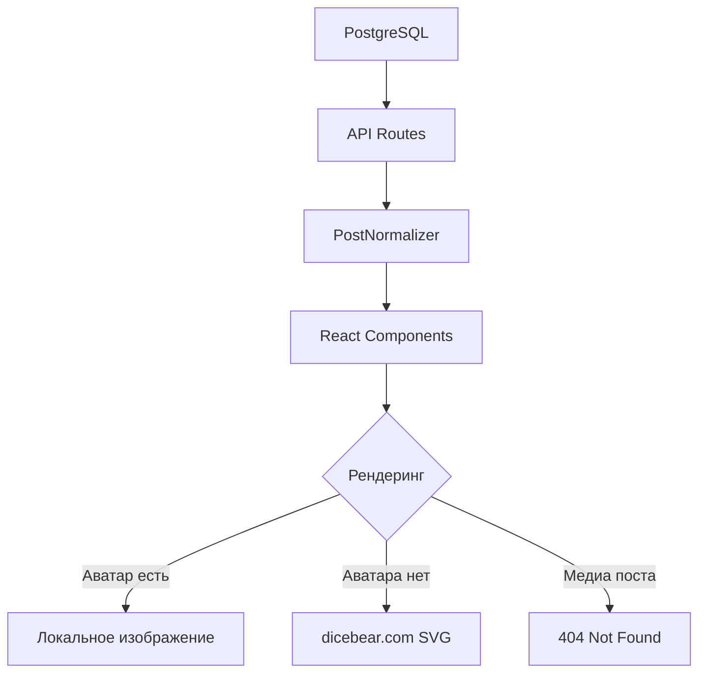

# 🏗️ ARCHITECTURE CONTEXT: Media Storage Setup

## 📅 Дата: 18.01.2025
## 🎯 Задача: Анализ текущей архитектуры медиа-хранения

## 🔍 ТЕКУЩАЯ АРХИТЕКТУРА

### 1. Компоненты, использующие медиа

#### Avatar.tsx
```typescript
// Использует dicebear.com для генерации SVG аватаров
const avatarUrl = `https://api.dicebear.com/9.x/avataaars/svg?seed=${seed}&backgroundColor=${backgroundColor}`;

// Также поддерживает локальные изображения
if (src) {
  return ;
}
```

#### PostCard компоненты
```typescript
// Ожидают медиа в структуре:
post.thumbnail // URL превью
post.mediaUrl  // URL основного контента
```

#### CreatorCard компоненты
```typescript
// Используют поля:
creator.avatar         // URL аватара
creator.backgroundImage // URL фона (НЕ СУЩЕСТВУЕТ в БД)
```

### 2. Поток данных медиа



### 3. Структура хранения в БД

#### Таблица users
```sql
avatar VARCHAR(255) -- Хранит только имя файла: "avatar_TIMESTAMP_RANDOM.ext"
-- НЕТ поля backgroundImage
```

#### Таблица posts
```sql
thumbnail TEXT -- Полный URL: "https://iwzfrnfemdeomowothhn.supabase.co/storage/v1/object/public/posts/..."
mediaUrl TEXT  -- Полный URL: "https://iwzfrnfemdeomowothhn.supabase.co/storage/v1/object/public/posts/..."
```

### 4. Файловая структура

```
public/
├── posts/
│   └── images/      # 6 файлов из ~300 необходимых
├── placeholder.jpg  # Общий placeholder
├── placeholder-video.png
├── placeholder-audio.png
└── [некоторые avatar_*.jpeg файлы]
```

### 5. API эндпоинты

#### GET /api/creators
```typescript
// Возвращает креаторов с полем avatar
// НЕ нормализует пути к файлам
```

#### GET /api/posts
```typescript
// Возвращает посты с thumbnail и mediaUrl
// PostNormalizer пытается исправить несоответствия
```

### 6. Зависимости и интеграции

#### Frontend зависимости
- React компоненты ожидают работающие URL
- Нет fallback механизма для отсутствующих изображений
- Нет lazy loading или оптимизации

#### Backend зависимости
- PostgreSQL хранит ссылки на внешние ресурсы
- Нет локального кеширования
- Нет валидации доступности медиа

#### Внешние зависимости
- dicebear.com для генерации аватаров
- Supabase Storage (недоступен)

## 🔗 ПАТТЕРНЫ И ПРАКТИКИ

### Текущие паттерны
1. **Mixed Storage**: Аватары локально, посты в Supabase
2. **No Validation**: Нет проверки доступности файлов
3. **External Dependencies**: Зависимость от dicebear.com
4. **Inconsistent Paths**: Разные форматы путей для разных типов медиа

### Проблемы архитектуры
1. **Data Loss**: Медиа-файлы не мигрированы с Supabase
2. **Schema Mismatch**: Frontend ожидает поля, которых нет в БД
3. **No Fallbacks**: Нет обработки отсутствующих файлов
4. **Performance**: Множественные 404 запросы замедляют загрузку

## 📊 АНАЛИЗ ВЛИЯНИЯ

### Затронутые компоненты
- **Avatar.tsx**: Частично работает (dicebear fallback)
- **PostCard**: Не показывает медиа (404)
- **CreatorCard**: Не может показать фоны
- **Feed страница**: Визуально сломана
- **Creator профили**: Неполная информация

### Критичность
- 🔴 **Высокая**: Основной контент (посты) не отображается
- 🟡 **Средняя**: Аватары частично работают
- 🟢 **Низкая**: Система не падает, только визуальные проблемы

## ✅ ЧЕКЛИСТ АНАЛИЗА

- [x] Все компоненты, использующие медиа, идентифицированы?
- [x] Поток данных прослежен от БД до рендеринга?
- [x] Зависимости и интеграции учтены?
- [x] Проблемы архитектуры выявлены?
- [x] Влияние на систему оценено?

## 🚀 СЛЕДУЮЩИЕ ШАГИ

1. Создать SOLUTION_PLAN.md с детальным планом решения
2. Разработать стратегию миграции медиа
3. Спроектировать fallback механизмы
4. Планировать оптимизацию производительности 