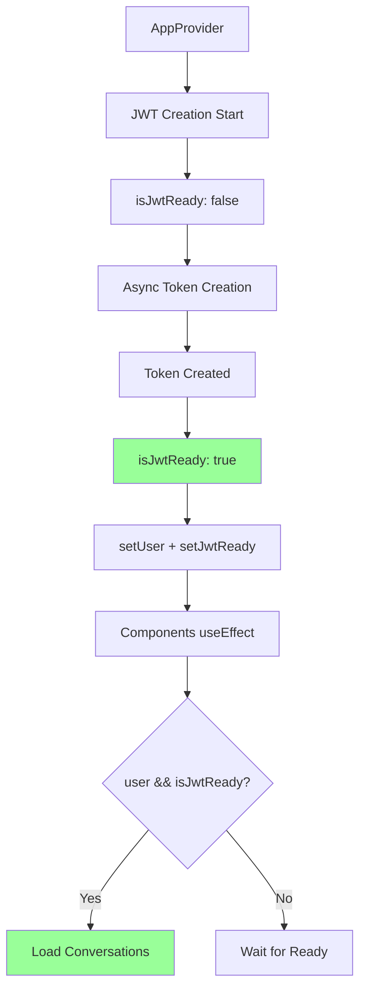

# 🎯 SOLUTION PLAN: Messages JWT Flow Fix

## 📅 Дата: 23.01.2025
## 🎯 Цель: Исправление JWT timing race condition
## 🔄 Статус: Solution Design Phase  

---

## 📋 PROBLEM STATEMENT

**ROOT CAUSE**: AppProvider создает JWT токен асинхронно, но MessagesPageClient пытается его использовать немедленно через useEffect dependency на `user?.id`.

**TIMING ISSUE**: 
- AppProvider: JWT creation ~200-500ms (async)
- MessagesPageClient: useEffect triggers immediately when user?.id available
- Result: "No JWT token available" error

---

## 🎯 SOLUTION STRATEGY

### **Выбранный Подход: JWT Ready State in AppProvider**

**Rationale**: 
- ✅ Minimal code changes
- ✅ Centralized solution (benefits all JWT-dependent components)
- ✅ No polling overhead
- ✅ Reliable synchronization mechanism

**Alternative Rejected**:
- ❌ Retry logic: Adds complexity to every component
- ❌ Token polling: Performance overhead  
- ❌ setTimeout delays: Unreliable timing

---

## 🏗️ IMPLEMENTATION DESIGN

### **Solution Architecture**:


### **State Management Enhancement**:
```typescript
// lib/store/appStore.ts - ADD to existing store
interface AppStore {
  // Existing fields...
  user: User | null
  userLoading: boolean
  
  // NEW: JWT Ready State
  isJwtReady: boolean          // ← New field
  setJwtReady: (ready: boolean) => void  // ← New action
}
```

### **Component Dependency Update**:
```typescript
// components/MessagesPageClient.tsx - MODIFY useEffect
// BEFORE:
useEffect(() => {
  if (!user?.id) return
  loadConversations()
}, [user?.id])

// AFTER:
useEffect(() => {
  if (!user?.id || !isJwtReady) return
  loadConversations()
}, [user?.id, isJwtReady])
```

---

## 📋 IMPLEMENTATION PHASES

### **PHASE 1: Zustand Store Enhancement** (5 minutes)

#### Step 1.1: Add JWT Ready State
```typescript
// lib/store/appStore.ts
// ADD to existing interface:
interface AppStore {
  // ... existing fields
  isJwtReady: boolean
  setJwtReady: (ready: boolean) => void
}

// ADD to store implementation:
export const useAppStore = create<AppStore>()(
  devtools(
    persist(
      (set, get) => ({
        // ... existing fields
        isJwtReady: false,  // ← NEW
        
        setJwtReady: (isJwtReady) => {
          console.log('[AppStore] setJwtReady:', isJwtReady)
          set({ isJwtReady })
        },
        
        // ... existing methods
      }),
      // ... persist config
    )
  )
)
```

#### Step 1.2: Export JWT Ready Hook
```typescript
// lib/store/appStore.ts
// ADD new hook:
export const useJwtReady = () => {
  if (typeof window === 'undefined') {
    return false // SSR guard
  }
  return useAppStore(state => state.isJwtReady)
}

export const useJwtActions = () => {
  if (typeof window === 'undefined') {
    return { setJwtReady: () => {} }
  }
  return useAppStore(state => ({
    setJwtReady: state.setJwtReady
  }))
}
```

### **PHASE 2: AppProvider Integration** (10 minutes)

#### Step 2.1: Add JWT Ready Management
```typescript
// lib/providers/AppProvider.tsx
// ADD import:
import { useJwtActions } from '@/lib/store/appStore'

// MODIFY AppProvider function:
export function AppProvider({ children }: AppProviderProps) {
  // ... existing code
  const { setJwtReady } = useJwtActions()
  
  // ... existing useEffect and initialization code
}
```

#### Step 2.2: Update JWT Creation Flow
```typescript
// lib/providers/AppProvider.tsx
// MODIFY ensureJWTTokenForWallet function:
const ensureJWTTokenForWallet = async (walletAddress: string) => {
  try {
    // Set JWT as not ready at start
    setJwtReady(false)
    
    // Existing token check logic...
    const savedToken = localStorage.getItem('fonana_jwt_token')
    if (savedToken) {
      // Token exists and valid
      if (tokenData.token && tokenData.expiresAt > Date.now()) {
        console.log('[AppProvider] Valid JWT token already exists')
        setJwtReady(true) // ← Set ready immediately
        return
      }
    }
    
    // Create new token...
    const response = await fetch('/api/auth/wallet', { /* ... */ })
    const data = await response.json()
    
    if (data.token && data.user) {
      // Save token to localStorage
      localStorage.setItem('fonana_jwt_token', JSON.stringify(tokenData))
      
      // Update user state
      if (!user) {
        setUser(data.user)
      }
      
      // CRITICAL: Set JWT ready AFTER token is saved
      setJwtReady(true) // ← Set ready after completion
      
      console.log('[AppProvider] JWT token ready for components')
    }
    
  } catch (error) {
    console.error('[AppProvider] JWT creation failed:', error)
    setJwtReady(false) // ← Ensure false on failure
  }
}
```

#### Step 2.3: Handle Wallet Disconnect
```typescript
// lib/providers/AppProvider.tsx  
// MODIFY disconnect useEffect:
useEffect(() => {
  if (connected && publicKey && isInitialized) {
    ensureJWTTokenForWallet(publicKey.toBase58())
  } else if (!connected && isInitialized) {
    // Clear JWT ready state on disconnect
    setJwtReady(false)
    localStorage.removeItem('fonana_jwt_token')
    jwtManager.logout()
  }
}, [connected, publicKey, isInitialized])
```

### **PHASE 3: MessagesPageClient Update** (5 minutes)

#### Step 3.1: Add JWT Ready Dependency
```typescript
// components/MessagesPageClient.tsx
// ADD import:
import { useUser } from '@/lib/store/appStore'
import { useJwtReady } from '@/lib/store/appStore'

// MODIFY component:
export default function MessagesPageClient() {
  const user = useUser()
  const isJwtReady = useJwtReady() // ← ADD
  
  // ... existing state
  
  // MODIFY useEffect:
  useEffect(() => {
    if (!user?.id) {
      setIsLoading(false)
      return
    }
    
    // NEW: Wait for JWT ready
    if (!isJwtReady) {
      console.log('[MessagesPageClient] Waiting for JWT token ready...')
      return
    }
    
    console.log('[MessagesPageClient] JWT ready, loading conversations')
    loadConversations()
  }, [user?.id, isJwtReady]) // ← ADD isJwtReady dependency
  
  // ... rest of component unchanged
}
```

#### Step 3.2: Update Loading State Logic
```typescript
// components/MessagesPageClient.tsx
// MODIFY loading indicator:
if (!user) {
  return (
    <div className="flex items-center justify-center min-h-screen pt-20">
      <div className="text-center">
        <ChatBubbleLeftEllipsisIcon className="w-16 h-16 text-gray-400 mx-auto mb-4" />
        <h2 className="text-xl font-semibold text-gray-900 dark:text-white mb-2">
          Connect Your Wallet
        </h2>
        <p className="text-gray-600 dark:text-gray-400">
          Please connect your wallet to access messages
        </p>
      </div>
    </div>
  )
}

// NEW: Add JWT waiting state
if (user && !isJwtReady) {
  return (
    <div className="flex items-center justify-center min-h-screen pt-20">
      <div className="text-center">
        <ChatBubbleLeftEllipsisIcon className="w-16 h-16 text-gray-400 mx-auto mb-4 animate-pulse" />
        <h2 className="text-xl font-semibold text-gray-900 dark:text-white mb-2">
          Initializing Authentication
        </h2>
        <p className="text-gray-600 dark:text-gray-400">
          Setting up secure connection...
        </p>
      </div>
    </div>
  )
}
```

### **PHASE 4: Error Handling & Edge Cases** (5 minutes)

#### Step 4.1: JWT Creation Timeout
```typescript
// lib/providers/AppProvider.tsx
// ADD timeout for JWT creation:
const ensureJWTTokenForWallet = async (walletAddress: string) => {
  try {
    setJwtReady(false)
    
    // Add timeout protection
    const timeoutPromise = new Promise((_, reject) => 
      setTimeout(() => reject(new Error('JWT creation timeout')), 10000)
    )
    
    const tokenPromise = fetch('/api/auth/wallet', {
      method: 'POST',
      headers: { 'Content-Type': 'application/json' },
      body: JSON.stringify({ wallet: walletAddress })
    })
    
    const response = await Promise.race([tokenPromise, timeoutPromise])
    
    // ... rest of logic
    
  } catch (error) {
    console.error('[AppProvider] JWT creation failed:', error)
    setJwtReady(false)
    
    // Show user-friendly error
    setTimeout(() => {
      toast.error('Authentication failed. Please try reconnecting your wallet.')
    }, 1000)
  }
}
```

#### Step 4.2: JWT Validation Check
```typescript
// lib/providers/AppProvider.tsx
// ADD validation after setting ready:
const validateJwtToken = async () => {
  try {
    const token = await jwtManager.getToken()
    if (!token) {
      console.warn('[AppProvider] JWT validation failed - no token')
      setJwtReady(false)
      return false
    }
    
    // Optional: Validate with server
    // const response = await fetch('/api/auth/validate', {
    //   headers: { 'Authorization': `Bearer ${token}` }
    // })
    // return response.ok
    
    return true
  } catch (error) {
    console.error('[AppProvider] JWT validation error:', error)
    setJwtReady(false)
    return false
  }
}
```

---

## 📊 EXPECTED RESULTS

### **Before Fix**:
```
User connects wallet → AppProvider creates JWT → MessagesPageClient useEffect → 
jwtManager.getToken() → null → "No JWT token available" error
```

### **After Fix**:
```
User connects wallet → AppProvider creates JWT → setJwtReady(true) → 
MessagesPageClient useEffect (user && isJwtReady) → jwtManager.getToken() → 
valid token → loadConversations() succeeds
```

### **Performance Impact**:
- ✅ **No polling overhead**: Event-driven updates
- ✅ **Minimal re-renders**: Only when state actually changes  
- ✅ **Fast response**: Immediate action when JWT ready
- ✅ **Reliable timing**: No race conditions

### **Error Recovery**:
- ✅ **Timeout handling**: 10-second max wait for JWT creation
- ✅ **Failure recovery**: Clear JWT ready state on errors
- ✅ **User feedback**: Loading states and error messages
- ✅ **Retry capability**: User can reconnect wallet

---

## 🧪 TESTING STRATEGY

### **Test Cases**:

1. **Happy Path**: Connect wallet → JWT created → Messages load
2. **Slow Network**: JWT creation takes 2-3 seconds → Still works
3. **API Failure**: JWT creation fails → Error handling works
4. **Disconnect/Reconnect**: Wallet disconnect → JWT cleared → Reconnect works
5. **Page Refresh**: JWT persists in localStorage → Immediate ready state

### **Validation Methods**:

1. **Console Logs**: Track JWT ready state changes
2. **Developer Tools**: Monitor localStorage for token creation
3. **Network Tab**: Verify no duplicate token creation calls
4. **User Experience**: Smooth loading without errors

---

## 🎯 IMPLEMENTATION TIMELINE

### **Total Estimated Time: 25 minutes**

- **Phase 1** (Store): 5 minutes
- **Phase 2** (AppProvider): 10 minutes  
- **Phase 3** (MessagesPageClient): 5 minutes
- **Phase 4** (Error Handling): 5 minutes

### **Risk Mitigation**:
- **Backup Plan**: If new approach fails, revert to retry pattern
- **Testing**: Validate each phase before proceeding
- **Minimal Changes**: Each change is small and reversible

---

## 📋 DEPLOYMENT CHECKLIST

### **Pre-Implementation**:
- [ ] Backup current working state
- [ ] Review Memory Bank for similar patterns
- [ ] Prepare Playwright MCP test scenarios

### **During Implementation**:
- [ ] Test after each phase  
- [ ] Monitor console for errors
- [ ] Verify JWT ready state changes

### **Post-Implementation**:
- [ ] Test all JWT-dependent components
- [ ] Verify no infinite loops
- [ ] Document successful pattern for other components

---

**Solution Plan Status**: ✅ **COMPLETE**
**Next Phase**: Implementation Execution 