# M7 ARCHITECTURE CONTEXT: React Error #185 Infinite Loop Root Cause

**Task ID:** react-185-infinite-loop-m7-success-2025-024  
**Date:** 2025-01-24  
**Route:** HEAVY  
**Status:** ARCHITECTURE ANALYSIS PHASE

## 🏗️ SYSTEM ARCHITECTURE OVERVIEW

### **COMPONENT HIERARCHY MAP:**
```
app/layout.tsx
├── ClientShell.tsx (✅ FIXED: Now imports AppProvider not AppProviderV2)
    ├── ThemeProvider
    ├── ErrorBoundary (🚨 CATCHES React Error #185 but doesn't stop loop)
    ├── WalletProvider (🔥 SUSPECT #1)
    ├── WalletPersistenceProvider
    ├── AppProvider (🔥 SUSPECT #2)
    │   ├── WebSocketEventManager setup
    │   ├── CacheManager initialization  
    │   └── JWT token management
    ├── WalletStoreSync (🔥 SUSPECT #3 - M7 Phase 1 modified)
    ├── ServiceWorkerRegistration (🔥 SUSPECT #4 - M7 Phase 2 modified)
    └── Toaster (dynamic import)
```

## 🔄 COMPONENT INTERACTION FLOW

### **NORMAL INITIALIZATION SEQUENCE:**


### **CURRENT BROKEN SEQUENCE:**

```mermaid
graph TD
    A[WalletProvider Mount] --> B[WalletStoreSync Mount]
    B --> C[AppProvider Mount]
    C --> D[JWT useEffect Trigger]
    D --> E[🚨 React Error #185]
    E --> F[ErrorBoundary Catch]
    F --> G[Component Unmount]
    G --> H[setState on Unmounted]
    H --> I[AppProvider Cleanup]
    I --> A
    
    style E fill:#FFB6C1
    style H fill:#FF6B6B
```


## 🔍 SUSPECT ANALYSIS

### **SUSPECT #1: WalletStoreSync (M7 Phase 1 Modified)**

**Current Implementation Status:**
```typescript
// M7 PHASE 1 CHANGES APPLIED:
export function WalletStoreSync() {
  const walletAdapter = useOriginalWallet()
  const { setAdapter, updateState } = useWalletStore()

  // 🔥 M7 CIRCUIT BREAKER: Prevent infinite loops
  const [updateCount, setUpdateCount] = useState(0)
  const [isCircuitOpen, setIsCircuitOpen] = useState(false)
  const resetTimeoutRef = useRef<NodeJS.Timeout | null>(null)

  // 🔥 M7 STABLE CALLBACKS: Prevent dependency changes
  const stableSetAdapter = useCallback((adapter: any) => {
    if (isCircuitOpen) return
    setAdapter(adapter)
  }, [isCircuitOpen])

  const stableUpdateState = useCallback((newState: any) => {
    if (isCircuitOpen) return;
    if (updateCount >= 15) {
      // Circuit breaker logic...
      return
    }
    updateState(newState)
    setUpdateCount(prev => prev + 1)
  }, [updateState, updateCount, isCircuitOpen])
  
  // useEffect patterns...
}
```

**POTENTIAL ISSUES:**
- **Circuit breaker threshold** - 15 updates may be too high
- **useCallback dependencies** - may still cause re-renders
- **setState in circuit breaker** - setIsCircuitOpen/setUpdateCount on unmounted component

### **SUSPECT #2: AppProvider JWT Management**

**Current Implementation Status:**
```typescript
// M7 PROTECTION ADDED:
useEffect(() => {
  if (connected && publicKey && isInitialized) {
    // 🔥 INLINE JWT LOGIC (M7 Pattern 2):
    const performJWTCreation = async (walletAddress: string) => {
      // Set JWT as not ready at start
      if (!isMountedRef.current) {
        console.log('[AppProvider] Component unmounted before setJwtReady(false), aborting')
        return
      }
      setJwtReady(false) // 🚨 POTENTIAL ISSUE: Still setState even with protection
      
      // More setState calls with protection...
    }
    performJWTCreation(publicKey.toBase58())
  }
}, [connected, publicKey, isInitialized, setJwtReady, setUser, user])
```

**POTENTIAL ISSUES:**
- **Unmount protection INSUFFICIENT** - checks happen but setState still called
- **Complex dependency array** - includes functions that may change frequently
- **Async function setState** - timing issues with cleanup

### **SUSPECT #3: ServiceWorkerRegistration (M7 Phase 2 Modified)**

**Current Implementation Status:**
```typescript
// M7 PHASE 2 STABILIZATION:
export default function ServiceWorkerRegistration() {
  const hasRegisteredRef = useRef(false)
  const registrationAttemptRef = useRef(0)
  
  useEffect(() => {
    // 🔥 M7 PHASE 2: Prevent multiple registration attempts
    if (hasRegisteredRef.current) {
      console.log('[SW] Already attempted registration in this session, skipping')
      return
    }
    
    // 🔥 M7 CIRCUIT BREAKER: Limit registration attempts
    if (registrationAttemptRef.current >= 3) {
      console.error('[SW] Circuit breaker: Too many registration attempts, stopping')
      return
    }
    
    // Registration logic...
  }, [])
}
```

**POTENTIAL ISSUES:**
- **No SW logs visible** in console - may not be working correctly
- **Session storage dependency** - may interact poorly with component unmounting
- **Cache invalidation timing** - could trigger reloads during initialization

### **SUSPECT #4: ErrorBoundary Recovery Logic**

**Current Implementation:**
```typescript
// components/ErrorBoundary.tsx
componentDidCatch(error: Error, errorInfo: ErrorInfo) {
  console.log('[ErrorBoundary] React Error #185 detected - attempting silent recovery')
  
  // 🚨 POTENTIAL ISSUE: What happens here?
  this.setState({ hasError: true, error, errorInfo })
  
  // Silent recovery attempt?
}
```

**POTENTIAL ISSUES:**
- **componentDidCatch setState** - may trigger new renders
- **"Silent recovery" mechanism** - unclear what it does
- **Error boundary remount** - may cause parent component issues

## 📊 DATA FLOW ANALYSIS

### **STATE MANAGEMENT INTEGRATION:**

```typescript
// Zustand Store (lib/store/appStore.ts)
export const useAppStore = create<AppState>((set, get) => ({
  // User state
  user: null,
  userLoading: false,
  setUser: (user) => set({ user }), // 🚨 Used in AppProvider

  // JWT state  
  isJwtReady: false,
  setJwtReady: (ready) => set({ isJwtReady: ready }), // 🚨 Used in AppProvider
}))

// WalletStore (separate)
export const useWalletStore = create<WalletState>((set) => ({
  adapter: null,
  setAdapter: (adapter) => set({ adapter }), // 🚨 Used in WalletStoreSync
  updateState: (newState) => set(newState), // 🚨 Used in WalletStoreSync
}))
```

**CRITICAL OBSERVATION:** Multiple stores with cross-dependencies!

### **TIMING ANALYSIS:**

```javascript
// CONSOLE LOG SEQUENCE FROM USER:
[WalletProvider] Initialized wallets: ['Phantom']           // Step 1
[WalletStoreSync] Setting adapter: true                     // Step 2  
[WalletStoreSync] Updating store state: {connected: false...} // Step 3
[AppProvider] Initializing application...                   // Step 4
🔥 [DEBUG] useEffect JWT ENTRY: {connected: false...}       // Step 5
🔥 [DEBUG] JWT useEffect DEPENDENCIES CHANGED...            // Step 6
[ErrorBoundary] React Error #185 detected                   // Step 7 ← ERROR!
[AppProvider] Cleaning up...                                // Step 8 ← UNMOUNT!
// Back to Step 1 → INFINITE CYCLE
```

**TIMING INSIGHT:** Error happens between JWT useEffect start and completion!

## 🧬 DEPENDENCY GRAPH ANALYSIS

### **CIRCULAR DEPENDENCY CHAIN:**

```
AppProvider useEffect dependencies:
[connected, publicKey, isInitialized, setJwtReady, setUser, user]
                                      ↑            ↑       ↑
                                      |            |       |
                              Zustand actions that MAY trigger re-renders
                                      |            |       |
                              May cause useEffect to re-run
                                      ↓            ↓       ↓
                              setState calls in async function
                                      ↓            ↓       ↓  
                              Component unmount during async operation
                                      ↓            ↓       ↓
                              React Error #185!
```

### **WALLET ADAPTER FLOW:**

```
useWallet() → walletAdapter changes → WalletStoreSync detects → 
setAdapter(newAdapter) → Zustand store update → 
Components re-render → AppProvider useEffect triggers →
JWT creation starts → Component unmounts mid-process →
setState on unmounted component → React Error #185
```

## 🔧 ARCHITECTURAL WEAKNESSES

### **WEAKNESS #1: Excessive useState/setState Usage**
- Multiple state updates during initialization
- Async setState calls without proper cancellation
- setState calls in cleanup phases

### **WEAKNESS #2: Complex Dependency Arrays**
- Functions in useEffect dependencies
- Cross-store dependencies (AppStore + WalletStore)
- Potential stale closure issues

### **WEAKNESS #3: Insufficient Cleanup Patterns** 
- AbortController not used for async operations
- Ref-based unmount protection may be insufficient
- Component lifecycle not properly coordinated

### **WEAKNESS #4: Error Recovery Architecture**
- ErrorBoundary doesn't prevent infinite loops
- "Silent recovery" mechanism unclear
- No circuit breaker at component tree level

## 🎯 ROOT CAUSE HYPOTHESIS

### **MOST LIKELY SCENARIO:**

1. **WalletProvider initializes** → triggers WalletStoreSync
2. **WalletStoreSync updates Zustand store** → triggers connected/publicKey changes
3. **AppProvider useEffect triggers** → starts async JWT creation
4. **Store updates cause re-render** → AppProvider starts unmounting
5. **Async JWT creation continues** → calls setState on unmounting component
6. **React Error #185 occurs** → ErrorBoundary catches
7. **Component tree re-mounts** → back to step 1

### **CRITICAL INSIGHT:**
**The problem is NOT any single component, but the INTERACTION between rapid state changes and async operations during component initialization!**

## 📋 NEXT STEPS FOR SOLUTION PLAN

1. **Stabilize WalletStoreSync** - Fix circuit breaker thresholds
2. **Add AbortController** to AppProvider async operations
3. **Simplify dependency arrays** - remove function dependencies
4. **Coordinate component mounting** - prevent race conditions
5. **Enhance ErrorBoundary** - add actual loop prevention

**STATUS:** Architecture analysis complete, ready for Solution Plan
**CONFIDENCE:** VERY HIGH - Root cause interaction identified  
**COMPLEXITY:** High but manageable with systematic fixes 