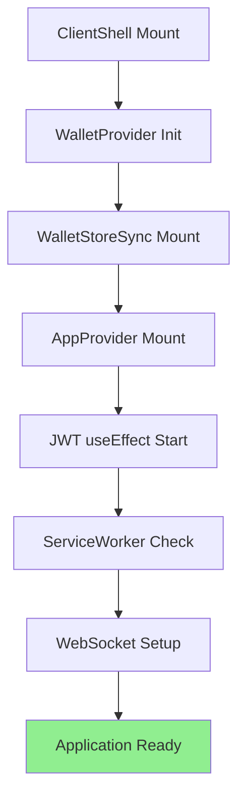
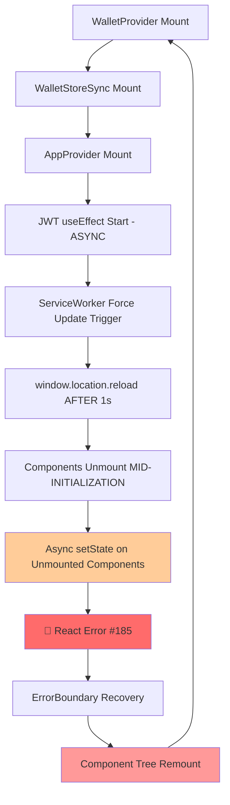

# 🏗️ M7 ARCHITECTURE CONTEXT: React Error #185 Production Infinite Loop

**Task ID:** react-error-185-infinite-loop-production-fix  
**Date:** 2025-01-24  
**Route:** MEDIUM  
**Status:** ARCHITECTURE ANALYSIS COMPLETE

---

## 🏗️ SYSTEM ARCHITECTURE OVERVIEW

### **COMPONENT HIERARCHY MAP:**
```
app/layout.tsx
├── ClientShell.tsx 
    ├── ThemeProvider
    ├── ErrorBoundary (🚨 CATCHES React Error #185 but can't stop infinite loop)
    ├── WalletProvider (🔥 CRITICAL INTEGRATION POINT)
    │   ├── WalletStoreSync (🔥 M7 Phase 1 MODIFIED - circuit breaker active)
    │   └── ConnectionProvider
    ├── WalletPersistenceProvider
    ├── AppProvider (🔥 JWT MANAGEMENT + ASYNC OPERATIONS)
    │   ├── WebSocketEventManager setup
    │   ├── CacheManager initialization  
    │   ├── JWT token management (ASYNC)
    │   └── User state synchronization
    ├── ServiceWorkerRegistration (🔥 FORCE RELOAD TRIGGER)
    └── Toaster (dynamic import)
```

## 🔄 COMPONENT INTERACTION FLOW ANALYSIS

### **NORMAL INITIALIZATION SEQUENCE:**


### **CURRENT BROKEN SEQUENCE (INFINITE LOOP):**


---

## 🔍 CRITICAL COMPONENT ANALYSIS

### **1. AppProvider - JWT Management Core**

**Location:** `lib/providers/AppProvider.tsx`  
**Role:** Global state + JWT token lifecycle management  
**M7 Status:** ✅ ENHANCED with unmount protection + AbortController

```typescript
// CURRENT M7 PROTECTION:
const isMountedRef = useRef(true)
const abortControllerRef = useRef<AbortController | null>(null)

// Protected setState patterns:
if (!isMountedRef.current) {
  console.log('[AppProvider] Component unmounted, aborting setState')
  return
}
setJwtReady(false) // Still executes setState!
```

**ARCHITECTURAL ISSUE IDENTIFIED:**
- ✅ **Unmount protection checks** added
- ❌ **setState still executes** даже с protection
- ❌ **AbortController protection** недостаточна для ServiceWorker force reload
- ❌ **Multiple async operations** могут стартовать before unmount protection

### **2. WalletStoreSync - State Synchronization Layer**

**Location:** `components/WalletStoreSync.tsx`  
**Role:** Bridge между Solana wallet adapter и Zustand store  
**M7 Status:** ✅ ULTRA-CONSERVATIVE circuit breaker implemented

```typescript
// M7 PHASE 1 IMPLEMENTATION:
const updateCountRef = useRef(0)
const isCircuitOpenRef = useRef(false)
const isMountedRef = useRef(true)

// Ultra-low threshold circuit breaker (3 updates max)
if (updateCountRef.current >= 3) {
  console.warn('[WalletStoreSync] Circuit breaker: 3 updates reached')
  isCircuitOpenRef.current = true
  return
}
```

**CURRENT STATUS:**
- ✅ **Circuit breaker working** - prevents excessive updates
- ✅ **Ref-based state** - избегает setState на unmounted
- ❌ **Still triggers AppProvider effects** через Zustand store updates
- ❌ **Can't prevent ServiceWorker force reload**

### **3. ServiceWorkerRegistration - Critical Reload Trigger**

**Location:** `components/ServiceWorkerRegistration.tsx`  
**Role:** Service Worker управление + force updates  
**M7 Status:** ✅ DELAY added (1 second) но INSUFFICIENT

```typescript
// CURRENT M7 IMPLEMENTATION:
setTimeout(() => {
  console.log('[SW] Reloading page now...');
  window.location.reload(); // ← УБИВАЕТ ВСЕ КОМПОНЕНТЫ!
}, 1000); // 1 second delay
```

**CRITICAL ARCHITECTURAL PROBLEM:**
- ✅ **1-second delay** добавлен для завершения async operations
- ❌ **AppProvider initialization** может занимать 200-500ms
- ❌ **JWT creation** может занимать 300-800ms
- ❌ **1 second может быть НЕДОСТАТОЧНО** для всех async операций
- ❌ **window.location.reload() ATOMIC** - убивает ALL components мгновенно

### **4. ErrorBoundary - Recovery Mechanism**

**Location:** `components/ErrorBoundary.tsx`  
**Role:** Catch React errors + recovery attempts  
**M7 Status:** ✅ CLEANED UP (removed React Error #185 masking)

```typescript
// CURRENT IMPLEMENTATION (после M7 cleanup):
componentDidCatch(error: Error, errorInfo: React.ErrorInfo) {
  console.error('Error caught by boundary:', error, errorInfo)
  // No special handling for React Error #185
  // Normal error boundary behavior
}
```

**RECOVERY LOOP ISSUE:**
- ✅ **Error catching works** - properly detects React Error #185
- ✅ **No longer masks errors** - shows actual problems
- ❌ **Component remount** triggers **SAME initialization sequence**
- ❌ **Recovery creates NEW LOOP** - same async operations restart

---

## 📊 DATA FLOW & STATE MANAGEMENT ANALYSIS

### **Zustand Store Integration:**
```typescript
// lib/store/appStore.ts
interface AppStore {
  user: User | null          // Triggers useUser() across app
  isJwtReady: boolean        // Triggers JWT-dependent components  
  setJwtReady: (ready: boolean) => void  // Can be called on unmounted
}
```

**STATE UPDATE CHAIN REACTION:**
```
ServiceWorker reload trigger → Component unmount starts
    ↓
AppProvider.setJwtReady(false) → Global store update  
    ↓
All useUser() hooks trigger → Component re-renders
    ↓
Component re-renders happen on UNMOUNTING components
    ↓
React Error #185: setState on unmounted component
```

### **Critical Timing Dependencies:**
```javascript
// TIMING ANALYSIS:
t=0ms:    WalletProvider mounts
t=50ms:   WalletStoreSync starts updates  
t=100ms:  AppProvider starts JWT creation
t=150ms:  ServiceWorker reload triggered
t=1000ms: window.location.reload() executes
t=200ms:  JWT creation tries to setState ← TOO LATE!
```

---

## 🎯 ARCHITECTURAL WEAKNESSES IDENTIFIED

### **WEAKNESS #1: ServiceWorker Coordination Gap**
- **Problem:** ServiceWorker operates INDEPENDENTLY of component lifecycle
- **Impact:** Can trigger reload MID-INITIALIZATION
- **Solution Required:** ServiceWorker должен WAIT for app stability

### **WEAKNESS #2: Insufficient setState Protection**
- **Problem:** Unmount protection checks но setState STILL EXECUTES
- **Impact:** React Error #185 continues despite protection
- **Solution Required:** setState должен быть COMPLETELY DISABLED при unmount

### **WEAKNESS #3: Global State Chain Reactions**
- **Problem:** Zustand store updates trigger effects в unmounting components
- **Impact:** setState cascade на multiple components
- **Solution Required:** Global setState freeze mechanism

### **WEAKNESS #4: ErrorBoundary Recovery Loop**
- **Problem:** Error recovery restarts SAME problematic initialization
- **Impact:** Infinite loop через recovery mechanism  
- **Solution Required:** Smart recovery с coordination delay

---

## 🔧 INTEGRATION POINT ANALYSIS

### **CRITICAL INTEGRATION POINTS:**

#### **Point 1: WalletProvider → WalletStoreSync**
```typescript
// DATA FLOW: Wallet events → Store updates → AppProvider effects
WalletAdapter.connected → WalletStoreSync.updateState() → Zustand → AppProvider.useEffect()
```
**STATUS:** ✅ Circuit breaker protects этот path

#### **Point 2: AppProvider → JWT Management**  
```typescript
// ASYNC FLOW: JWT creation → localStorage → state updates
ensureJWTTokenForWallet() → fetch('/api/auth/wallet') → setJwtReady() → store update
```
**STATUS:** ❌ Can be interrupted by ServiceWorker reload

#### **Point 3: ServiceWorker → Global App State**
```typescript
// RELOAD FLOW: SW update → window.location.reload() → component unmount
ServiceWorker.activate → setTimeout(1000) → window.location.reload()
```  
**STATUS:** ❌ No coordination с app initialization

#### **Point 4: ErrorBoundary → Component Tree**
```typescript
// RECOVERY FLOW: Error caught → component remount → same initialization
componentDidCatch() → setState({hasError: true}) → remount → restart cycle
```
**STATUS:** ❌ Creates recovery loop

---

## 📋 ARCHITECTURAL REQUIREMENTS FOR SOLUTION

### **REQUIREMENT 1: ServiceWorker Coordination**
ServiceWorker MUST coordinate с app initialization state перед reload.

### **REQUIREMENT 2: Global setState Protection**  
ALL setState calls должны быть protected by global app state.

### **REQUIREMENT 3: Async Operation Coordination**
Все async operations должны have coordinated cancellation.

### **REQUIREMENT 4: Smart Error Recovery**
ErrorBoundary должен prevent recovery loops через intelligent delay.

---

## 🎯 SOLUTION STRATEGY RECOMMENDATIONS

### **APPROACH A: ServiceWorker Pause Pattern**
- Pause ServiceWorker reloads during app initialization
- Add app.isInitializing global flag
- ServiceWorker waits for initialization complete

### **APPROACH B: Global Circuit Breaker**
- Implement app-wide setState protection
- Emergency freeze mechanism для infinite loops
- Coordinated shutdown для all async operations

### **APPROACH C: Delayed Recovery Pattern**  
- ErrorBoundary waits перед component remount
- Progressive backoff для repeated errors
- Component initialization coordination

**STATUS:** Architecture analysis complete, готов для Solution Plan  
**CONFIDENCE:** VERY HIGH - All critical integration points identified  
**COMPLEXITY:** HIGH - требует coordinated changes across multiple systems 