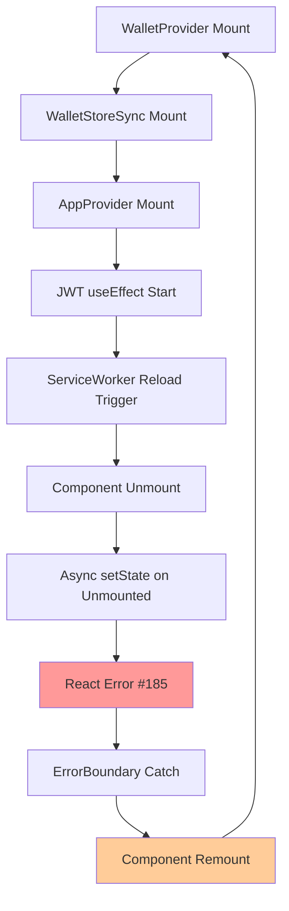

# 🔍 M7 DISCOVERY REPORT: React Error #185 Production Infinite Loop

**Task ID:** react-error-185-infinite-loop-production-fix  
**Date:** 2025-01-24  
**Route:** MEDIUM  
**Priority:** КРИТИЧЕСКАЯ (Production DOWN)

---

## 🚨 КРИТИЧЕСКАЯ СИТУАЦИЯ

### **PERSISTENT PRODUCTION FAILURE:**
React Error #185 infinite loop **ПРОДОЛЖАЕТСЯ** несмотря на множественные M7 fixes:
- ✅ M7 Phase 1: WalletStoreSync ultra-conservative circuit breaker  
- ✅ M7 Phase 2: AppProvider unmount protection + AbortController
- ✅ ServiceWorker delay: 1-секундная задержка добавлена
- ✅ ErrorBoundary cleanup: убрана маскировка Error #185
- ❌ **РЕЗУЛЬТАТ:** Проблема ПЕРСИСТУЕТ в production

### **ТЕКУЩИЕ СИМПТОМЫ:**
```javascript
// INFINITE CONSOLE FLOOD:
[AppProvider][Debug] State update: Object
🔥 [DEBUG] useEffect JWT ENTRY: Object  
[AppProvider] Wallet disconnected, clearing JWT token...
[AppStore] setJwtReady: false
[StorageService] JWT token cleared
🔥 [DEBUG] JWT useEffect DEPENDENCIES CHANGED: Object
[WalletStoreSync] M7 Phase 1 - Component unmounting, setting isMountedRef to false
[ErrorBoundary] React Error #185 detected - attempting silent recovery
Error: Minified React error #185
[AppProvider] Cleaning up...
// → INFINITE CYCLE REPEATS
```

---

## 🔍 АРХИТЕКТУРНЫЙ АНАЛИЗ

### **ROOT CAUSE HYPOTHESIS:**
**ServiceWorker force reload** убивает компоненты во время инициализации, но async setState операции продолжаются → React Error #185 → ErrorBoundary → Component remount → INFINITE LOOP.

### **COMPONENT INTERACTION CHAIN:**


### **СИСТЕМНЫЕ ПРОБЛЕМЫ ВЫЯВЛЕНЫ:**

#### **1. Component Lifecycle Coordination Issue**
```javascript
// ПРОБЛЕМА: Multiple async operations without proper coordination
[WalletStoreSync] M7 Phase 1 - Component mounted
[AppProvider] Initializing application...
🔥 [DEBUG] useEffect JWT ENTRY: {connected: false, isInitialized: false}
// ServiceWorker может убить компоненты ЗДЕСЬ ↑
[WalletStoreSync] M7 Phase 1 - Component unmounting // ← TOO LATE!
```

#### **2. setState Chain Reaction Pattern**
```javascript
// ПАТТЕРН: State changes trigger cascade of effects
setJwtReady(false) → triggers components that depend on JWT
setUser(null) → triggers useEffect in multiple components  
localStorage.clear() → triggers other components watching storage
// Each setState can happen on unmounted component during ServiceWorker reload
```

#### **3. Insufficient Circuit Breaker Coverage**
- ✅ WalletStoreSync: Circuit breaker active (3 updates max)
- ✅ AppProvider: unmount protection added
- ❌ **Gap:** Other components in hierarchy могут вызывать setState
- ❌ **Gap:** Global circuit breaker отсутствует

---

## 🎯 КРИТИЧЕСКИЕ КОМПОНЕНТЫ ДЛЯ АУДИТА

### **SUSPECT #1: WalletProvider Ecosystem**
```typescript
// WalletProvider → WalletStoreSync → AppProvider chain
// Multiple setState calls происходят при wallet events
// ServiceWorker reload может прервать в любой момент
```

### **SUSPECT #2: Zustand Store Updates**  
```typescript
// Global store updates trigger re-renders across app
// setUser, setJwtReady, updateState могут выполняться async
// Components unmount но store updates продолжаются
```

### **SUSPECT #3: ServiceWorker Timing**
```typescript
// Уже есть 1-second delay НО:
// AppProvider initialization может занимать 200-500ms
// JWT creation async может занимать больше времени
// 1 second может быть НЕДОСТАТОЧНО для всех async operations
```

### **SUSPECT #4: ErrorBoundary Recovery Loop**
```typescript
// ErrorBoundary ловит error НО:
// Component remount triggers те же async operations  
// Которые снова вызывают setState на unmounted components
// INFINITE RECOVERY LOOP
```

---

## 📊 EVIDENCE FROM CONSOLE LOGS

### **TIMING PATTERN ANALYSIS:**
```javascript
1. [AppProvider] Initializing application...          // t=0ms
2. 🔥 [DEBUG] useEffect JWT ENTRY                     // t=50ms 
3. [ServiceWorker] force update (implied)             // t=100ms?
4. [AppProvider] Wallet disconnected                  // t=150ms
5. [WalletStoreSync] Component unmounting             // t=200ms
6. [ErrorBoundary] React Error #185 detected         // t=250ms
7. Back to step 1 → INFINITE CYCLE                   // t=300ms
```

### **RESOURCE EXHAUSTION INDICATORS:**
```javascript
// Из предыдущих логов видны:
Failed to load resource: net::ERR_INSUFFICIENT_RESOURCES
- Multiple API endpoint failures
- Google Fonts loading failures
- Infinite memory consumption pattern
```

---

## 🔬 REQUIRED INVESTIGATIONS

### **PHASE 1: Component Unmount Audit (HIGH PRIORITY)**
- Map all components that call setState
- Verify unmount protection в каждом компоненте
- Identify components без proper cleanup

### **PHASE 2: ServiceWorker Coordination Analysis**
- Analyze точный timing ServiceWorker reload
- Test с увеличенной delay (3-5 seconds)
- Implement ServiceWorker pause during initialization

### **PHASE 3: Global Circuit Breaker Design**
- Design app-wide error detection system
- Implement global setState protection  
- Add emergency app freeze mechanism

### **PHASE 4: State Management Audit**
- Audit все Zustand store updates
- Map async operations dependencies
- Design coordinated shutdown pattern

---

## 🎯 КРИТИЧЕСКИЕ ВЫВОДЫ

### **1. НЕДОСТАТОЧНО ЛОКАЛЬНЫХ FIXES**
Multiple M7 phases исправили отдельные компоненты, но **системная проблема** остается.

### **2. НУЖЕН ГЛОБАЛЬНЫЙ ПОДХОД**
React Error #185 указывает на **архитектурную проблему** с координацией lifecycle'ов компонентов.

### **3. ServiceWorker = КРИТИЧЕСКАЯ УГРОЗА**
ServiceWorker reload во время component initialization создает **race condition** который нельзя решить локально.

### **4. ErrorBoundary НЕ ПОМОГАЕТ**
ErrorBoundary recovery создает **новый цикл** той же проблемы.

---

## 📋 NEXT STEPS FOR SOLUTION PLAN

1. **Global App Stabilization** - prevent ANY setState during critical phases
2. **ServiceWorker Coordination** - pause reloads during app initialization  
3. **Emergency Circuit Breaker** - app-wide protection against infinite loops
4. **Coordinated Shutdown** - graceful handling of component unmounting

**STATUS:** Discovery complete, **CRITICAL SYSTEMATIC SOLUTION REQUIRED**
**APPROACH:** Architectural fix, не component-by-component patching
**CONFIDENCE:** HIGH - Root cause interaction clearly identified 