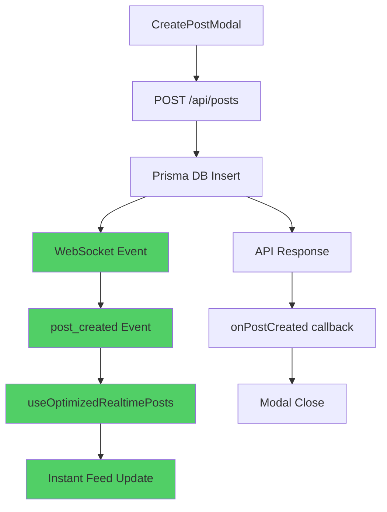
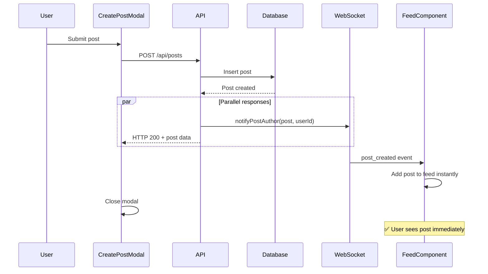
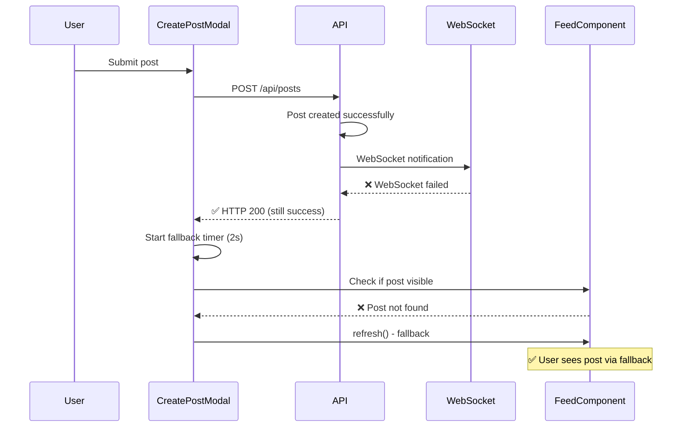
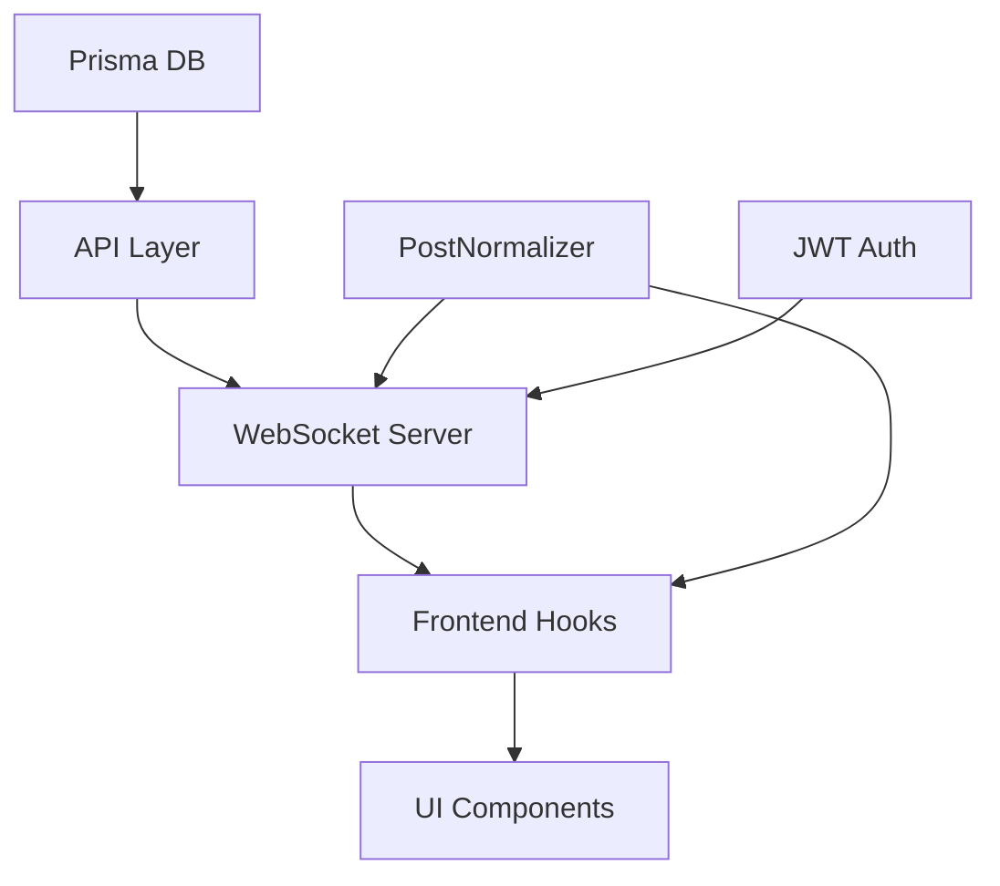

# 🏗️ ARCHITECTURE CONTEXT: Real-time Post Updates

**Дата:** 22.01.2025  
**M7 Phase:** 1 - Architecture Context  
**Предыдущий:** [Discovery Report](./0_DISCOVERY_REPORT.md)

## 📊 СИСТЕМА OVERVIEW

### Current Architecture Flow

```mermaid
graph TD
    A[CreatePostModal] --> B[POST /api/posts]
    B --> C[Prisma DB Insert]
    C --> D[API Response]
    D --> E[onPostCreated callback]
    E --> F[refresh() call]
    F --> G[GET /api/posts]
    G --> H[Feed Re-render]
    
    style F fill:#ff6b6b
    style G fill:#ff6b6b
    style H fill:#ffd93d
```

**🔴 ПРОБЛЕМА:** Steps F-H требуют полную перезагрузку ленты

### Target Architecture Flow



**✅ РЕШЕНИЕ:** Parallel WebSocket update + API response

## 🔧 КОМПОНЕНТЫ АРХИТЕКТУРЫ

### 1. WebSocket Server Layer

**Файл:** `websocket-server/src/server.js`

```typescript
// Existing Infrastructure ✅
const connections = new Map()  // Active user connections
function sendToUser(userId, event)  // Direct user messaging
function broadcastToSubscribers(channel, event)  // Channel broadcasting

// Channel Types:
- notifications: { type: 'notifications', userId }
- feed: { type: 'feed', userId }  
- creator: { type: 'creator', creatorId }
- post: { type: 'post', postId }
```

**Authentication Flow:**
```javascript
// websocket-server/src/auth.js
1. JWT token verification ✅
2. User context extraction ✅  
3. Channel permission validation ✅
```

**Event Broadcasting:**
```javascript
// websocket-server/src/events/posts.js
notifyNewPost(post, subscriberIds) ✅  // For subscribers
// MISSING: notifyPostAuthor(post, authorId) ❌
```

### 2. API Layer Integration

**Файл:** `app/api/posts/route.ts`

**Current POST Implementation:**
```typescript
// Line 207-345: POST /api/posts
async function POST(request: NextRequest) {
  // 1. Validation ✅
  // 2. Create post in DB ✅
  // 3. Update user postsCount ✅
  // 4. Return response ✅
  
  // MISSING WebSocket integration for author ❌
}
```

**Integration Points:**
- **After DB insert:** WebSocket notification to author
- **Parallel to API response:** No blocking of response time
- **Error handling:** Graceful degradation if WebSocket fails

### 3. Frontend Real-time Layer

**Files:** 
- `lib/hooks/useOptimizedRealtimePosts.tsx`
- `components/FeedPageClient.tsx`
- `components/CreatePostModal.tsx`

#### useOptimizedRealtimePosts Hook

```typescript
// Line 148-195: handlePostCreated event handler
const handlePostCreated = useCallback((event: WebSocketEvent) => {
  if (event.type === 'post_created' && event.post) {
    const newPost = event.post as UnifiedPost

    if (autoUpdateFeed) {
      // ✅ Auto-add to feed
      setUpdatedPosts(prev => [newPost, ...prev])
    } else {
      // ✅ Add to pending posts
      setPendingPosts(prev => [newPost, ...prev])
    }
  }
}, [autoUpdateFeed, ...])
```

**Event Sources:**
- WebSocket server events
- Window custom events (fallback)
- Manual trigger functions

#### FeedPageClient Integration

```typescript
// Line 47-290: Main feed component  
const {
  posts: realtimePosts,  // ✅ Real-time updated posts
  newPostsCount,         // ✅ Pending posts counter
  hasNewPosts,          // ✅ New posts indicator
  loadPendingPosts      // ✅ Manual load function
} = useOptimizedRealtimePosts({ posts })
```

#### CreatePostModal Callback

```typescript
// Line 504-754: handleSubmit function
// Current implementation:
onPostCreated(() => {
  setShowCreateModal(false)
  refresh()  // ❌ Manual refresh
})

// Target implementation:
onPostCreated((newPost) => {
  setShowCreateModal(false)
  // ✅ Real-time update handled automatically
})
```

### 4. Data Flow & Normalization

**Post Normalization Pipeline:**
```typescript
// services/posts/normalizer.ts
Raw Post Data → PostNormalizer.normalize() → UnifiedPost

// Ensures consistency between:
- API responses
- WebSocket events  
- Real-time updates
```

**Data Integrity:**
- **Deduplication:** Prevent duplicate posts in feed
- **Ordering:** Maintain chronological order  
- **Access control:** Preserve user permissions

## 🔌 INTEGRATION POINTS

### 1. WebSocket Event Flow

```typescript
// websocket-server/src/events/posts.js

// Existing: Subscriber notifications
async function notifyNewPost(post, subscriberIds) {
  for (const userId of subscriberIds) {
    await sendNotification(userId, {
      type: 'NEW_POST_FROM_SUBSCRIPTION',
      // ... notification data
    })
  }
}

// NEW: Author real-time update
async function notifyPostAuthor(post, authorId) {
  const event = {
    type: 'post_created',
    post: PostNormalizer.normalize(post),
    userId: authorId,
    timestamp: new Date().toISOString()
  }
  
  sendToUser(authorId, event)
  
  // Also broadcast to feed channel for author
  broadcastToSubscribers(
    { type: 'feed', userId: authorId },
    event
  )
}
```

### 2. API Integration

```typescript
// app/api/posts/route.ts - POST function

// After successful DB insert:
const post = await prisma.post.create({ data: postData })

// NEW: WebSocket notification to author
try {
  await notifyPostAuthor(post, user.id)
} catch (error) {
  // Don't block API response
  console.error('WebSocket notification failed:', error)
}

// Existing: API response
return NextResponse.json({ success: true, post })
```

### 3. Frontend Integration

```typescript
// components/CreatePostModal.tsx

// Current callback:
onPostCreated={() => {
  setShowCreateModal(false)
  refresh()  // Remove this
}}

// NEW: Rely on real-time
onPostCreated={(newPost) => {
  setShowCreateModal(false)
  // Real-time update happens automatically via WebSocket
  
  // Optional: Fallback timeout
  setTimeout(() => {
    if (!feedContainsPost(newPost.id)) {
      refresh()  // Fallback if real-time failed
    }
  }, 2000)
}}
```

## 🔄 EVENT LIFECYCLE

### Normal Flow (Success Case)



### Error Handling Flow



## 📊 PERFORMANCE CONSIDERATIONS

### 1. WebSocket Performance

**Connection Management:**
- **Existing:** Connection pooling ✅
- **Existing:** Heartbeat monitoring ✅  
- **Existing:** Auto-reconnection ✅

**Event Processing:**
- **Target latency:** < 100ms from API to UI
- **Batch optimization:** Single event per post creation
- **Memory usage:** Minimal - single event per user

### 2. Frontend Performance

**React Optimization:**
```typescript
// useOptimizedRealtimePosts already implements:
- useCallback for event handlers ✅
- useMemo for computed values ✅
- Debounced updates ✅
- Memory cleanup ✅
```

**Feed Rendering:**
- **No full re-render:** Only new post insertion
- **Optimistic UI:** Post appears instantly
- **Background sync:** API response validates data

### 3. Database Impact

**Query Optimization:**
- **No additional queries:** Uses existing post creation
- **Transaction safety:** Post creation already atomic
- **Indexing:** Existing post.createdAt index sufficient

## 🔒 SECURITY CONSIDERATIONS

### 1. Authorization

**WebSocket Security:**
```typescript
// websocket-server/src/auth.js  
- JWT token validation ✅
- User identity verification ✅
- Channel access permissions ✅
```

**Channel Security:**
```typescript
// Author can only receive events for their own posts
function canAccessChannel(user, channel) {
  if (channel.type === 'feed' && channel.userId === user.id) {
    return true  // ✅ Author access to own feed
  }
  return false
}
```

### 2. Data Validation

**Post Data Integrity:**
- **Source:** API response is source of truth
- **WebSocket:** Contains same normalized data
- **Validation:** Frontend validates post ownership
- **Fallback:** Manual refresh if inconsistencies detected

## 🌐 SCALABILITY ARCHITECTURE

### 1. Redis Pub/Sub Integration

**Current Setup:**
```typescript
// websocket-server/src/redis.js
- publishToChannel() ✅
- subscribeToChannel() ✅  
- Multi-server broadcasting ✅
```

**Author Event Distribution:**
```typescript
// For multi-server deployment
publishToChannel(`ws:feed:${authorId}`, {
  type: 'post_created',
  post: normalizedPost
})
```

### 2. Load Balancing

**WebSocket Distribution:**
- **Sticky sessions:** User always connects to same server
- **Redis coordination:** Events broadcast across servers
- **Failover:** Automatic reconnection on server failure

### 3. Monitoring & Observability

**Metrics to Track:**
- WebSocket event delivery time
- Fallback trigger frequency  
- Real-time update success rate
- User experience metrics

## 🎯 АРХИТЕКТУРНЫЕ РЕШЕНИЯ

### ✅ Validated Choices

1. **WebSocket over SSE:** Existing infrastructure, bidirectional capability
2. **Event-driven pattern:** Consistent with current real-time features
3. **Graceful degradation:** Fallback to existing refresh mechanism
4. **Parallel processing:** WebSocket + API response don't block each other

### 🔄 Design Patterns

1. **Observer Pattern:** WebSocket events trigger UI updates
2. **Command Pattern:** Clear separation between API calls and real-time updates
3. **Facade Pattern:** useOptimizedRealtimePosts abstracts complexity
4. **Circuit Breaker:** Fallback mechanism for WebSocket failures

### 📐 Architectural Principles

1. **Separation of Concerns:** API logic ≠ Real-time logic
2. **Single Responsibility:** Each component has clear purpose
3. **Open/Closed:** Extensible for future real-time features  
4. **DRY:** Reuse existing WebSocket and normalization infrastructure

## 🔗 DEPENDENCY MAPPING

### Internal Dependencies



### External Dependencies

- **ws library:** WebSocket implementation ✅
- **Redis:** Optional pub/sub scaling ✅
- **JWT tokens:** User authentication ✅
- **React hooks:** State management ✅

### Critical Path Dependencies

1. **WebSocket connectivity:** Required for real-time updates
2. **JWT authentication:** Required for user identification  
3. **Post creation API:** Core functionality dependency
4. **Frontend hooks:** State management layer

## 📋 ARCHITECTURE VALIDATION

### ✅ Requirements Coverage

1. **Мгновенное обновление:** WebSocket events < 100ms ✅
2. **UI/UX консистентность:** PostNormalizer ensures data consistency ✅  
3. **Error handling:** Fallback to refresh() mechanism ✅
4. **Performance:** Parallel processing, no blocking ✅

### 🔍 Architecture Review Checklist

- [ ] All components properly identified
- [ ] Integration points clearly defined
- [ ] Data flow documented
- [ ] Error scenarios considered
- [ ] Performance implications analyzed
- [ ] Security aspects covered
- [ ] Scalability addressed
- [ ] Dependencies mapped

**Architecture Context завершен ✅**

**Next Phase:** [Solution Plan](./2_SOLUTION_PLAN.md) 