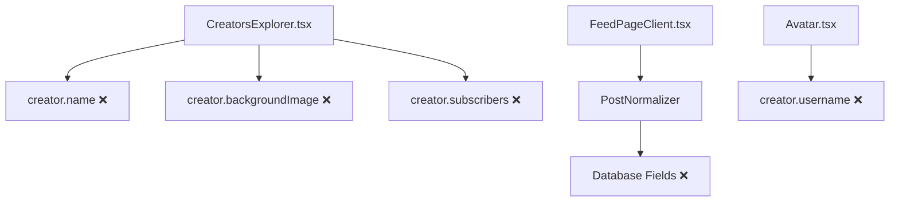
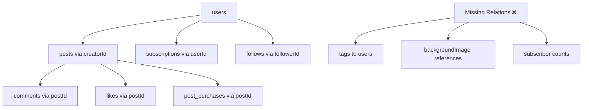

# 🏗️ ARCHITECTURE CONTEXT: Supabase Full Import

## 📊 ТЕКУЩАЯ АРХИТЕКТУРА СИСТЕМЫ

### Database Layer
```
┌─────────────────────┐    ┌─────────────────────┐
│ Local PostgreSQL   │    │ Supabase (Remote)   │
│ Port: 5432          │    │ Full Production DB  │
│ 25 tables           │◄──┤ 26 tables           │
│ 53 users, 10 posts │    │ 54 users, 339 posts│
│ Simplified schema   │    │ Complete schema     │
└─────────────────────┘    └─────────────────────┘
```

### Application Layer
```
┌─────────────────────┐
│ Next.js Frontend    │
│ Port: 3000          │
│ - CreatorsExplorer  │ ❌ BROKEN (missing fields)
│ - FeedPageClient    │ ❌ BROKEN (loading loops)
│ - TypeScript types  │ ❌ MISMATCH with DB
└─────────────────────┘
           │
           ▼
┌─────────────────────┐
│ API Layer           │
│ - /api/creators     │ ✅ Working (simplified)
│ - /api/posts        │ ✅ Working (simplified)
│ - PostNormalizer    │ ⚠️ Bandaid solution
└─────────────────────┘
           │
           ▼
┌─────────────────────┐
│ Prisma ORM          │
│ - Schema mismatch   │ ❌ Out of sync
│ - Missing fields    │ ❌ Type errors
│ - Broken relations  │ ❌ Foreign key issues
└─────────────────────┘
```

### WebSocket Layer
```
┌─────────────────────┐
│ WebSocket Server    │
│ Port: 3002          │
│ - JWT Auth broken   │ ❌ No connections
│ - Real-time broken  │ ❌ Not functional
└─────────────────────┘
```

## 🔗 КОМПОНЕНТЫ И ИХ ЗАВИСИМОСТИ

### Frontend Components


### API Dependencies
```mermaid
graph TD
    A[/api/creators] --> B[Prisma Query]
    B --> C[users table]
    C --> D[Missing fields ❌]
    
    E[/api/posts] --> F[PostNormalizer]
    F --> G[Complex mappings ⚠️]
    
    H[PostNormalizer] --> I[Fallback values]
    I --> J[Incomplete data ⚠️]
```

### Database Relations


## 📋 ИНТЕГРАЦИОННЫЕ ТОЧКИ

### External Services
1. **Supabase Storage** - медиа файлы
   - Avatars: `avatar_*.png/jpeg/webp`
   - Backgrounds: `bg_*.jpg/png/jpeg`
   - Post media: Various formats

2. **Solana Blockchain** - платежи
   - Wallet connections
   - Transaction signatures
   - Payment processing

3. **NextAuth.js** - аутентификация
   - Session management
   - JWT token generation
   - Wallet integration

### Internal Integrations
1. **Prisma ORM** ❌
   - Schema out of sync
   - Type mismatches
   - Query failures

2. **PostNormalizer Service** ⚠️
   - Band-aid solution
   - Data transformation
   - Fallback mappings

3. **API Routes** ✅
   - Simplified versions working
   - Original versions broken
   - Limited functionality

## ⚙️ ВЕРСИИ И ЗАВИСИМОСТИ

### Core Dependencies
```json
{
  "next": "14.1.0",
  "@prisma/client": "^5.0.0",
  "next-auth": "^4.0.0",
  "@solana/web3.js": "^1.78.0",
  "react": "^18.0.0",
  "typescript": "^5.0.0"
}
```

### Database Versions
- **Local PostgreSQL**: 16.x
- **Supabase PostgreSQL**: 15.x (managed)
- **Prisma Schema**: v5.x format

### Conflict Points
1. **Prisma Schema** vs **Real Database**
   - Generated types don't match reality
   - Queries fail on missing fields
   - Relations broken

2. **TypeScript Interfaces** vs **API Responses**
   - PostCreator expects name, username
   - Database has nickname, fullName
   - Runtime type errors

3. **Frontend Expectations** vs **Backend Reality**
   - Components expect full creator data
   - APIs return simplified data
   - Infinite loading states

## 🚨 КРИТИЧЕСКИЕ ТОЧКИ СБОЯ

### 1. Component Crashes
```typescript
// CreatorsExplorer.tsx:376
creator.subscribers.toLocaleString() // ❌ subscribers = undefined
```

### 2. Type Safety Breakdown
```typescript
// TypeScript expects:
interface PostCreator {
  name: string;        // ❌ DB has NULL
  username: string;    // ❌ DB has no such field
}
```

### 3. Data Normalization Failures
```typescript
// PostNormalizer attempts:
name: user.fullName || user.name || user.nickname || 'Unknown'
// ❌ Still creates inconsistencies
```

### 4. API Query Failures
```sql
-- Original API attempts:
SELECT users.*, posts.* FROM users 
JOIN posts ON posts.minSubscriptionTier = users.tier
-- ❌ minSubscriptionTier doesn't exist in local DB
```

## 🔄 DATAFLOW ANALYSIS

### Current Broken Flow
```
Supabase (Full Schema) ❌ Local DB (Partial Schema)
           ↓                           ↓
   339 posts lost ←              10 posts only
           ↓                           ↓
   Complete data ❌           Prisma (Mismatched)
           ↓                           ↓
   Working Frontend ❌         API (Simplified)
                                      ↓
                               Frontend (Broken)
```

### Post-Import Flow (Target)
```
Supabase (Full Schema) → Local DB (Full Schema)
           ↓                           ↓
   339 posts imported →        All posts available
           ↓                           ↓
   Complete data →          Prisma (Matched)
           ↓                           ↓
   All features available →    API (Full)
                                      ↓
                              Frontend (Working)
```

## 🎯 ARCHITECTURE COMPATIBILITY

### Суpabase Schema → Local PostgreSQL
- **Compatibility**: 100% ✅
- **Data types**: PostgreSQL → PostgreSQL ✅
- **Constraints**: Foreign keys compatible ✅
- **Indexes**: Can be recreated ✅

### Prisma ORM Integration
- **Schema Generation**: Auto-generated from DB ✅
- **Type Safety**: Will be restored ✅
- **Query Building**: Complex queries will work ✅
- **Relations**: All relations will function ✅

### Frontend Integration
- **Component Compatibility**: Immediate ✅
- **TypeScript Types**: Will match after schema update ✅
- **API Responses**: Full data available ✅
- **User Experience**: Dramatically improved ✅

## 📊 RISK ASSESSMENT

### Technical Risks 🟡
- **Prisma Schema Regeneration**: Required
- **API Route Updates**: May need adjustments
- **TypeScript Recompilation**: Required

### Data Risks 🟢
- **Local Data Loss**: 10 posts vs 339 gained (net +329)
- **User Data**: All users preserved + 1 additional
- **Relationships**: All will be restored

### Performance Risks 🟢
- **Database Size**: 154MB (manageable)
- **Query Performance**: Improved with proper indexes
- **Storage**: Local storage sufficient

### Integration Risks 🟢
- **Supabase Storage**: URLs remain valid
- **Solana Integration**: Wallet addresses preserved
- **NextAuth**: Compatible with new schema

## ✅ READINESS CHECKLIST

### Prerequisites
- [x] Database connection working
- [x] Supabase MCP access active
- [x] Schema differences analyzed
- [x] Data volume assessed
- [x] Risk mitigation planned

### Dependencies Clear
- [x] No blocking external services
- [x] Prisma can handle schema change
- [x] TypeScript compilation will succeed
- [x] Next.js can restart cleanly

**АРХИТЕКТУРНАЯ ГОТОВНОСТЬ: ✅ ГОТОВО К ИМПОРТУ** 